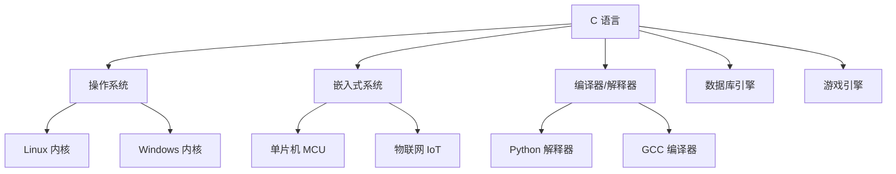
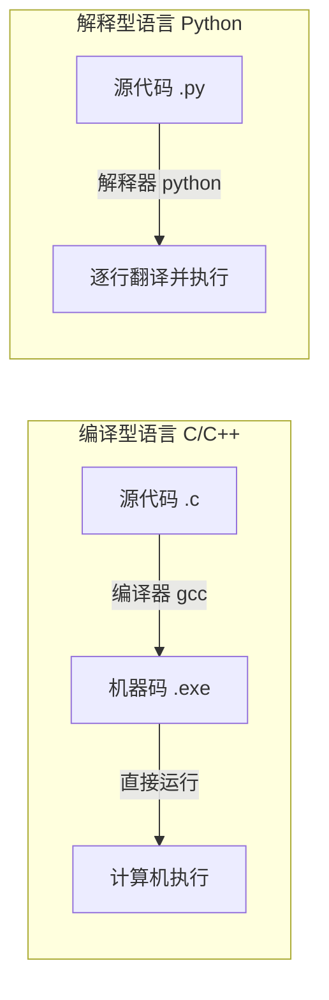

# 第 1 课：C 语言简介与环境搭建

## 什么是 C 语言？

C 语言是由 **丹尼斯·里奇（Dennis Ritchie）** 于 1972 年在贝尔实验室设计开发的通用编程语言。它最初的目的是为了重写 UNIX 操作系统，后来迅速成为世界上最流行的编程语言之一。

### 为什么学习 C 语言？



| 理由 | 说明 |
|------|------|
| **底层能力** | 可以直接操作内存、硬件寄存器，适合嵌入式和系统开发 |
| **高效性能** | 编译后直接生成机器码，运行速度极快 |
| **编程基础** | 学会 C 语言，再学其他语言（Java、Python、Go）会非常轻松 |
| **广泛应用** | Linux 内核、数据库（MySQL/Redis）、Python 解释器都是 C 写的 |
| **长盛不衰** | 50+ 年历史，TIOBE 排行榜常年 Top 3 |

### C 语言的特点

- **简洁**：只有 32 个关键字，语法规则不多
- **高效**：接近汇编的性能，但比汇编容易读写
- **可移植**：一次编写，稍加修改就能在不同平台运行
- **面向过程**：以函数为基本单位组织代码

!!! note "C 语言 vs 其他语言"
    | 特性 | C | Python | Java |
    |------|---|--------|------|
    | 执行速度 | ⭐⭐⭐⭐⭐ | ⭐⭐ | ⭐⭐⭐ |
    | 学习难度 | ⭐⭐⭐ | ⭐ | ⭐⭐ |
    | 内存管理 | 手动 | 自动 | 自动 |
    | 应用领域 | 系统/嵌入式 | AI/Web | 企业应用 |

---

## 编译型语言 vs 解释型语言

在正式搭建环境之前，先理解一个重要概念：



**C 语言是编译型语言**：代码先经过编译器翻译成机器码（可执行文件），然后才能运行。

编译过程分为 4 个步骤：


| 阶段 | 命令 | 说明 |
|------|------|------|
| 预处理 | `gcc -E hello.c -o hello.i` | 展开 `#include`、`#define` |
| 编译 | `gcc -S hello.i -o hello.s` | 翻译成汇编语言 |
| 汇编 | `gcc -c hello.s -o hello.o` | 翻译成机器码（目标文件） |
| 链接 | `gcc hello.o -o hello` | 链接库函数，生成可执行文件 |

> 日常使用时，一条命令即可完成全部步骤：`gcc hello.c -o hello`

---

## 开发环境搭建

### 方案一：Windows + VS Code + MinGW（推荐）

#### 1. 安装 MinGW-w64（GCC 编译器）

MinGW 是 Windows 上的 GCC 编译器套件。

**安装步骤：**

1. 访问 [MinGW-w64 下载页](https://github.com/niXman/mingw-builds-binaries/releases)
2. 下载最新版本，例如：`x86_64-*-release-posix-seh-ucrt-*.7z`
3. 解压到 `C:\mingw64`（路径不要有中文和空格）
4. 将 `C:\mingw64\bin` 添加到系统环境变量 `PATH`

**验证安装：**

```bash
gcc --version
```

看到类似输出即成功：

```
gcc (x86_64-posix-seh-rev0, Built by MinGW-Builds project) 13.2.0
```

#### 2. 安装 VS Code

1. 访问 [VS Code 官网](https://code.visualstudio.com/) 下载安装
2. 安装以下扩展：
    - **C/C++**（Microsoft 出品，提供语法高亮、调试、智能提示）
    - **Code Runner**（一键运行代码）

#### 3. 配置 VS Code

创建工作目录，例如 `C:\c-projects`，用 VS Code 打开。

创建 `.vscode/tasks.json`：

```json
{
    "version": "2.0.0",
    "tasks": [
        {
            "label": "gcc build",
            "type": "shell",
            "command": "gcc",
            "args": [
                "-g",
                "${file}",
                "-o",
                "${fileDirname}/${fileBasenameNoExtension}.exe"
            ],
            "group": {
                "kind": "build",
                "isDefault": true
            }
        }
    ]
}
```

### 方案二：Linux（Ubuntu/Debian）

```bash
# 安装 GCC
sudo apt update
sudo apt install build-essential

# 验证
gcc --version
```

### 方案三：在线编译器（无需安装）

如果暂时不想安装环境，可以使用在线编译器练习：

| 平台 | 网址 | 特点 |
|------|------|------|
| 菜鸟教程 | [runoob.com/try](https://www.runoob.com/try/runcode.php?filename=helloworld&type=c) | 中文界面 |
| OnlineGDB | [onlinegdb.com](https://www.onlinegdb.com/) | 支持调试 |
| Compiler Explorer | [godbolt.org](https://godbolt.org/) | 可以看汇编输出 |

---

## 第一次编译运行

创建文件 `hello.c`：

```c title="hello.c"
#include <stdio.h>

int main(void)
{
    printf("Hello, World!\n");
    return 0;
}
```

编译并运行：

```bash
# 编译
gcc hello.c -o hello

# 运行（Linux/macOS）
./hello

# 运行（Windows）
hello.exe
```

输出：

```
Hello, World!
```

🎉 恭喜！你成功运行了第一个 C 程序！

---

## GCC 常用编译选项

| 选项 | 说明 | 示例 |
|------|------|------|
| `-o` | 指定输出文件名 | `gcc hello.c -o hello` |
| `-g` | 生成调试信息 | `gcc -g hello.c -o hello` |
| `-Wall` | 开启所有警告 | `gcc -Wall hello.c -o hello` |
| `-Werror` | 警告当作错误 | `gcc -Werror hello.c -o hello` |
| `-std=c99` | 指定 C 标准 | `gcc -std=c99 hello.c -o hello` |
| `-O2` | 优化等级 2 | `gcc -O2 hello.c -o hello` |

!!! tip "推荐编译命令"
    日常开发推荐使用：
    ```bash
    gcc -Wall -g -std=c99 hello.c -o hello
    ```
    开启警告 + 调试信息 + C99 标准，帮你尽早发现问题。

---

## 练习题

### 练习 1：环境验证

在终端中执行以下命令，截图记录输出：

```bash
gcc --version
```

### 练习 2：编译体验

1. 创建 `test.c`，输入以下代码：

```c
#include <stdio.h>

int main(void)
{
    printf("我的第一个C程序！\n");
    printf("1 + 2 = %d\n", 1 + 2);
    return 0;
}
```

2. 编译并运行，观察输出。

### 练习 3：编译阶段（选做）

使用以下命令分别查看编译的 4 个阶段输出：

```bash
gcc -E test.c -o test.i    # 查看预处理结果
gcc -S test.c -o test.s    # 查看汇编代码
gcc -c test.c -o test.o    # 生成目标文件
gcc test.o -o test         # 链接生成可执行文件
```

打开 `test.i` 和 `test.s` 文件，感受编译器在背后做了多少工作！

---

## 本课小结

| 知识点 | 说明 |
|--------|------|
| C 语言特点 | 简洁、高效、可移植、面向过程 |
| 编译过程 | 预处理 → 编译 → 汇编 → 链接 |
| 开发环境 | GCC 编译器 + VS Code 编辑器 |
| 编译命令 | `gcc hello.c -o hello` |
| 运行方式 | `./hello`（Linux）或 `hello.exe`（Windows） |

> **下一课**：[第一个C程序](../02-hello-world/README.md) —— 深入理解 C 程序的基本结构
