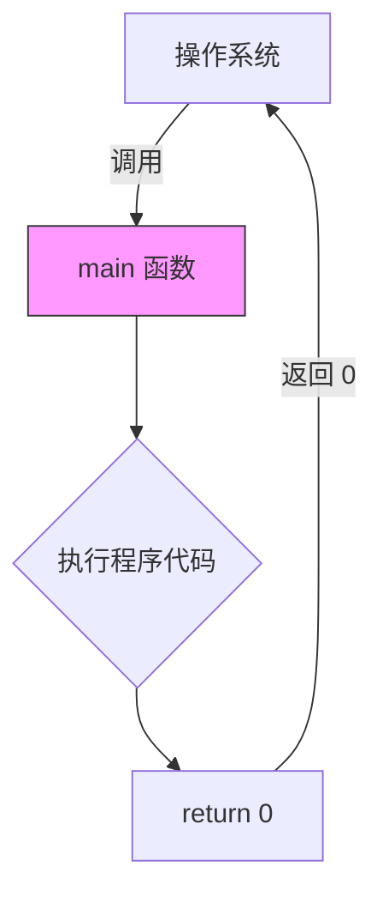
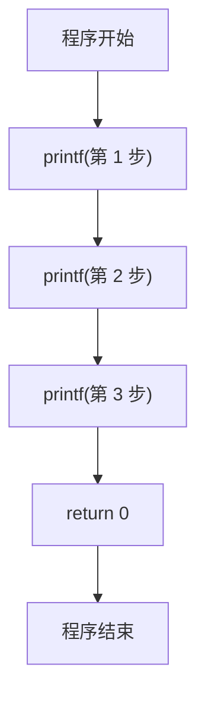

# 第 2 课：第一个 C 程序

## 经典的 Hello World

每个程序员的编程之旅都从 Hello World 开始：

```c title="hello.c" hl_lines="1 3 5 6"
#include <stdio.h>

int main(void)
{
    printf("Hello, World!\n");
    return 0;
}
```

这短短 7 行代码包含了 C 程序最核心的元素。下面逐行解析。

---

## 程序结构详解

### 1. 头文件包含 `#include`

```c
#include <stdio.h>
```

- `#include` 是**预处理指令**，告诉编译器在编译前先把指定文件的内容插入到当前位置
- `<stdio.h>` 是**标准输入输出头文件**（Standard Input/Output Header）
- 因为我们用了 `printf()` 函数，而 `printf` 的声明就在 `stdio.h` 里
- 如果不写这行，编译器会报警告甚至错误

!!! note "尖括号 vs 双引号"
    ```c
    #include <stdio.h>    // 从系统目录查找（标准库头文件）
    #include "myfile.h"   // 先从当前目录查找，再找系统目录（自己写的头文件）
    ```

### 2. main 函数

```c
int main(void)
{
    // 程序代码
    return 0;
}
```

- `main` 是**主函数**，是 C 程序的**入口点**——程序从这里开始执行
- 每个 C 程序**有且只有一个** `main` 函数
- `int` 表示 main 函数返回一个整数值
- `void` 表示 main 函数不接受参数（也可以写成 `int main()` ）
- `return 0;` 表示程序正常结束，返回 0 给操作系统



!!! warning "常见错误"
    ```c
    // ❌ 错误：没有 main 函数
    #include <stdio.h>
    printf("hello");
    
    // ❌ 错误：main 写成 Main 或 MAIN（C 语言区分大小写！）
    int Main(void) { ... }
    ```

### 3. 花括号 `{}`

花括号定义了**代码块**（block）：

```c
int main(void)
{                    // 代码块开始
    printf("Hi\n");  // 代码块内的语句
    return 0;        // 代码块内的语句
}                    // 代码块结束
```

- 所有属于 `main` 函数的代码都必须放在 `{ }` 之间
- 花括号必须**成对出现**

### 4. 语句和分号

C 语言中，每条**语句**都必须以**分号 `;`** 结尾：

```c
printf("Hello!\n");   // ✅ 正确
return 0;             // ✅ 正确
printf("Hello!\n")    // ❌ 编译错误：缺少分号
```

!!! tip "分号是 C 程序中最常见的错误之一"
    忘记分号会导致编译器报出看起来很奇怪的错误信息。如果编译出错，先检查是不是忘了分号！

### 5. printf 函数

`printf` 是**格式化输出函数**，用来在屏幕上打印内容：

```c
printf("Hello, World!\n");
```

- 双引号 `" "` 里的内容叫**字符串**
- `\n` 是**换行符**（转义字符），让光标移到下一行
- `printf` 不会自动换行，必须手动加 `\n`

**对比有无 `\n`：**

```c
printf("AAA");
printf("BBB");
// 输出：AAABBB（同一行）

printf("AAA\n");
printf("BBB\n");
// 输出：
// AAA
// BBB
```

---

## 注释

注释是给**人**看的说明文字，编译器会完全忽略它们。

### 单行注释 `//`

```c
// 这是单行注释
int a = 10;  // 变量后面也可以加注释
```

### 多行注释 `/* */`

```c
/*
 * 这是多行注释
 * 可以写很多行
 * 用来解释复杂的逻辑
 */
int main(void)
{
    /* 也可以在一行内使用 */
    return 0;
}
```

!!! warning "多行注释不能嵌套"
    ```c
    /* 外层注释
       /* 内层注释 */   ← 这里外层注释就结束了！
       这里会报错
    */
    ```

### 注释的好习惯

```c
// ✅ 好的注释：解释"为什么"
int timeout = 5000;  // 串口超时时间 5 秒，硬件手册要求最少 3 秒

// ❌ 不好的注释：解释"是什么"（代码本身已经说清楚了）
int a = 10;  // 把 a 设置为 10
```

---

## 完整示例

下面是一个包含多个 `printf` 的完整程序：

```c title="intro.c"
#include <stdio.h>

/*
 * 我的第一个 C 程序
 * 功能：显示欢迎信息和基本计算
 */
int main(void)
{
    // 打印欢迎信息
    printf("==========================\n");
    printf("   欢迎学习 C 语言！\n");
    printf("==========================\n");
    
    // printf 可以做简单计算
    printf("1 + 2 = %d\n", 1 + 2);
    printf("10 / 3 = %d\n", 10 / 3);   // 整数除法，结果是 3
    
    // 打印特殊字符
    printf("打印双引号：\"Hello\"\n");
    printf("打印反斜杠：C:\\Users\\test\n");
    printf("打印制表符：A\tB\tC\n");
    
    return 0;
}
```

输出：

```
==========================
   欢迎学习 C 语言！
==========================
1 + 2 = 3
10 / 3 = 3
打印双引号："Hello"
打印反斜杠：C:\Users\test
打印制表符：A	B	C
```

---

## 常用转义字符

| 转义字符 | 含义 | 示例 |
|----------|------|------|
| `\n` | 换行 | `printf("A\nB");` → 分两行 |
| `\t` | 制表符（Tab） | `printf("A\tB");` → A 和 B 之间有 Tab |
| `\\` | 反斜杠 `\` | `printf("C:\\path");` → `C:\path` |
| `\"` | 双引号 `"` | `printf("\"Hi\"");` → `"Hi"` |
| `\0` | 空字符 | 字符串的结束标志 |
| `\r` | 回车 | 光标回到行首（不换行） |
| `\a` | 响铃 | 发出一声"哔" |

---

## 程序的执行流程

C 程序是**从上到下，逐行执行**的：

```c title="flow.c"
#include <stdio.h>

int main(void)
{
    printf("第 1 步\n");  // 先执行
    printf("第 2 步\n");  // 再执行
    printf("第 3 步\n");  // 最后执行
    return 0;
}
```



---

## 常见编译错误和解决方法

### 错误 1：缺少分号

```c
printf("hello")   // 忘了分号
return 0;
```

编译器报错：

```
error: expected ';' before 'return'
```

**解决**：在 `printf("hello")` 后面加上 `;`

### 错误 2：拼写错误

```c
#include <stdio.h>

int main(void)
{
    prinf("hello\n");  // printf 拼错了
    return 0;
}
```

编译器报错：

```
error: implicit declaration of function 'prinf'
```

**解决**：检查函数名拼写，改为 `printf`

### 错误 3：忘记包含头文件

```c
// 没有 #include <stdio.h>
int main(void)
{
    printf("hello\n");
    return 0;
}
```

编译器可能报警告：

```
warning: implicit declaration of function 'printf'
```

**解决**：在文件开头添加 `#include <stdio.h>`

### 错误 4：花括号不匹配

```c
int main(void)
{
    printf("hello\n");
    return 0;
// 忘了右花括号
```

**解决**：确保每个 `{` 都有对应的 `}`

---

## 练习题

### 练习 1：修改 Hello World

修改 Hello World 程序，让它输出你的名字和今天的日期。

??? note "参考答案"
    ```c
    #include <stdio.h>
    
    int main(void)
    {
        printf("你好，我是小明！\n");
        printf("今天是 2025 年 7 月 10 日\n");
        return 0;
    }
    ```

### 练习 2：打印图形

用 `printf` 打印一个三角形：

```
*
**
***
****
*****
```

??? note "参考答案"
    ```c
    #include <stdio.h>
    
    int main(void)
    {
        printf("*\n");
        printf("**\n");
        printf("***\n");
        printf("****\n");
        printf("*****\n");
        return 0;
    }
    ```

### 练习 3：转义字符

编写程序输出以下内容（注意引号和反斜杠）：

```
文件路径：C:\Program Files\test
他说："C 语言真好学！"
```

??? note "参考答案"
    ```c
    #include <stdio.h>
    
    int main(void)
    {
        printf("文件路径：C:\\Program Files\\test\n");
        printf("他说：\"C 语言真好学！\"\n");
        return 0;
    }
    ```

### 练习 4：找 Bug（纠错题）

下面的代码有 **4 个错误**，找出并修正它们：

```c
#include <studio.h>

int main(void)
{
    printf("Hello!\n")
    printf("Goodbye!\n");
    retrun 0;
```

??? note "参考答案"
    ```c
    #include <stdio.h>       // 错误1：studio.h → stdio.h
    
    int main(void)
    {
        printf("Hello!\n");  // 错误2：缺少分号
        printf("Goodbye!\n");
        return 0;            // 错误3：retrun → return
    }                        // 错误4：缺少右花括号
    ```

---

## 本课小结

| 知识点 | 说明 |
|--------|------|
| `#include` | 包含头文件，获取函数声明 |
| `main()` | 程序入口，有且只有一个 |
| `printf()` | 格式化输出到屏幕 |
| `return 0` | 程序正常结束 |
| 分号 `;` | 每条语句必须以分号结尾 |
| `//` 和 `/* */` | 单行注释和多行注释 |
| `\n` | 换行符（转义字符） |
| `{ }` | 代码块的边界 |

> **下一课**：[数据类型与变量](../03-data-types/README.md) —— 学习如何存储和使用数据
