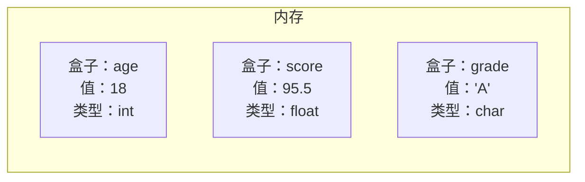

# 第 3 课：数据类型与变量

## 什么是变量？

变量就是一个**有名字的存储空间**，用来保存数据。你可以把它想象成一个贴了标签的盒子：



---

## 变量的声明与初始化

### 声明变量

```c
// 语法：数据类型 变量名;
int age;        // 声明一个整型变量 age
float score;    // 声明一个浮点型变量 score
char grade;     // 声明一个字符型变量 grade
```

### 初始化变量（声明时赋值）

```c
int age = 18;           // 声明并初始化
float score = 95.5;
char grade = 'A';
```

### 先声明后赋值

```c
int age;       // 声明
age = 18;      // 赋值（用 = 号）
age = 20;      // 可以重新赋值
```

### 同时声明多个变量

```c
int a, b, c;              // 声明 3 个 int 变量
int x = 1, y = 2, z = 3;  // 声明并初始化
```

!!! warning "未初始化的变量"
    ```c
    int a;
    printf("%d\n", a);  // ⚠️ 值不确定！可能是 0，也可能是随机数
    ```
    **永远在使用变量前给它一个初始值！**

---

## 变量命名规则

| 规则 | 示例 | 说明 |
|------|------|------|
| 只能包含字母、数字、下划线 | `age`, `score_1`, `_count` | ✅ 合法 |
| 不能以数字开头 | `1st_name` | ❌ 非法 |
| 不能使用关键字 | `int`, `return`, `if` | ❌ 非法 |
| 区分大小写 | `Age` ≠ `age` ≠ `AGE` | 三个不同变量 |

### 命名建议

```c
// ✅ 好的命名：见名知意
int student_count;
float battery_voltage;
int is_connected;

// ❌ 不好的命名
int a;        // 不知道是什么
int x1;       // 含义不明
int aaaa;     // 毫无意义
```

---

## 基本数据类型

### 整型 (Integer)

用来存储**整数**（没有小数部分）：

| 类型 | 大小(字节) | 范围 | 格式符 |
|------|-----------|------|--------|
| `char` | 1 | -128 ~ 127 | `%c` / `%d` |
| `short` | 2 | -32,768 ~ 32,767 | `%hd` |
| `int` | 4 | -2,147,483,648 ~ 2,147,483,647 | `%d` |
| `long` | 4 或 8 | 至少 -2³¹ ~ 2³¹-1 | `%ld` |
| `long long` | 8 | -2⁶³ ~ 2⁶³-1 | `%lld` |

```c title="integer.c"
#include <stdio.h>

int main(void)
{
    char   c = 65;         // ASCII 码 65 = 'A'
    short  s = 1000;
    int    i = 100000;
    long   l = 1000000L;   // L 后缀表示 long
    long long ll = 9999999999LL;  // LL 后缀表示 long long
    
    printf("char:      %d (字符: %c)\n", c, c);
    printf("short:     %hd\n", s);
    printf("int:       %d\n", i);
    printf("long:      %ld\n", l);
    printf("long long: %lld\n", ll);
    
    return 0;
}
```

输出：

```
char:      65 (字符: A)
short:     1000
int:       100000
long:      1000000
long long: 9999999999
```

### 无符号整型 (unsigned)

只存储**非负数**，范围翻倍：

| 类型 | 大小 | 范围 | 格式符 |
|------|------|------|--------|
| `unsigned char` | 1 | 0 ~ 255 | `%u` |
| `unsigned short` | 2 | 0 ~ 65,535 | `%hu` |
| `unsigned int` | 4 | 0 ~ 4,294,967,295 | `%u` |
| `unsigned long long` | 8 | 0 ~ 2⁶⁴-1 | `%llu` |

```c
unsigned int count = 0;     // 计数器不需要负数
unsigned char pixel = 255;  // 像素值 0~255
```

!!! tip "嵌入式开发中的常用整型"
    在嵌入式开发中，通常使用 `<stdint.h>` 中明确大小的类型：
    ```c
    #include <stdint.h>
    
    uint8_t   led_state = 0;      // 无符号 8 位 (0~255)
    int16_t   temperature = -10;  // 有符号 16 位
    uint32_t  timer_count = 0;    // 无符号 32 位
    ```
    这样代码在不同平台上的行为是一致的。

---

### 浮点型 (Floating Point)

用来存储**小数**：

| 类型 | 大小(字节) | 精度 | 格式符 |
|------|-----------|------|--------|
| `float` | 4 | 约 6~7 位有效数字 | `%f` |
| `double` | 8 | 约 15~16 位有效数字 | `%lf`（scanf）/ `%f`（printf） |

```c title="float.c"
#include <stdio.h>

int main(void)
{
    float  pi_f = 3.14159265358979f;  // f 后缀表示 float
    double pi_d = 3.14159265358979;   // 默认就是 double
    
    printf("float:  %.10f\n", pi_f);   // 打印 10 位小数
    printf("double: %.15f\n", pi_d);
    
    // 科学计数法
    double big = 6.022e23;    // 6.022 × 10²³（阿伏伽德罗常数）
    double small = 1.6e-19;   // 1.6 × 10⁻¹⁹（电子电荷）
    printf("big:   %e\n", big);
    printf("small: %e\n", small);
    
    return 0;
}
```

输出：

```
float:  3.1415927410     ← 第 8 位开始不准确
double: 3.141592653589790
big:   6.022000e+23
small: 1.600000e-19
```

!!! warning "浮点数的精度陷阱"
    ```c
    float a = 0.1f + 0.2f;
    printf("0.1 + 0.2 = %.20f\n", a);
    // 输出：0.1 + 0.2 = 0.30000001192092895508
    // 不是精确的 0.3！
    
    // ❌ 千万不要用 == 比较浮点数
    if (a == 0.3f) { ... }  // 可能判断为 false！
    
    // ✅ 正确做法：判断差值是否足够小
    if (fabs(a - 0.3f) < 0.0001f) { ... }
    ```

---

### 字符型 (char)

`char` 本质上是一个 **1 字节的整数**，存储的是字符的 ASCII 码：

```c title="char.c"
#include <stdio.h>

int main(void)
{
    char ch = 'A';      // 用单引号括起来
    
    printf("字符: %c\n", ch);    // 输出字符：A
    printf("ASCII: %d\n", ch);   // 输出 ASCII 码：65
    
    // 字符本质是数字，可以做运算
    printf("A + 1 = %c\n", ch + 1);   // 输出：B
    printf("A + 32 = %c\n", ch + 32); // 输出：a（大写转小写）
    
    // 数字字符转数值
    char digit = '7';
    int  value = digit - '0';  // '7' - '0' = 55 - 48 = 7
    printf("字符 '%c' 的数值是 %d\n", digit, value);
    
    return 0;
}
```

### ASCII 码表（常用部分）

| 范围 | 字符 | ASCII 码 |
|------|------|----------|
| 数字 | `'0'` ~ `'9'` | 48 ~ 57 |
| 大写字母 | `'A'` ~ `'Z'` | 65 ~ 90 |
| 小写字母 | `'a'` ~ `'z'` | 97 ~ 122 |
| 空格 | `' '` | 32 |
| 换行 | `'\n'` | 10 |

!!! tip "大小写转换技巧"
    ```c
    char upper = 'A';
    char lower = upper + 32;   // 'A' + 32 = 'a'
    
    char lower2 = 'z';
    char upper2 = lower2 - 32; // 'z' - 32 = 'Z'
    ```
    大写和小写字母的 ASCII 码差 32。

---

## sizeof 运算符

`sizeof` 用来**查看数据类型或变量占用多少字节**：

```c title="sizeof.c"
#include <stdio.h>

int main(void)
{
    printf("char:      %zu 字节\n", sizeof(char));
    printf("short:     %zu 字节\n", sizeof(short));
    printf("int:       %zu 字节\n", sizeof(int));
    printf("long:      %zu 字节\n", sizeof(long));
    printf("long long: %zu 字节\n", sizeof(long long));
    printf("float:     %zu 字节\n", sizeof(float));
    printf("double:    %zu 字节\n", sizeof(double));
    
    // 也可以对变量使用
    int age = 18;
    printf("age 占 %zu 字节\n", sizeof(age));
    printf("age 占 %zu 字节\n", sizeof age);  // 对变量可以省略括号
    
    return 0;
}
```

典型输出（64 位系统）：

```
char:      1 字节
short:     2 字节
int:       4 字节
long:      4 字节      ← Windows 是 4，Linux 64 位是 8
long long: 8 字节
float:     4 字节
double:    8 字节
age 占 4 字节
```

---

## 常量

常量是**值不会改变**的数据。

### 方式一：`#define` 宏定义

```c
#define PI 3.14159
#define MAX_SIZE 100

printf("PI = %f\n", PI);        // 使用时直接替换为 3.14159
printf("MAX = %d\n", MAX_SIZE); // 替换为 100
```

- 习惯用**全大写**命名
- 末尾**不加分号**
- 本质是文本替换，没有类型检查

### 方式二：`const` 关键字

```c
const int MAX_AGE = 150;
const double PI = 3.14159265358979;

// MAX_AGE = 200;  // ❌ 编译错误！不能修改 const 变量
```

- 有类型检查，更安全
- 推荐使用 `const`

### 字面量

代码中直接写出的值叫做**字面量**：

```c
int a = 42;          // 42 是整型字面量
float b = 3.14f;     // 3.14f 是浮点字面量
char c = 'X';        // 'X' 是字符字面量
char *s = "Hello";   // "Hello" 是字符串字面量

// 不同进制的整型字面量
int dec = 100;       // 十进制
int oct = 0144;      // 八进制（以 0 开头）
int hex = 0x64;      // 十六进制（以 0x 开头）
int bin = 0b01100100;// 二进制（以 0b 开头，C23/GCC 扩展）

printf("dec=%d oct=%d hex=%d\n", dec, oct, hex);
// 输出：dec=100 oct=100 hex=100  （都是 100）
```

---

## 类型转换

### 隐式转换（自动转换）

当不同类型的值混合运算时，编译器会自动将"小"类型转换为"大"类型：

```c
int a = 10;
double b = 3.5;
double result = a + b;  // int 自动转为 double
printf("result = %f\n", result);  // 13.500000
```

转换规则（从小到大）：


!!! warning "整数除法陷阱"
    ```c
    int a = 10;
    int b = 3;
    double result = a / b;  // ⚠️ result = 3.000000，不是 3.333...
    // 因为 a / b 先做整数除法得到 3，然后 3 转为 double
    
    // ✅ 正确做法：至少一个操作数是浮点数
    double result2 = (double)a / b;  // 3.333333
    double result3 = a / 3.0;        // 3.333333
    ```

### 强制转换（显式转换）

用 `(类型名)` 手动转换：

```c
double pi = 3.14159;
int pi_int = (int)pi;  // 强制转为 int，截断小数部分
printf("%d\n", pi_int); // 3（不是四舍五入，是直接截断！）

// 用于整数除法
int total = 17;
int count = 5;
double avg = (double)total / count;  // 3.400000
```

---

## 综合示例

```c title="bmi.c"
#include <stdio.h>

int main(void)
{
    // 计算 BMI（体质指数）
    const double height = 1.75;  // 身高（米）
    const double weight = 70.0;  // 体重（千克）
    
    double bmi = weight / (height * height);
    
    printf("========== BMI 计算器 ==========\n");
    printf("身高: %.2f 米\n", height);
    printf("体重: %.1f 千克\n", weight);
    printf("BMI:  %.1f\n", bmi);
    printf("================================\n");
    
    // 演示不同数据类型
    int age = 25;
    char blood_type = 'A';
    
    printf("年龄: %d 岁\n", age);
    printf("血型: %c 型\n", blood_type);
    
    return 0;
}
```

输出：

```
========== BMI 计算器 ==========
身高: 1.75 米
体重: 70.0 千克
BMI:  22.9
================================
年龄: 25 岁
血型: A 型
```

---

## 练习题

### 练习 1：变量声明

声明以下变量并打印：

- 你的年龄（整数）
- 你的身高（小数，单位米）
- 你名字的首字母（字符）

??? note "参考答案"
    ```c
    #include <stdio.h>
    
    int main(void)
    {
        int age = 20;
        float height = 1.72f;
        char initial = 'L';
        
        printf("年龄: %d 岁\n", age);
        printf("身高: %.2f 米\n", height);
        printf("首字母: %c\n", initial);
        
        return 0;
    }
    ```

### 练习 2：sizeof 探索

编写程序，打印所有基本数据类型的大小，并回答：你的电脑上 `long` 是 4 字节还是 8 字节？

### 练习 3：温度转换

写一个程序，将摄氏温度转换为华氏温度。公式：$F = C \times 1.8 + 32$

??? note "参考答案"
    ```c
    #include <stdio.h>
    
    int main(void)
    {
        double celsius = 37.5;
        double fahrenheit = celsius * 1.8 + 32;
        
        printf("%.1f°C = %.1f°F\n", celsius, fahrenheit);
        return 0;
    }
    ```

### 练习 4：整数溢出观察

下面的代码输出什么？为什么？

```c
#include <stdio.h>

int main(void)
{
    short s = 32767;   // short 的最大值
    s = s + 1;
    printf("32767 + 1 = %d\n", s);
    
    unsigned char c = 255;  // unsigned char 的最大值
    c = c + 1;
    printf("255 + 1 = %d\n", c);
    
    return 0;
}
```

??? note "参考答案"
    ```
    32767 + 1 = -32768   ← 有符号整数溢出，从最大值变成最小值
    255 + 1 = 0          ← 无符号整数溢出，从 255 回到 0
    ```
    这叫做**整数溢出**，就像汽车里程表从 999999 变成 000000 一样。

---

## 本课小结

| 知识点 | 说明 |
|--------|------|
| 变量 | 有名字的存储空间，用来保存数据 |
| 整型 | `char`(1) / `short`(2) / `int`(4) / `long long`(8) |
| 浮点型 | `float`(4) / `double`(8) |
| 字符型 | `char`，用单引号 `'A'`，本质是 ASCII 码 |
| `sizeof` | 查看类型/变量占多少字节 |
| 常量 | `#define` 或 `const`，值不可改变 |
| 类型转换 | 隐式（自动）和显式（强制） |
| 命名规则 | 字母/数字/下划线，不能数字开头 |

> **下一课**：[运算符与表达式](../04-operators/README.md) —— 学习如何对数据进行计算和判断
