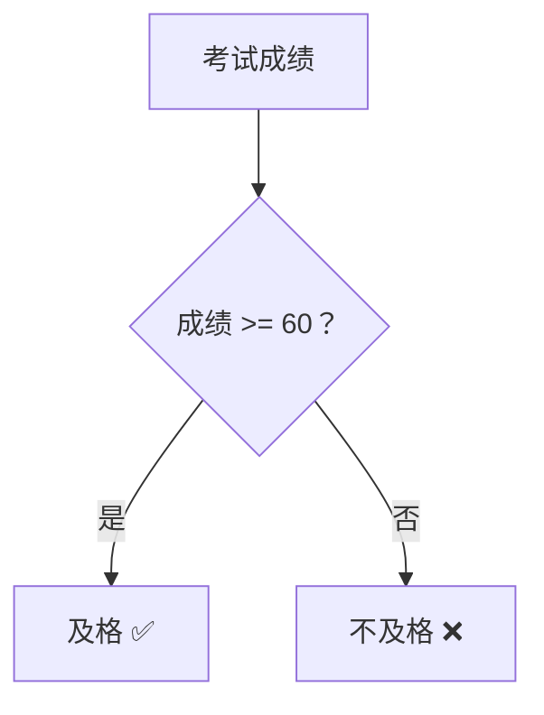
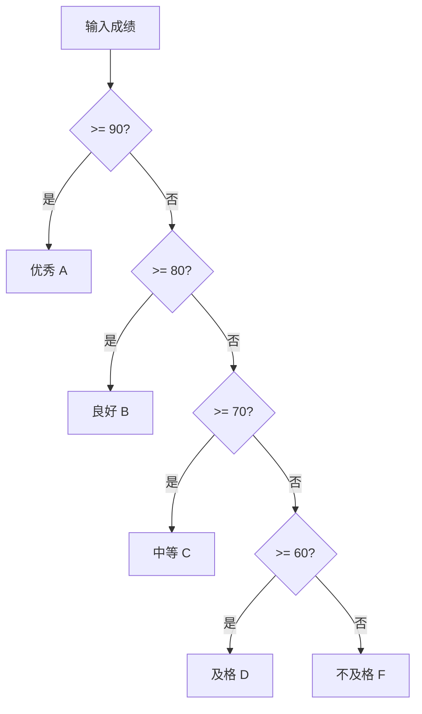

# 第 6 课：条件判断

## 什么是条件判断？

在现实生活中，我们经常需要根据不同情况做出不同选择：



C 语言中用**条件语句**来实现这种"分支判断"的逻辑。

---

## if 语句

### 最简单的 if

```c
if (条件) {
    // 条件为真时执行
}
```

```c title="if_basic.c"
#include <stdio.h>

int main(void)
{
    int score = 85;
    
    if (score >= 60) {
        printf("及格了！\n");
    }
    
    return 0;
}
```

!!! note "C 语言中的"真"和"假""
    - **0** → 假（false）
    - **非 0**（任何非零值）→ 真（true）
    
    ```c
    if (1)  { ... }  // 真，会执行
    if (-1) { ... }  // 真，会执行（-1 也是非零）
    if (0)  { ... }  // 假，不会执行
    ```

---

### if-else

```c
if (条件) {
    // 条件为真时执行
} else {
    // 条件为假时执行
}
```

```c title="if_else.c"
#include <stdio.h>

int main(void)
{
    int age;
    printf("请输入你的年龄: ");
    scanf("%d", &age);
    
    if (age >= 18) {
        printf("你是成年人\n");
    } else {
        printf("你是未成年人\n");
    }
    
    return 0;
}
```

---

### if-else if-else（多重判断）

```c
if (条件1) {
    // 条件1为真
} else if (条件2) {
    // 条件2为真
} else if (条件3) {
    // 条件3为真
} else {
    // 以上都不满足
}
```

```c title="grade.c"
#include <stdio.h>

int main(void)
{
    int score;
    printf("请输入成绩: ");
    scanf("%d", &score);
    
    if (score >= 90) {
        printf("优秀 A\n");
    } else if (score >= 80) {
        printf("良好 B\n");
    } else if (score >= 70) {
        printf("中等 C\n");
    } else if (score >= 60) {
        printf("及格 D\n");
    } else {
        printf("不及格 F\n");
    }
    
    return 0;
}
```



---

### 嵌套 if

```c title="nested_if.c"
#include <stdio.h>

int main(void)
{
    int age;
    char gender;
    
    printf("年龄: ");
    scanf("%d", &age);
    printf("性别(M/F): ");
    scanf(" %c", &gender);
    
    if (age >= 18) {
        if (gender == 'M') {
            printf("成年男性\n");
        } else {
            printf("成年女性\n");
        }
    } else {
        if (gender == 'M') {
            printf("未成年男性\n");
        } else {
            printf("未成年女性\n");
        }
    }
    
    return 0;
}
```

!!! tip "嵌套层数不要太深"
    嵌套超过 3 层的代码很难阅读。可以通过**提前返回**或**合并条件**来简化：
    ```c
    // ❌ 嵌套太深
    if (a) {
        if (b) {
            if (c) {
                do_something();
            }
        }
    }
    
    // ✅ 合并条件
    if (a && b && c) {
        do_something();
    }
    ```

---

## switch 语句

当需要根据**一个变量的不同值**来执行不同操作时，用 `switch` 比多个 `if-else if` 更清晰：

```c
switch (表达式) {
    case 常量1:
        // 代码
        break;
    case 常量2:
        // 代码
        break;
    default:
        // 其他情况
        break;
}
```

```c title="switch_basic.c"
#include <stdio.h>

int main(void)
{
    int day;
    printf("输入星期几(1-7): ");
    scanf("%d", &day);
    
    switch (day) {
        case 1: printf("星期一\n"); break;
        case 2: printf("星期二\n"); break;
        case 3: printf("星期三\n"); break;
        case 4: printf("星期四\n"); break;
        case 5: printf("星期五\n"); break;
        case 6: printf("星期六\n"); break;
        case 7: printf("星期日\n"); break;
        default: printf("输入无效！\n"); break;
    }
    
    return 0;
}
```

### break 的作用

!!! warning "忘记 break 会"穿透"到下一个 case！"
    ```c
    int x = 2;
    switch (x) {
        case 1: printf("一\n");
        case 2: printf("二\n");   // 从这里开始执行
        case 3: printf("三\n");   // 继续执行（穿透！）
        case 4: printf("四\n");   // 继续执行（穿透！）
        default: printf("默认\n"); // 继续执行
    }
    // 输出：二 三 四 默认
    ```
    每个 `case` 后面都要加 `break`，除非你**故意**要穿透。

### 利用穿透的例子

```c title="switch_fall.c"
#include <stdio.h>

int main(void)
{
    int month;
    printf("输入月份(1-12): ");
    scanf("%d", &month);
    
    switch (month) {
        case 12: case 1: case 2:
            printf("冬天 ❄️\n");
            break;
        case 3: case 4: case 5:
            printf("春天 🌸\n");
            break;
        case 6: case 7: case 8:
            printf("夏天 ☀️\n");
            break;
        case 9: case 10: case 11:
            printf("秋天 🍂\n");
            break;
        default:
            printf("无效月份\n");
            break;
    }
    
    return 0;
}
```

### switch 的限制

| 限制 | 说明 |
|------|------|
| `case` 后只能是**整型常量** | ❌ `case 3.14:`  ❌ `case "hello":` |
| 不能用变量 | ❌ `case n:`  只能是 `case 5:` |
| 不能判断范围 | ❌ `case > 60:`（要用 if） |

---

## 条件表达式（三目运算符）

```c
结果 = (条件) ? 值1 : 值2;
```

```c
// if-else 写法
int max;
if (a > b) {
    max = a;
} else {
    max = b;
}

// 三目运算符（一行搞定）
int max = (a > b) ? a : b;
```

更多示例：

```c
// 绝对值
int abs_val = (x >= 0) ? x : -x;

// 判断奇偶
printf("%d 是%s数\n", n, (n % 2 == 0) ? "偶" : "奇");

// 嵌套（不推荐太复杂）
char *level = (score >= 90) ? "优" :
              (score >= 60) ? "及格" : "不及格";
```

---

## 实际应用示例

### 示例 1：简易计算器

```c title="calculator.c"
#include <stdio.h>

int main(void)
{
    double a, b;
    char op;
    
    printf("请输入表达式 (如 10 + 3): ");
    scanf("%lf %c %lf", &a, &op, &b);
    
    switch (op) {
        case '+':
            printf("%.2f + %.2f = %.2f\n", a, b, a + b);
            break;
        case '-':
            printf("%.2f - %.2f = %.2f\n", a, b, a - b);
            break;
        case '*':
            printf("%.2f * %.2f = %.2f\n", a, b, a * b);
            break;
        case '/':
            if (b != 0) {
                printf("%.2f / %.2f = %.2f\n", a, b, a / b);
            } else {
                printf("错误: 除数不能为零！\n");
            }
            break;
        default:
            printf("不支持的运算符: %c\n", op);
            break;
    }
    
    return 0;
}
```

### 示例 2：判断字符类型

```c title="char_type.c"
#include <stdio.h>

int main(void)
{
    char ch;
    printf("请输入一个字符: ");
    scanf(" %c", &ch);
    
    if (ch >= 'A' && ch <= 'Z') {
        printf("'%c' 是大写字母\n", ch);
        printf("对应的小写字母是: '%c'\n", ch + 32);
    } else if (ch >= 'a' && ch <= 'z') {
        printf("'%c' 是小写字母\n", ch);
        printf("对应的大写字母是: '%c'\n", ch - 32);
    } else if (ch >= '0' && ch <= '9') {
        printf("'%c' 是数字\n", ch);
        printf("数值是: %d\n", ch - '0');
    } else {
        printf("'%c' 是特殊字符 (ASCII: %d)\n", ch, ch);
    }
    
    return 0;
}
```

### 示例 3：嵌入式风格——GPIO 引脚配置

```c title="gpio_config.c"
#include <stdio.h>

// 模拟 GPIO 模式
#define MODE_INPUT    0
#define MODE_OUTPUT   1
#define MODE_AF       2  // Alternate Function
#define MODE_ANALOG   3

int main(void)
{
    int pin, mode;
    
    printf("GPIO 引脚配置\n");
    printf("引脚编号 (0-15): ");
    scanf("%d", &pin);
    
    if (pin < 0 || pin > 15) {
        printf("错误: 引脚号必须在 0~15 之间\n");
        return 1;  // 非零返回值表示错误
    }
    
    printf("模式选择:\n");
    printf("  0 - 输入模式\n");
    printf("  1 - 输出模式\n");
    printf("  2 - 复用功能\n");
    printf("  3 - 模拟模式\n");
    printf("选择: ");
    scanf("%d", &mode);
    
    printf("\n配置结果: GPIO Pin %d → ", pin);
    switch (mode) {
        case MODE_INPUT:  printf("输入模式\n"); break;
        case MODE_OUTPUT: printf("输出模式\n"); break;
        case MODE_AF:     printf("复用功能\n"); break;
        case MODE_ANALOG: printf("模拟模式\n"); break;
        default:
            printf("无效模式！\n");
            return 1;
    }
    
    // 模拟设置寄存器
    unsigned int moder = 0;
    moder |= (mode << (pin * 2));
    printf("MODER 寄存器值: 0x%08X\n", moder);
    
    return 0;
}
```

---

## 练习题

### 练习 1：成绩等级

输入一个 0~100 的分数，输出对应等级：
- 90~100: 优秀
- 80~89: 良好
- 70~79: 中等
- 60~69: 及格
- 0~59: 不及格
- 其他: 输入无效

### 练习 2：三个数排序

输入三个整数，按照从小到大的顺序输出。

??? note "参考答案"
    ```c
    #include <stdio.h>
    
    int main(void)
    {
        int a, b, c, temp;
        printf("输入三个整数: ");
        scanf("%d %d %d", &a, &b, &c);
        
        // 冒泡排序的思路
        if (a > b) { temp = a; a = b; b = temp; }
        if (a > c) { temp = a; a = c; c = temp; }
        if (b > c) { temp = b; b = c; c = temp; }
        
        printf("从小到大: %d %d %d\n", a, b, c);
        return 0;
    }
    ```

### 练习 3：简易菜单

用 switch 实现一个菜单：

```
===== 功能菜单 =====
1. 查看信息
2. 修改密码
3. 退出系统
请选择: 
```

### 练习 4：判断三角形

输入三条边的长度，判断能否构成三角形。如果能，判断是等边、等腰还是普通三角形。

??? note "参考答案"
    ```c
    #include <stdio.h>
    
    int main(void)
    {
        int a, b, c;
        printf("输入三条边: ");
        scanf("%d %d %d", &a, &b, &c);
        
        // 三角形条件：任意两边之和大于第三边
        if (a + b > c && a + c > b && b + c > a) {
            if (a == b && b == c) {
                printf("等边三角形\n");
            } else if (a == b || a == c || b == c) {
                printf("等腰三角形\n");
            } else {
                printf("普通三角形\n");
            }
        } else {
            printf("不能构成三角形\n");
        }
        
        return 0;
    }
    ```

---

## 本课小结

| 知识点 | 说明 |
|--------|------|
| `if` | 条件为真则执行 |
| `if-else` | 二选一 |
| `if-else if-else` | 多重判断 |
| `switch-case` | 根据值选择分支，`case` 后必须加 `break` |
| 三目运算符 | `条件 ? 值1 : 值2`，适合简单的二选一 |
| 真/假 | 0 为假，非 0 为真 |
| 嵌套 | 不要超过 3 层，尽量简化 |

> **下一课**：[循环结构](../07-loop/README.md) —— 让程序学会"重复做事"
