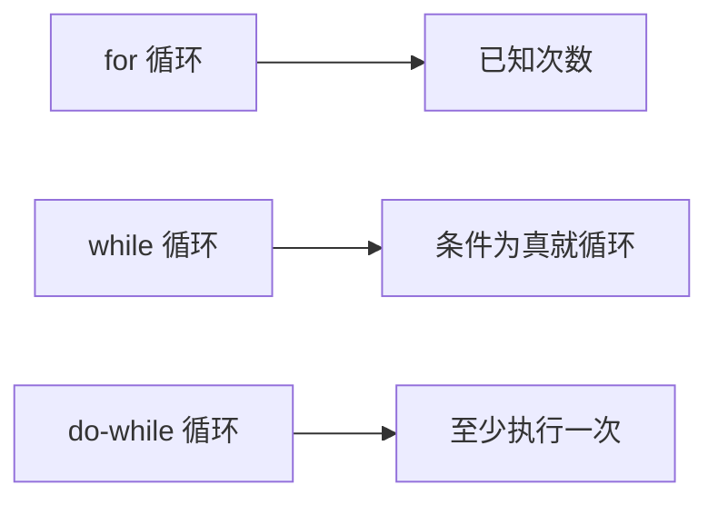
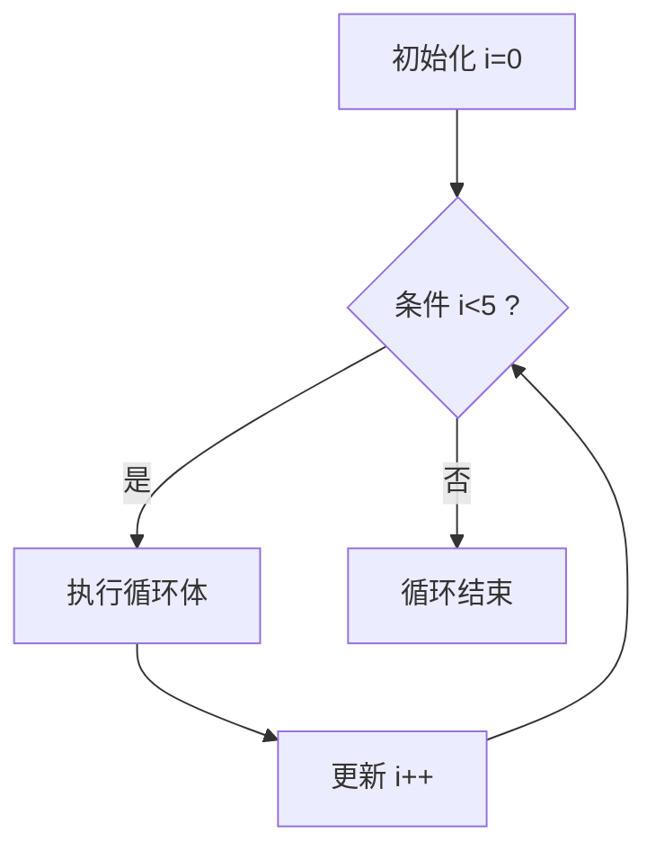
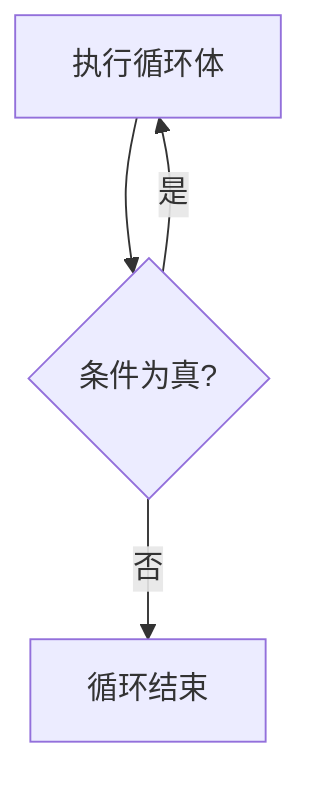
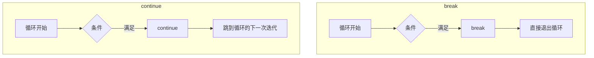

# 第 7 课：循环结构

## 什么是循环？

循环让程序能**重复执行**某段代码。C 语言提供三种循环：



---

## for 循环

### 基本语法

```c
for (初始化; 条件; 更新) {
    // 循环体
}
```



```c title="for_basic.c"
#include <stdio.h>

int main(void)
{
    // 打印 0 到 4
    for (int i = 0; i < 5; i++) {
        printf("i = %d\n", i);
    }
    // 输出：0, 1, 2, 3, 4
    
    // 打印 10 到 1（倒序）
    for (int i = 10; i >= 1; i--) {
        printf("%d ", i);
    }
    printf("\n");
    // 输出：10 9 8 7 6 5 4 3 2 1
    
    // 步长为 2
    for (int i = 0; i <= 10; i += 2) {
        printf("%d ", i);
    }
    printf("\n");
    // 输出：0 2 4 6 8 10
    
    return 0;
}
```

### 经典应用：累加求和

```c title="sum.c"
#include <stdio.h>

int main(void)
{
    // 计算 1 + 2 + 3 + ... + 100
    int sum = 0;
    for (int i = 1; i <= 100; i++) {
        sum += i;  // sum = sum + i
    }
    printf("1+2+...+100 = %d\n", sum);  // 5050
    
    // 计算阶乘 5! = 1×2×3×4×5
    int factorial = 1;
    int n = 5;
    for (int i = 1; i <= n; i++) {
        factorial *= i;
    }
    printf("%d! = %d\n", n, factorial);  // 120
    
    return 0;
}
```

---

## while 循环

### 基本语法

```c
while (条件) {
    // 条件为真就一直执行
}
```

```c title="while_basic.c"
#include <stdio.h>

int main(void)
{
    // 等价于上面的 for 循环
    int i = 0;
    while (i < 5) {
        printf("i = %d\n", i);
        i++;
    }
    
    return 0;
}
```

### while 适合的场景

`while` 特别适合**不知道循环多少次**的情况：

```c title="while_digits.c"
#include <stdio.h>

int main(void)
{
    // 计算一个数有几位
    int num;
    printf("输入一个正整数: ");
    scanf("%d", &num);
    
    int digits = 0;
    int temp = num;
    while (temp > 0) {
        digits++;
        temp /= 10;  // 去掉最后一位
    }
    printf("%d 有 %d 位数\n", num, digits);
    
    return 0;
}
```

```c title="while_guess.c"
#include <stdio.h>
#include <stdlib.h>
#include <time.h>

int main(void)
{
    // 猜数字游戏
    srand(time(NULL));
    int secret = rand() % 100 + 1;  // 1~100 的随机数
    int guess;
    int count = 0;
    
    printf("猜一个 1~100 的数字：\n");
    
    while (1) {  // 无限循环
        printf("你的猜测: ");
        scanf("%d", &guess);
        count++;
        
        if (guess == secret) {
            printf("🎉 恭喜！你猜对了！用了 %d 次\n", count);
            break;  // 跳出循环
        } else if (guess > secret) {
            printf("太大了！\n");
        } else {
            printf("太小了！\n");
        }
    }
    
    return 0;
}
```

---

## do-while 循环

### 基本语法

```c
do {
    // 至少执行一次
} while (条件);  // 注意这里有分号！
```

与 `while` 的区别：`do-while` **先执行一次，再判断条件**。



```c title="do_while.c"
#include <stdio.h>

int main(void)
{
    // 输入验证：确保输入 1~100
    int score;
    do {
        printf("请输入成绩(1-100): ");
        scanf("%d", &score);
        if (score < 1 || score > 100) {
            printf("输入无效，请重新输入！\n");
        }
    } while (score < 1 || score > 100);
    
    printf("你输入的成绩是: %d\n", score);
    
    return 0;
}
```

### 三种循环对比

| 特性 | for | while | do-while |
|------|-----|-------|----------|
| 执行次数 | 0 次或多次 | 0 次或多次 | **至少 1 次** |
| 适用场景 | 已知循环次数 | 不确定次数 | 至少执行一次 |
| 常见用途 | 遍历数组、计数 | 等待条件、读取数据 | 输入验证、菜单 |

---

## 循环控制语句

### break —— 立即跳出循环

```c title="break_example.c"
#include <stdio.h>

int main(void)
{
    // 找到第一个能被 7 整除的数
    for (int i = 1; i <= 100; i++) {
        if (i % 7 == 0) {
            printf("第一个能被7整除的数: %d\n", i);
            break;  // 找到了就退出循环
        }
    }
    // 输出：7
    
    return 0;
}
```

### continue —— 跳过本次，继续下一次

```c title="continue_example.c"
#include <stdio.h>

int main(void)
{
    // 打印 1~20 中所有奇数
    for (int i = 1; i <= 20; i++) {
        if (i % 2 == 0) {
            continue;  // 跳过偶数
        }
        printf("%d ", i);
    }
    printf("\n");
    // 输出：1 3 5 7 9 11 13 15 17 19
    
    return 0;
}
```

### break 和 continue 的区别



### goto 语句（了解即可）

`goto` 可以无条件跳转到指定标签，但**一般不推荐使用**：

```c
// 不推荐，但在跳出多层嵌套循环时有用
for (int i = 0; i < 10; i++) {
    for (int j = 0; j < 10; j++) {
        if (i == 5 && j == 5) {
            goto done;  // 直接跳出两层循环
        }
    }
}
done:
printf("跳出来了\n");
```

---

## 嵌套循环

### 九九乘法表

```c title="multiplication.c"
#include <stdio.h>

int main(void)
{
    for (int i = 1; i <= 9; i++) {
        for (int j = 1; j <= i; j++) {
            printf("%d×%d=%-4d", j, i, i * j);
        }
        printf("\n");
    }
    
    return 0;
}
```

输出：

```
1×1=1   
1×2=2   2×2=4   
1×3=3   2×3=6   3×3=9   
1×4=4   2×4=8   3×4=12  4×4=16  
1×5=5   2×5=10  3×5=15  4×5=20  5×5=25  
1×6=6   2×6=12  3×6=18  4×6=24  5×6=30  6×6=36  
1×7=7   2×7=14  3×7=21  4×7=28  5×7=35  6×7=42  7×7=49  
1×8=8   2×8=16  3×8=24  4×8=32  5×8=40  6×8=48  7×8=56  8×8=64  
1×9=9   2×9=18  3×9=27  4×9=36  5×9=45  6×9=54  7×9=63  8×9=72  9×9=81  
```

### 打印图形

```c title="triangle.c"
#include <stdio.h>

int main(void)
{
    int rows = 5;
    
    // 直角三角形
    printf("直角三角形:\n");
    for (int i = 1; i <= rows; i++) {
        for (int j = 1; j <= i; j++) {
            printf("* ");
        }
        printf("\n");
    }
    
    // 等腰三角形
    printf("\n等腰三角形:\n");
    for (int i = 1; i <= rows; i++) {
        // 打印空格
        for (int j = 1; j <= rows - i; j++) {
            printf(" ");
        }
        // 打印星号
        for (int j = 1; j <= 2 * i - 1; j++) {
            printf("*");
        }
        printf("\n");
    }
    
    return 0;
}
```

输出：

```
直角三角形:
* 
* * 
* * * 
* * * * 
* * * * * 

等腰三角形:
    *
   ***
  *****
 *******
*********
```

---

## 经典算法示例

### 判断素数

```c title="prime.c"
#include <stdio.h>

int main(void)
{
    int n;
    printf("输入一个正整数: ");
    scanf("%d", &n);
    
    if (n <= 1) {
        printf("%d 不是素数\n", n);
        return 0;
    }
    
    int is_prime = 1;  // 先假设是素数
    for (int i = 2; i * i <= n; i++) {  // 只需检查到 √n
        if (n % i == 0) {
            is_prime = 0;  // 能整除，不是素数
            break;
        }
    }
    
    printf("%d %s素数\n", n, is_prime ? "是" : "不是");
    
    return 0;
}
```

### 斐波那契数列

```c title="fibonacci.c"
#include <stdio.h>

int main(void)
{
    int n;
    printf("打印多少个斐波那契数: ");
    scanf("%d", &n);
    
    int a = 0, b = 1;
    
    printf("斐波那契数列: ");
    for (int i = 0; i < n; i++) {
        printf("%d ", a);
        int temp = a + b;
        a = b;
        b = temp;
    }
    printf("\n");
    // 输入 10，输出：0 1 1 2 3 5 8 13 21 34
    
    return 0;
}
```

### 数字翻转

```c title="reverse.c"
#include <stdio.h>

int main(void)
{
    int num, reversed = 0;
    printf("输入一个整数: ");
    scanf("%d", &num);
    
    int original = num;
    while (num != 0) {
        reversed = reversed * 10 + num % 10;
        num /= 10;
    }
    
    printf("%d 翻转后是 %d\n", original, reversed);
    // 输入 12345，输出：54321
    
    return 0;
}
```

---

## 无限循环

嵌入式开发中，主循环永不退出：

```c
// 方式 1
while (1) {
    // 永远执行
}

// 方式 2
for (;;) {
    // 永远执行
}
```

```c title="embedded_loop.c"
// 嵌入式主循环典型结构
#include <stdio.h>

int main(void)
{
    printf("系统启动...\n");
    
    int count = 0;
    while (1) {
        // 模拟嵌入式主循环
        printf("主循环第 %d 次运行\n", ++count);
        
        // 模拟退出条件
        if (count >= 5) {
            printf("演示结束\n");
            break;
        }
    }
    
    return 0;
}
```

---

## 练习题

### 练习 1：水仙花数

找出所有三位数中的水仙花数。水仙花数：各位数字的立方和等于该数本身。

例如：$153 = 1^3 + 5^3 + 3^3$

??? note "参考答案"
    ```c
    #include <stdio.h>
    
    int main(void)
    {
        printf("水仙花数: ");
        for (int n = 100; n <= 999; n++) {
            int a = n / 100;       // 百位
            int b = n / 10 % 10;   // 十位
            int c = n % 10;        // 个位
            
            if (a*a*a + b*b*b + c*c*c == n) {
                printf("%d ", n);
            }
        }
        printf("\n");
        // 输出：153 370 371 407
        return 0;
    }
    ```

### 练习 2：打印所有素数

打印 1~100 之间的所有素数。

??? note "参考答案"
    ```c
    #include <stdio.h>
    
    int main(void)
    {
        printf("1~100 的素数:\n");
        int count = 0;
        
        for (int n = 2; n <= 100; n++) {
            int is_prime = 1;
            for (int i = 2; i * i <= n; i++) {
                if (n % i == 0) {
                    is_prime = 0;
                    break;
                }
            }
            if (is_prime) {
                printf("%4d", n);
                count++;
                if (count % 10 == 0) printf("\n");
            }
        }
        printf("\n共 %d 个素数\n", count);
        return 0;
    }
    ```

### 练习 3：猜数字游戏

改进猜数字游戏：限制最多猜 7 次，猜不出来就失败。

### 练习 4：菱形图案

输入行数 n（奇数），打印一个菱形：

```
  *
 ***
*****
 ***
  *
```

??? note "参考答案"
    ```c
    #include <stdio.h>
    
    int main(void)
    {
        int n;
        printf("输入行数(奇数): ");
        scanf("%d", &n);
        
        int mid = n / 2;
        
        for (int i = 0; i < n; i++) {
            int stars;
            int spaces;
            
            if (i <= mid) {
                stars = 2 * i + 1;
                spaces = mid - i;
            } else {
                stars = 2 * (n - 1 - i) + 1;
                spaces = i - mid;
            }
            
            for (int j = 0; j < spaces; j++) printf(" ");
            for (int j = 0; j < stars; j++) printf("*");
            printf("\n");
        }
        
        return 0;
    }
    ```

### 练习 5：最大公约数

输入两个正整数，求它们的最大公约数（GCD）。提示：使用辗转相除法。

??? note "参考答案"
    ```c
    #include <stdio.h>
    
    int main(void)
    {
        int a, b;
        printf("输入两个正整数: ");
        scanf("%d %d", &a, &b);
        
        int original_a = a, original_b = b;
        
        // 辗转相除法
        while (b != 0) {
            int temp = b;
            b = a % b;
            a = temp;
        }
        
        printf("GCD(%d, %d) = %d\n", original_a, original_b, a);
        return 0;
    }
    ```

---

## 本课小结

| 知识点 | 说明 |
|--------|------|
| `for` | `for (初始化; 条件; 更新)`，适合已知次数 |
| `while` | `while (条件)`，适合不确定次数 |
| `do-while` | `do { } while (条件);`，至少执行一次 |
| `break` | 立即跳出当前循环 |
| `continue` | 跳过本次循环，继续下一次 |
| 嵌套循环 | 循环里面套循环，打印图形、遍历二维数据 |
| 无限循环 | `while(1)` 或 `for(;;)`，嵌入式主循环 |

> **下一课**：[函数基础](../08-function-basic/README.md) —— 学习代码复用的核心方式
