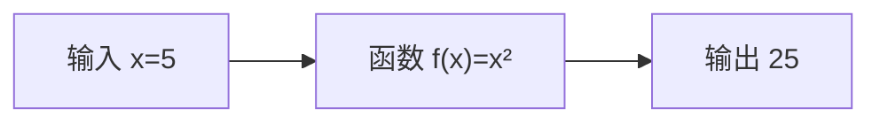
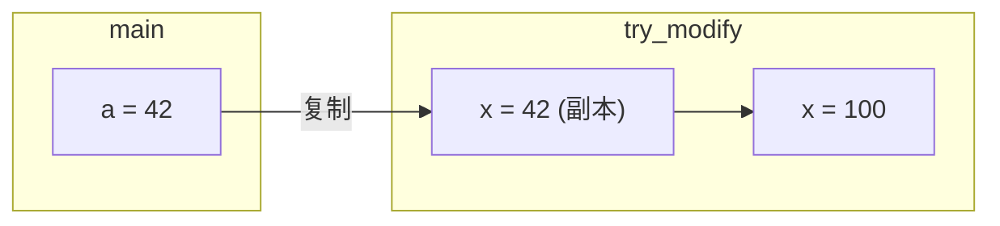

# 第 8 课：函数基础

## 什么是函数？

函数是一段**完成特定任务的代码块**，可以被反复调用。就像数学里的函数 $f(x) = x^2$：



### 为什么需要函数？

```c
// ❌ 不用函数：重复代码
printf("==========\n");
printf(" 欢迎光临\n");
printf("==========\n");
// ... 其他代码 ...
printf("==========\n");
printf(" 欢迎光临\n");
printf("==========\n");

// ✅ 用函数：写一次，调用多次
void welcome(void) {
    printf("==========\n");
    printf(" 欢迎光临\n");
    printf("==========\n");
}
welcome();  // 第一次调用
welcome();  // 第二次调用
```

---

## 函数的定义与调用

### 语法

```c
返回类型 函数名(参数列表)
{
    // 函数体
    return 返回值;  // 如果返回类型是 void，可以省略
}
```

### 完整示例

```c title="function_basic.c"
#include <stdio.h>

// 函数定义：计算两个数的和
int add(int a, int b)
{
    return a + b;
}

// 函数定义：打印分隔线
void print_line(void)
{
    printf("========================\n");
}

// 函数定义：打印 n 次星号
void print_stars(int n)
{
    for (int i = 0; i < n; i++) {
        printf("* ");
    }
    printf("\n");
}

int main(void)
{
    // 调用函数
    print_line();
    
    int result = add(3, 5);
    printf("3 + 5 = %d\n", result);
    
    // 也可以直接在 printf 中调用
    printf("10 + 20 = %d\n", add(10, 20));
    
    print_stars(5);   // * * * * *
    print_stars(3);   // * * *
    
    print_line();
    
    return 0;
}
```

---

## 函数的三要素

### 1. 返回类型

| 返回类型 | 说明 | 示例 |
|----------|------|------|
| `int` | 返回整数 | `int add(int a, int b)` |
| `double` | 返回浮点数 | `double average(int a, int b)` |
| `char` | 返回字符 | `char to_upper(char c)` |
| `void` | 不返回值 | `void print_hello(void)` |

```c
// 返回 int
int max(int a, int b)
{
    return (a > b) ? a : b;
}

// 返回 double
double circle_area(double radius)
{
    return 3.14159 * radius * radius;
}

// 不返回值
void greet(void)
{
    printf("Hello!\n");
    // 可以省略 return，或者写 return; （不带值）
}
```

### 2. 参数

```c
// 无参数
void hello(void)
{
    printf("Hello!\n");
}

// 一个参数
int square(int x)
{
    return x * x;
}

// 多个参数
int add(int a, int b)
{
    return a + b;
}

// 不同类型的参数
void print_info(char *name, int age, double height)
{
    printf("%s, %d岁, %.2f米\n", name, age, height);
}
```

### 3. 函数体

函数体是 `{ }` 之间的代码。`return` 语句会**立即结束**函数的执行：

```c
int abs_value(int x)
{
    if (x >= 0) {
        return x;     // 执行到这里就返回，不会继续往下
    }
    return -x;        // x < 0 时执行这里
}
```

---

## 函数声明（函数原型）

如果函数定义在 `main` 之后，需要在前面**声明**：

```c title="declaration.c"
#include <stdio.h>

// 函数声明（函数原型）—— 告诉编译器这个函数存在
int add(int a, int b);
void greet(void);

int main(void)
{
    greet();
    printf("3 + 5 = %d\n", add(3, 5));
    return 0;
}

// 函数定义 —— 放在 main 后面也没问题
int add(int a, int b)
{
    return a + b;
}

void greet(void)
{
    printf("Hello!\n");
}
```

!!! tip "声明时可以省略参数名"
    ```c
    int add(int, int);     // ✅ 合法，但不推荐
    int add(int a, int b); // ✅ 更好，参数名增加可读性
    ```

---

## 参数传递：值传递

C 语言的函数参数传递是**值传递**——函数拿到的是参数的**副本**：

```c title="pass_by_value.c"
#include <stdio.h>

void try_modify(int x)
{
    x = 100;  // 只修改了副本
    printf("函数内: x = %d\n", x);  // 100
}

int main(void)
{
    int a = 42;
    try_modify(a);
    printf("函数外: a = %d\n", a);  // 42（没有改变！）
    
    return 0;
}
```



!!! note "想在函数内修改外部变量怎么办？"
    需要用**指针**（第 13 课会详细讲解）：
    ```c
    void modify(int *x)
    {
        *x = 100;  // 通过指针修改原始变量
    }
    
    int a = 42;
    modify(&a);  // 传地址
    printf("a = %d\n", a);  // 100
    ```

---

## 实用函数示例

### 求最大值

```c
int max(int a, int b)
{
    return (a > b) ? a : b;
}

// 求三个数的最大值
int max3(int a, int b, int c)
{
    return max(max(a, b), c);  // 函数可以调用其他函数
}
```

### 判断素数

```c
int is_prime(int n)
{
    if (n <= 1) return 0;
    if (n <= 3) return 1;
    if (n % 2 == 0) return 0;
    
    for (int i = 3; i * i <= n; i += 2) {
        if (n % i == 0) return 0;
    }
    return 1;
}
```

### 温度转换

```c
double celsius_to_fahrenheit(double c)
{
    return c * 1.8 + 32.0;
}

double fahrenheit_to_celsius(double f)
{
    return (f - 32.0) / 1.8;
}
```

---

## 综合示例

```c title="math_functions.c"
#include <stdio.h>

// 函数声明
int factorial(int n);
int power(int base, int exp);
int gcd(int a, int b);

int main(void)
{
    printf("5! = %d\n", factorial(5));          // 120
    printf("2^10 = %d\n", power(2, 10));        // 1024
    printf("GCD(48, 18) = %d\n", gcd(48, 18));  // 6
    
    // 打印 100 以内的素数
    printf("\n100以内的素数: ");
    int count = 0;
    for (int i = 2; i <= 100; i++) {
        if (is_prime(i)) {
            printf("%d ", i);
            count++;
        }
    }
    printf("\n共 %d 个\n", count);
    
    return 0;
}

// 阶乘
int factorial(int n)
{
    int result = 1;
    for (int i = 2; i <= n; i++) {
        result *= i;
    }
    return result;
}

// 幂运算
int power(int base, int exp)
{
    int result = 1;
    for (int i = 0; i < exp; i++) {
        result *= base;
    }
    return result;
}

// 最大公约数（辗转相除法）
int gcd(int a, int b)
{
    while (b != 0) {
        int temp = b;
        b = a % b;
        a = temp;
    }
    return a;
}

// 判断素数
int is_prime(int n)
{
    if (n <= 1) return 0;
    for (int i = 2; i * i <= n; i++) {
        if (n % i == 0) return 0;
    }
    return 1;
}
```

---

## 练习题

### 练习 1：绝对值函数

编写函数 `int abs_val(int x)`，返回 x 的绝对值。

### 练习 2：最小公倍数

编写函数 `int lcm(int a, int b)`，利用公式 $LCM = \frac{a \times b}{GCD(a, b)}$ 求最小公倍数。

??? note "参考答案"
    ```c
    int gcd(int a, int b)
    {
        while (b != 0) {
            int temp = b;
            b = a % b;
            a = temp;
        }
        return a;
    }
    
    int lcm(int a, int b)
    {
        return a / gcd(a, b) * b;  // 先除后乘，避免溢出
    }
    ```

### 练习 3：字符判断函数

编写以下函数：
- `int is_digit(char c)` — 判断是否是数字
- `int is_upper(char c)` — 判断是否是大写字母
- `char to_lower(char c)` — 转小写

??? note "参考答案"
    ```c
    int is_digit(char c) { return c >= '0' && c <= '9'; }
    int is_upper(char c) { return c >= 'A' && c <= 'Z'; }
    char to_lower(char c) { return is_upper(c) ? c + 32 : c; }
    ```

---

## 本课小结

| 知识点 | 说明 |
|--------|------|
| 函数定义 | `返回类型 函数名(参数) { 函数体 }` |
| 函数声明 | 在使用前声明函数原型 |
| 返回值 | `return 值;`，`void` 函数不返回值 |
| 值传递 | 函数参数是副本，不会修改原始变量 |
| 函数调用 | `函数名(参数)` |

> **下一课**：[函数进阶](../09-function-advanced/README.md) —— 递归、作用域与静态变量
