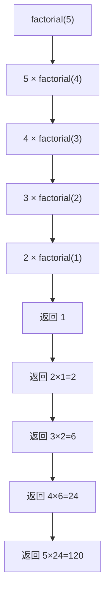

# 第 9 课：函数进阶

## 递归函数

递归就是**函数调用自己**。每个递归必须有：

1. **基准条件**（Base Case）：什么时候停止递归
2. **递归步骤**：把问题分解为更小的子问题

### 经典示例：阶乘

$n! = n \times (n-1)!$，其中 $0! = 1$

```c title="recursive_factorial.c"
#include <stdio.h>

int factorial(int n)
{
    // 基准条件
    if (n <= 1) {
        return 1;
    }
    // 递归步骤
    return n * factorial(n - 1);
}

int main(void)
{
    printf("5! = %d\n", factorial(5));  // 120
    return 0;
}
```

执行过程：



### 斐波那契数列（递归版）

```c
// F(0)=0, F(1)=1, F(n)=F(n-1)+F(n-2)
int fibonacci(int n)
{
    if (n <= 0) return 0;
    if (n == 1) return 1;
    return fibonacci(n - 1) + fibonacci(n - 2);
}
```

!!! warning "递归的效率问题"
    斐波那契递归版效率很低（指数级复杂度），因为有大量重复计算：
    ```
    fib(5) = fib(4) + fib(3)
    fib(4) = fib(3) + fib(2)   ← fib(3) 被计算了两次！
    ```
    实际开发中，对于这类问题，**用循环更好**。

### 递归 vs 循环

| 特性 | 递归 | 循环 |
|------|------|------|
| 代码 | 通常更简洁 | 可能更长 |
| 性能 | 函数调用有开销 | 通常更快 |
| 内存 | 占用栈空间 | 占用少 |
| 适用场景 | 树/图遍历、分治 | 简单重复 |

!!! tip "嵌入式中谨慎使用递归"
    嵌入式系统栈空间有限（通常只有几 KB），递归层次太深会**栈溢出**。
    优先使用循环实现。

---

## 作用域

作用域决定了变量**在哪里可以被访问**。

### 局部变量

在函数或代码块 `{ }` 内定义的变量，只在该范围内有效：

```c title="local_scope.c"
#include <stdio.h>

void func(void)
{
    int x = 10;  // 局部变量，只在 func 内有效
    printf("func: x = %d\n", x);
}

int main(void)
{
    int x = 20;  // 另一个局部变量，和 func 的 x 没关系
    printf("main: x = %d\n", x);
    
    func();
    
    // printf("%d\n", y);  // ❌ 错误：y 在 func 中定义，这里看不到
    
    // 代码块作用域
    {
        int y = 30;  // 只在这个 {} 内有效
        printf("block: y = %d\n", y);
    }
    // printf("%d\n", y);  // ❌ 错误：y 已经超出作用域
    
    // for 循环中的变量
    for (int i = 0; i < 3; i++) {
        printf("i = %d\n", i);
    }
    // printf("%d\n", i);  // ❌ 错误：i 只在 for 循环内有效
    
    return 0;
}
```

### 全局变量

在所有函数**外部**定义的变量，整个文件都可以访问：

```c title="global_scope.c"
#include <stdio.h>

int count = 0;  // 全局变量

void increment(void)
{
    count++;  // 可以访问全局变量
}

void print_count(void)
{
    printf("count = %d\n", count);  // 也可以访问
}

int main(void)
{
    increment();
    increment();
    increment();
    print_count();  // count = 3
    
    return 0;
}
```

!!! warning "尽量少用全局变量"
    - 全局变量任何函数都能修改，难以追踪 Bug
    - 多个函数依赖全局变量，**耦合度高**
    - 在嵌入式中，如果必须用全局变量，加上注释说明用途
    
    ```c
    // ✅ 如果必须用，给一个清晰的名字和注释
    static int g_sensor_temperature = 0;  // 传感器温度（单位：0.1°C）
    ```

### 局部变量 vs 全局变量

| 特性 | 局部变量 | 全局变量 |
|------|----------|----------|
| 定义位置 | 函数/代码块内 | 所有函数外 |
| 作用范围 | 定义它的 `{}` 内 | 整个文件 |
| 生命周期 | 函数执行时创建，结束时销毁 | 程序运行期间一直存在 |
| 默认初始值 | 不确定（垃圾值） | 0 |
| 存储位置 | 栈（Stack） | 数据段 |

---

## 静态局部变量 `static`

普通局部变量每次调用函数都重新创建。`static` 局部变量**只初始化一次**，函数返回后**值保持不变**：

```c title="static_var.c"
#include <stdio.h>

void counter(void)
{
    static int count = 0;  // 只初始化一次！
    count++;
    printf("第 %d 次调用\n", count);
}

void normal(void)
{
    int count = 0;  // 每次都重新初始化
    count++;
    printf("普通: count = %d\n", count);
}

int main(void)
{
    counter();  // 第 1 次调用
    counter();  // 第 2 次调用
    counter();  // 第 3 次调用
    
    normal();   // 普通: count = 1
    normal();   // 普通: count = 1（每次都是 1）
    
    return 0;
}
```

输出：

```
第 1 次调用
第 2 次调用
第 3 次调用
普通: count = 1
普通: count = 1
```

### static 的典型应用

```c
// 生成唯一 ID
int get_next_id(void)
{
    static int id = 0;
    return ++id;
}

printf("ID: %d\n", get_next_id());  // 1
printf("ID: %d\n", get_next_id());  // 2
printf("ID: %d\n", get_next_id());  // 3
```

---

## 多函数协作

### 示例：简易成绩管理

```c title="grade_manager.c"
#include <stdio.h>

#define MAX_STUDENTS 5

// 函数声明
void input_scores(int scores[], int n);
double calc_average(int scores[], int n);
int find_max(int scores[], int n);
int find_min(int scores[], int n);
void print_report(int scores[], int n);

int main(void)
{
    int scores[MAX_STUDENTS];
    
    input_scores(scores, MAX_STUDENTS);
    print_report(scores, MAX_STUDENTS);
    
    return 0;
}

void input_scores(int scores[], int n)
{
    printf("请输入 %d 个学生的成绩:\n", n);
    for (int i = 0; i < n; i++) {
        printf("学生 %d: ", i + 1);
        scanf("%d", &scores[i]);
    }
}

double calc_average(int scores[], int n)
{
    int sum = 0;
    for (int i = 0; i < n; i++) {
        sum += scores[i];
    }
    return (double)sum / n;
}

int find_max(int scores[], int n)
{
    int max = scores[0];
    for (int i = 1; i < n; i++) {
        if (scores[i] > max) max = scores[i];
    }
    return max;
}

int find_min(int scores[], int n)
{
    int min = scores[0];
    for (int i = 1; i < n; i++) {
        if (scores[i] < min) min = scores[i];
    }
    return min;
}

void print_report(int scores[], int n)
{
    printf("\n===== 成绩报告 =====\n");
    printf("人数:   %d\n", n);
    printf("平均分: %.1f\n", calc_average(scores, n));
    printf("最高分: %d\n", find_max(scores, n));
    printf("最低分: %d\n", find_min(scores, n));
}
```

---

## 练习题

### 练习 1：递归求和

用递归实现 $1 + 2 + 3 + ... + n$。

??? note "参考答案"
    ```c
    int sum(int n)
    {
        if (n <= 1) return n;
        return n + sum(n - 1);
    }
    ```

### 练习 2：递归幂运算

用递归实现 $base^{exp}$（提示：$x^n = x \times x^{n-1}$）。

### 练习 3：静态计数器

编写一个函数 `record_call()`，每次调用打印"这是第 N 次调用"。用 `static` 实现。

### 练习 4：汉诺塔

经典递归问题：将 n 个盘子从 A 柱移到 C 柱（借助 B 柱）。

??? note "参考答案"
    ```c
    #include <stdio.h>
    
    void hanoi(int n, char from, char to, char via)
    {
        if (n == 1) {
            printf("移动盘子 %d: %c → %c\n", n, from, to);
            return;
        }
        hanoi(n - 1, from, via, to);
        printf("移动盘子 %d: %c → %c\n", n, from, to);
        hanoi(n - 1, via, to, from);
    }
    
    int main(void)
    {
        hanoi(3, 'A', 'C', 'B');
        return 0;
    }
    ```

---

## 本课小结

| 知识点 | 说明 |
|--------|------|
| 递归 | 函数调用自己，必须有基准条件 |
| 局部变量 | 在 `{}` 内有效，函数结束就销毁 |
| 全局变量 | 在所有函数外定义，整个文件有效 |
| `static` 局部变量 | 只初始化一次，值在函数调用间保持 |
| 作用域 | 变量的可见范围 |
| 生命周期 | 变量存在的时间 |

> **下一课**：[数组](../10-array/README.md) —— 存储和处理批量数据
