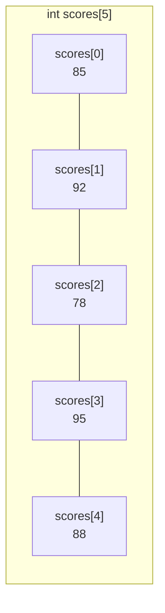
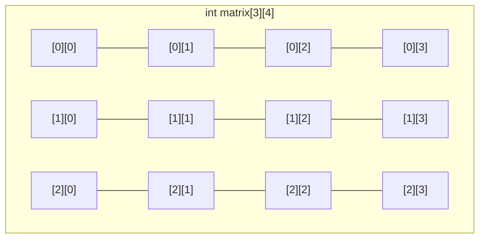

# 第 10 课：数组

## 什么是数组？

数组是**一组相同类型的数据**的集合，存储在连续的内存空间中。



---

## 一维数组

### 声明与初始化

```c
// 声明
int scores[5];               // 5 个 int 元素

// 声明并初始化
int scores[5] = {85, 92, 78, 95, 88};

// 部分初始化（其余为 0）
int scores[5] = {85, 92};    // {85, 92, 0, 0, 0}

// 全部初始化为 0
int scores[5] = {0};         // {0, 0, 0, 0, 0}

// 自动推断大小
int scores[] = {85, 92, 78, 95, 88};  // 编译器自动算出大小为 5
```

### 访问元素

数组下标从 **0** 开始！

```c title="array_basic.c"
#include <stdio.h>

int main(void)
{
    int scores[5] = {85, 92, 78, 95, 88};
    
    // 读取
    printf("第1个学生: %d\n", scores[0]);  // 85
    printf("第3个学生: %d\n", scores[2]);  // 78
    
    // 修改
    scores[2] = 80;
    printf("修改后: %d\n", scores[2]);     // 80
    
    // 遍历
    printf("所有成绩: ");
    for (int i = 0; i < 5; i++) {
        printf("%d ", scores[i]);
    }
    printf("\n");
    
    return 0;
}
```

!!! warning "数组越界 —— C 语言最常见的 Bug"
    ```c
    int arr[5] = {1, 2, 3, 4, 5};
    
    arr[5] = 100;  // ❌ 越界！有效下标是 0~4
    arr[-1] = 0;   // ❌ 越界！
    
    // C 语言不检查数组边界！越界可能：
    // 1. 修改其他变量的值（很难发现的 Bug）
    // 2. 程序崩溃（段错误 Segmentation Fault）
    // 3. 安全漏洞（缓冲区溢出攻击）
    ```

### 计算数组大小

```c
int arr[] = {10, 20, 30, 40, 50};
int size = sizeof(arr) / sizeof(arr[0]);  // 20 / 4 = 5
printf("数组有 %d 个元素\n", size);
```

---

### 数组的常用操作

```c title="array_operations.c"
#include <stdio.h>

int main(void)
{
    int arr[] = {34, 12, 56, 78, 23, 45, 67, 89, 11, 90};
    int n = sizeof(arr) / sizeof(arr[0]);
    
    // 1. 求和与平均值
    int sum = 0;
    for (int i = 0; i < n; i++) {
        sum += arr[i];
    }
    printf("总和: %d, 平均: %.1f\n", sum, (double)sum / n);
    
    // 2. 找最大值和最小值
    int max = arr[0], min = arr[0];
    int max_idx = 0, min_idx = 0;
    for (int i = 1; i < n; i++) {
        if (arr[i] > max) { max = arr[i]; max_idx = i; }
        if (arr[i] < min) { min = arr[i]; min_idx = i; }
    }
    printf("最大值: arr[%d] = %d\n", max_idx, max);
    printf("最小值: arr[%d] = %d\n", min_idx, min);
    
    // 3. 查找元素
    int target = 56;
    int found = -1;
    for (int i = 0; i < n; i++) {
        if (arr[i] == target) {
            found = i;
            break;
        }
    }
    if (found >= 0) {
        printf("找到 %d，位置: arr[%d]\n", target, found);
    } else {
        printf("没找到 %d\n", target);
    }
    
    // 4. 数组逆序
    for (int i = 0; i < n / 2; i++) {
        int temp = arr[i];
        arr[i] = arr[n - 1 - i];
        arr[n - 1 - i] = temp;
    }
    printf("逆序: ");
    for (int i = 0; i < n; i++) printf("%d ", arr[i]);
    printf("\n");
    
    return 0;
}
```

---

## 数组作为函数参数

数组传给函数时，传的是**数组的地址**（不是复制），所以函数可以修改原数组：

```c title="array_param.c"
#include <stdio.h>

// 打印数组
void print_array(int arr[], int n)
{
    for (int i = 0; i < n; i++) {
        printf("%d ", arr[i]);
    }
    printf("\n");
}

// 数组求和
int array_sum(int arr[], int n)
{
    int sum = 0;
    for (int i = 0; i < n; i++) {
        sum += arr[i];
    }
    return sum;
}

// 冒泡排序（修改原数组）
void bubble_sort(int arr[], int n)
{
    for (int i = 0; i < n - 1; i++) {
        for (int j = 0; j < n - 1 - i; j++) {
            if (arr[j] > arr[j + 1]) {
                int temp = arr[j];
                arr[j] = arr[j + 1];
                arr[j + 1] = temp;
            }
        }
    }
}

int main(void)
{
    int data[] = {64, 34, 25, 12, 22, 11, 90};
    int n = sizeof(data) / sizeof(data[0]);
    
    printf("排序前: ");
    print_array(data, n);
    
    printf("总和: %d\n", array_sum(data, n));
    
    bubble_sort(data, n);
    
    printf("排序后: ");
    print_array(data, n);
    
    return 0;
}
```

!!! warning "数组参数不能用 sizeof 计算大小"
    ```c
    void func(int arr[])
    {
        // ❌ 错误！sizeof(arr) 是指针大小（4或8），不是数组大小
        int n = sizeof(arr) / sizeof(arr[0]);
    }
    
    // ✅ 正确：把大小作为参数传进去
    void func(int arr[], int n)
    {
        // 使用 n 作为数组大小
    }
    ```

---

## 二维数组

二维数组就像一个**表格**（行和列）：



### 声明与初始化

```c
// 声明
int matrix[3][4];  // 3行4列

// 初始化
int matrix[3][4] = {
    {1, 2, 3, 4},     // 第0行
    {5, 6, 7, 8},     // 第1行
    {9, 10, 11, 12}   // 第2行
};

// 也可以这样写（自动按行填充）
int matrix[3][4] = {1,2,3,4, 5,6,7,8, 9,10,11,12};

// 全部初始化为 0
int matrix[3][4] = {0};
```

### 遍历二维数组

```c title="matrix.c"
#include <stdio.h>

int main(void)
{
    int matrix[3][4] = {
        {1, 2, 3, 4},
        {5, 6, 7, 8},
        {9, 10, 11, 12}
    };
    
    // 遍历并打印
    for (int i = 0; i < 3; i++) {        // 行
        for (int j = 0; j < 4; j++) {    // 列
            printf("%4d", matrix[i][j]);
        }
        printf("\n");
    }
    
    // 求所有元素的和
    int sum = 0;
    for (int i = 0; i < 3; i++) {
        for (int j = 0; j < 4; j++) {
            sum += matrix[i][j];
        }
    }
    printf("总和: %d\n", sum);  // 78
    
    return 0;
}
```

### 实际应用：学生成绩表

```c title="score_table.c"
#include <stdio.h>

#define STUDENTS 3
#define SUBJECTS 4

int main(void)
{
    // 3个学生，4门课的成绩
    int scores[STUDENTS][SUBJECTS] = {
        {85, 92, 78, 90},  // 张三
        {90, 88, 95, 87},  // 李四
        {78, 96, 82, 91}   // 王五
    };
    const char *names[] = {"张三", "李四", "王五"};
    const char *subjects[] = {"语文", "数学", "英语", "物理"};
    
    // 打印表头
    printf("%-8s", "姓名");
    for (int j = 0; j < SUBJECTS; j++) {
        printf("%8s", subjects[j]);
    }
    printf("%8s\n", "平均分");
    printf("------------------------------------------------\n");
    
    // 打印每个学生的成绩和平均分
    for (int i = 0; i < STUDENTS; i++) {
        printf("%-8s", names[i]);
        int sum = 0;
        for (int j = 0; j < SUBJECTS; j++) {
            printf("%8d", scores[i][j]);
            sum += scores[i][j];
        }
        printf("%8.1f\n", (double)sum / SUBJECTS);
    }
    
    // 每科平均分
    printf("------------------------------------------------\n");
    printf("%-8s", "平均");
    for (int j = 0; j < SUBJECTS; j++) {
        int sum = 0;
        for (int i = 0; i < STUDENTS; i++) {
            sum += scores[i][j];
        }
        printf("%8.1f", (double)sum / STUDENTS);
    }
    printf("\n");
    
    return 0;
}
```

---

## 字符数组（字符串预览）

C 语言中，字符串就是**字符数组**，以 `\0` 结尾：

```c title="char_array.c"
#include <stdio.h>

int main(void)
{
    // 字符数组
    char name1[] = {'H', 'e', 'l', 'l', 'o', '\0'};
    
    // 字符串字面量（自动加 \0）
    char name2[] = "Hello";
    
    printf("%s\n", name1);  // Hello
    printf("%s\n", name2);  // Hello
    printf("长度: %zu\n", sizeof(name2));  // 6（包括 \0）
    
    // 遍历字符串中的每个字符
    for (int i = 0; name2[i] != '\0'; i++) {
        printf("name2[%d] = '%c' (ASCII: %d)\n", i, name2[i], name2[i]);
    }
    
    return 0;
}
```

---

## 练习题

### 练习 1：数组统计

输入 10 个整数，找出最大值、最小值、平均值，并统计大于平均值的个数。

??? note "参考答案"
    ```c
    #include <stdio.h>
    
    int main(void)
    {
        int arr[10];
        printf("输入 10 个整数:\n");
        for (int i = 0; i < 10; i++) {
            scanf("%d", &arr[i]);
        }
        
        int max = arr[0], min = arr[0], sum = 0;
        for (int i = 0; i < 10; i++) {
            if (arr[i] > max) max = arr[i];
            if (arr[i] < min) min = arr[i];
            sum += arr[i];
        }
        double avg = (double)sum / 10;
        
        int above = 0;
        for (int i = 0; i < 10; i++) {
            if (arr[i] > avg) above++;
        }
        
        printf("最大值: %d\n", max);
        printf("最小值: %d\n", min);
        printf("平均值: %.1f\n", avg);
        printf("大于平均值的个数: %d\n", above);
        return 0;
    }
    ```

### 练习 2：数组去重

输入一组数，去掉重复的元素后输出。

### 练习 3：矩阵转置

输入一个 3×3 矩阵，输出它的转置矩阵。

??? note "参考答案"
    ```c
    #include <stdio.h>
    
    int main(void)
    {
        int m[3][3] = {{1,2,3}, {4,5,6}, {7,8,9}};
        int t[3][3];
        
        // 转置
        for (int i = 0; i < 3; i++) {
            for (int j = 0; j < 3; j++) {
                t[j][i] = m[i][j];
            }
        }
        
        printf("原矩阵:\n");
        for (int i = 0; i < 3; i++) {
            for (int j = 0; j < 3; j++) printf("%4d", m[i][j]);
            printf("\n");
        }
        
        printf("转置后:\n");
        for (int i = 0; i < 3; i++) {
            for (int j = 0; j < 3; j++) printf("%4d", t[i][j]);
            printf("\n");
        }
        
        return 0;
    }
    ```

### 练习 4：选择排序

用选择排序算法对数组从小到大排序。

??? note "参考答案"
    ```c
    void selection_sort(int arr[], int n)
    {
        for (int i = 0; i < n - 1; i++) {
            int min_idx = i;
            for (int j = i + 1; j < n; j++) {
                if (arr[j] < arr[min_idx]) {
                    min_idx = j;
                }
            }
            if (min_idx != i) {
                int temp = arr[i];
                arr[i] = arr[min_idx];
                arr[min_idx] = temp;
            }
        }
    }
    ```

---

## 本课小结

| 知识点 | 说明 |
|--------|------|
| 数组声明 | `int arr[大小]`，下标从 0 开始 |
| 初始化 | `{值1, 值2, ...}`，`{0}` 全部初始化为 0 |
| 数组大小 | `sizeof(arr) / sizeof(arr[0])` |
| 数组参数 | 传的是地址，函数可以修改原数组 |
| 二维数组 | `int m[行][列]`，用嵌套循环遍历 |
| 越界 | C 不检查边界，越界是严重的 Bug |
| 字符数组 | 字符串是以 `\0` 结尾的 char 数组 |

> **下一课**：[指针基础](../11-pointer-basic/README.md) —— 打开 C 语言最强大的武器
