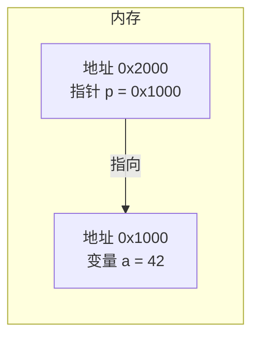
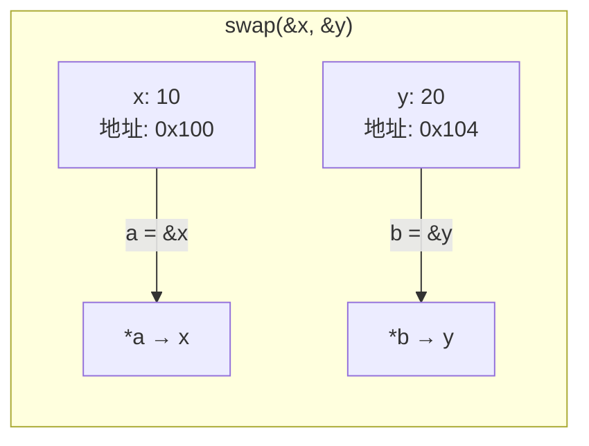

# 第 11 课：指针基础

## 什么是指针？

**指针就是一个存储"内存地址"的变量。** 把它想象成一个路标，指向某个数据存放的位置。



### 为什么需要指针？

| 场景 | 说明 |
|------|------|
| 函数修改外部变量 | 值传递无法修改，指针可以 |
| 动态内存分配 | `malloc` 返回指针 |
| 数组和字符串操作 | 数组名本质就是指针 |
| 嵌入式硬件操作 | 直接通过地址操作寄存器 |

---

## 地址与取地址运算符 `&`

每个变量在内存中都有一个**地址**：

```c title="address.c"
#include <stdio.h>

int main(void)
{
    int a = 42;
    double b = 3.14;
    char c = 'X';
    
    printf("a 的值: %d,  地址: %p\n", a, (void *)&a);
    printf("b 的值: %f,  地址: %p\n", b, (void *)&b);
    printf("c 的值: %c,  地址: %p\n", c, (void *)&c);
    
    return 0;
}
```

输出（地址每次运行可能不同）：

```
a 的值: 42,  地址: 0x7ffd5a3c4abc
b 的值: 3.140000,  地址: 0x7ffd5a3c4ab0
c 的值: X,  地址: 0x7ffd5a3c4aaf
```

---

## 指针变量

### 声明指针

```c
int *p;       // p 是一个指向 int 的指针
double *q;    // q 是一个指向 double 的指针
char *r;      // r 是一个指向 char 的指针
```

`*` 表示"这是一个指针变量"。

### 指针的使用

```c title="pointer_basic.c"
#include <stdio.h>

int main(void)
{
    int a = 42;
    int *p = &a;   // p 存储 a 的地址
    
    printf("a 的值:   %d\n", a);       // 42
    printf("a 的地址: %p\n", (void *)&a);
    printf("p 的值:   %p\n", (void *)p);   // 和 &a 相同
    printf("*p 的值:  %d\n", *p);      // 42（通过 p 访问 a 的值）
    
    // 通过指针修改 a 的值
    *p = 100;
    printf("修改后 a = %d\n", a);      // 100
    
    return 0;
}
```

### 两个核心运算符

| 运算符 | 名称 | 作用 | 示例 |
|--------|------|------|------|
| `&` | 取地址 | 获取变量的内存地址 | `&a` → 得到 a 的地址 |
| `*` | 解引用 | 通过地址访问/修改值 | `*p` → 得到 p 指向的值 |

```c
int a = 42;
int *p = &a;    // & 取地址，p 指向 a

printf("%d\n", *p);  // * 解引用，得到 42
*p = 100;            // * 解引用，修改 a 的值
```

!!! tip "记忆技巧"
    - `&a`：a 的**地址**是什么？
    - `*p`：p 指向的**值**是什么？
    - `&` 和 `*` 是**互逆操作**：`*(&a)` 就是 `a`

---

## NULL 指针

`NULL` 表示指针**不指向任何有效地址**：

```c
int *p = NULL;   // 空指针

// 使用前检查
if (p != NULL) {
    printf("%d\n", *p);
} else {
    printf("指针为空！\n");
}
```

!!! warning "解引用空指针会导致程序崩溃"
    ```c
    int *p = NULL;
    *p = 42;  // ❌ 段错误（Segmentation Fault）！
    ```
    **永远在使用指针前检查是否为 NULL。**

---

## 指针的大小

不管指向什么类型，指针本身的大小取决于**系统位数**：

```c
printf("int *:    %zu 字节\n", sizeof(int *));      // 8（64位）或 4（32位）
printf("double *: %zu 字节\n", sizeof(double *));  // 8
printf("char *:   %zu 字节\n", sizeof(char *));    // 8
```

---

## 指针解决"值传递"问题

```c title="swap.c"
#include <stdio.h>

// ❌ 值传递：无法交换
void swap_wrong(int a, int b)
{
    int temp = a;
    a = b;
    b = temp;
    // 只是交换了副本，原始变量不受影响
}

// ✅ 指针传递：可以交换
void swap(int *a, int *b)
{
    int temp = *a;
    *a = *b;
    *b = temp;
}

int main(void)
{
    int x = 10, y = 20;
    
    swap_wrong(x, y);
    printf("swap_wrong 后: x=%d, y=%d\n", x, y);  // x=10, y=20（没变）
    
    swap(&x, &y);    // 传地址
    printf("swap 后: x=%d, y=%d\n", x, y);  // x=20, y=10（交换了）
    
    return 0;
}
```



---

## 指针的类型必须匹配

```c
int a = 42;
int *p = &a;      // ✅ int 变量用 int * 指针
// double *q = &a; // ⚠️ 类型不匹配，编译警告

float f = 3.14;
float *pf = &f;   // ✅ float 变量用 float * 指针
```

**指针类型决定了解引用时读取多少字节：**

- `int *` → 解引用时读取 4 字节
- `char *` → 解引用时读取 1 字节
- `double *` → 解引用时读取 8 字节

---

## 综合示例

```c title="pointer_example.c"
#include <stdio.h>

// 通过指针返回多个值
void min_max(int arr[], int n, int *min, int *max)
{
    *min = arr[0];
    *max = arr[0];
    for (int i = 1; i < n; i++) {
        if (arr[i] < *min) *min = arr[i];
        if (arr[i] > *max) *max = arr[i];
    }
}

int main(void)
{
    int data[] = {34, 12, 56, 78, 23, 45};
    int n = sizeof(data) / sizeof(data[0]);
    
    int min, max;
    min_max(data, n, &min, &max);  // 传入 min 和 max 的地址
    
    printf("最小值: %d\n", min);  // 12
    printf("最大值: %d\n", max);  // 78
    
    return 0;
}
```

---

## 练习题

### 练习 1：指针基本操作

声明一个 `int` 变量和一个指针，通过指针修改变量的值。

### 练习 2：swap 函数

编写 `swap` 函数，交换两个 `double` 变量的值。

### 练习 3：通过指针返回多个值

编写函数 `divide(int a, int b, int *quotient, int *remainder)`，同时返回商和余数。

??? note "参考答案"
    ```c
    void divide(int a, int b, int *quotient, int *remainder)
    {
        *quotient = a / b;
        *remainder = a % b;
    }
    
    // 使用
    int q, r;
    divide(17, 5, &q, &r);
    printf("17 / 5 = %d 余 %d\n", q, r);  // 3 余 2
    ```

---

## 本课小结

| 知识点 | 说明 |
|--------|------|
| 指针 | 存储内存地址的变量 |
| `&` | 取地址运算符 |
| `*` | 解引用运算符（声明时表示指针类型） |
| NULL | 空指针，不指向任何有效地址 |
| 值传递 | 函数参数是副本 |
| 指针传递 | 传地址，函数可以修改原始变量 |

> **下一课**：[指针与数组](../12-pointer-array/README.md) —— 深入理解指针运算
