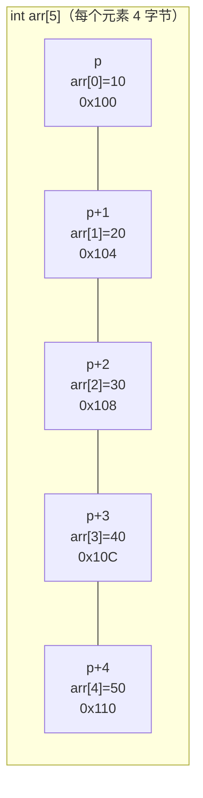

# 第 12 课：指针与数组

## 数组名就是指针

数组名代表**数组首元素的地址**：

```c title="array_pointer.c"
#include <stdio.h>

int main(void)
{
    int arr[] = {10, 20, 30, 40, 50};
    
    printf("arr     = %p\n", (void *)arr);      // 数组名 = 首元素地址
    printf("&arr[0] = %p\n", (void *)&arr[0]);  // 完全相同！
    
    // 用指针访问数组
    int *p = arr;   // 等价于 int *p = &arr[0];
    printf("*p = %d\n", *p);       // 10（第一个元素）
    printf("p[0] = %d\n", p[0]);   // 10（用下标访问也行）
    
    return 0;
}
```

---

## 指针运算

### 指针加减整数

指针 + 1 不是地址加 1 个字节，而是加**一个元素的大小**：

```c title="pointer_arithmetic.c"
#include <stdio.h>

int main(void)
{
    int arr[] = {10, 20, 30, 40, 50};
    int *p = arr;
    
    printf("p     = %p, *p     = %d\n", (void *)p, *p);      // 10
    printf("p + 1 = %p, *(p+1) = %d\n", (void *)(p+1), *(p+1));  // 20
    printf("p + 2 = %p, *(p+2) = %d\n", (void *)(p+2), *(p+2));  // 30
    
    // p+1 的地址比 p 大 4 字节（int 占 4 字节）
    printf("地址差: %td 字节\n", (char *)(p+1) - (char *)p);  // 4
    
    return 0;
}
```



### 用指针遍历数组

```c
int arr[] = {10, 20, 30, 40, 50};
int n = 5;

// 方法 1：下标
for (int i = 0; i < n; i++) {
    printf("%d ", arr[i]);
}

// 方法 2：指针偏移
for (int i = 0; i < n; i++) {
    printf("%d ", *(arr + i));  // arr[i] 等价于 *(arr + i)
}

// 方法 3：指针递增
for (int *p = arr; p < arr + n; p++) {
    printf("%d ", *p);
}
```

!!! note "重要等价关系"
    ```c
    arr[i]  ≡  *(arr + i)  ≡  *(i + arr)  ≡  i[arr]
    ```
    是的，`i[arr]` 在 C 语言中合法（但别这么写😂）。

---

## 指针与数组的区别

虽然数组名和指针很像，但它们**不完全相同**：

| 特性 | 数组名 `arr` | 指针 `p` |
|------|-------------|----------|
| `sizeof` | 整个数组大小 | 指针大小（4/8） |
| 可修改 | ❌ 不能 `arr++` | ✅ 可以 `p++` |
| 赋值 | ❌ 不能 `arr = ...` | ✅ 可以 `p = ...` |

```c
int arr[5] = {1, 2, 3, 4, 5};
int *p = arr;

printf("sizeof(arr) = %zu\n", sizeof(arr));  // 20（5×4）
printf("sizeof(p)   = %zu\n", sizeof(p));    // 8（指针大小）

// arr++;   // ❌ 编译错误！数组名是常量
p++;        // ✅ 指针可以移动
```

---

## 指针运算实例

### 数组逆序（用指针实现）

```c title="reverse_pointer.c"
#include <stdio.h>

void reverse(int *arr, int n)
{
    int *left = arr;           // 指向第一个元素
    int *right = arr + n - 1;  // 指向最后一个元素
    
    while (left < right) {
        int temp = *left;
        *left = *right;
        *right = temp;
        left++;
        right--;
    }
}

int main(void)
{
    int arr[] = {1, 2, 3, 4, 5};
    int n = 5;
    
    reverse(arr, n);
    
    for (int i = 0; i < n; i++) {
        printf("%d ", arr[i]);
    }
    printf("\n");  // 5 4 3 2 1
    
    return 0;
}
```

### 指针相减

两个指针相减得到的是**元素个数**（不是字节数）：

```c
int arr[] = {10, 20, 30, 40, 50};
int *p1 = &arr[1];
int *p2 = &arr[4];

printf("p2 - p1 = %td\n", p2 - p1);  // 3（中间隔了 3 个元素）
```

---

## 指针与 const

### const 修饰指针的几种方式

```c
int a = 10, b = 20;

// 1. 指向常量的指针（不能通过指针修改值）
const int *p1 = &a;
// *p1 = 100;  // ❌ 不能修改指向的值
p1 = &b;       // ✅ 可以改变指向

// 2. 常量指针（不能改变指向）
int *const p2 = &a;
*p2 = 100;     // ✅ 可以修改指向的值
// p2 = &b;    // ❌ 不能改变指向

// 3. 指向常量的常量指针（都不能改）
const int *const p3 = &a;
// *p3 = 100;  // ❌
// p3 = &b;    // ❌
```

!!! tip "记忆技巧"
    看 `const` 在 `*` 的**左边还是右边**：
    - `const int *p` → `const` 在 `*` 左边 → **值**不可改
    - `int *const p` → `const` 在 `*` 右边 → **指针**不可改

### 函数参数中使用 const

```c
// 告诉调用者：这个函数不会修改数组
void print_array(const int *arr, int n)
{
    for (int i = 0; i < n; i++) {
        printf("%d ", arr[i]);
        // arr[i] = 0;  // ❌ 编译错误，有 const 保护
    }
    printf("\n");
}
```

---

## 综合示例

```c title="string_length.c"
#include <stdio.h>

// 用指针计算字符串长度
int my_strlen(const char *s)
{
    const char *p = s;
    while (*p != '\0') {
        p++;
    }
    return p - s;  // 指针相减 = 字符个数
}

// 用指针复制字符串
void my_strcpy(char *dest, const char *src)
{
    while (*src != '\0') {
        *dest = *src;
        dest++;
        src++;
    }
    *dest = '\0';
    
    // 更简洁的写法（等价）：
    // while ((*dest++ = *src++));
}

int main(void)
{
    char str[] = "Hello, World!";
    printf("长度: %d\n", my_strlen(str));  // 13
    
    char copy[50];
    my_strcpy(copy, str);
    printf("复制: %s\n", copy);  // Hello, World!
    
    return 0;
}
```

---

## 练习题

### 练习 1：指针遍历

用指针（不用下标）遍历数组并打印所有元素。

### 练习 2：数组求和

用指针实现 `int array_sum(const int *arr, int n)`。

### 练习 3：查找元素

用指针实现 `int *find(int *arr, int n, int target)`，找到返回元素地址，没找到返回 NULL。

??? note "参考答案"
    ```c
    int *find(int *arr, int n, int target)
    {
        for (int *p = arr; p < arr + n; p++) {
            if (*p == target) return p;
        }
        return NULL;
    }
    
    // 使用
    int arr[] = {10, 20, 30, 40, 50};
    int *result = find(arr, 5, 30);
    if (result) {
        printf("找到: %d，位置: %td\n", *result, result - arr);
    }
    ```

---

## 本课小结

| 知识点 | 说明 |
|--------|------|
| 数组名 = 首元素地址 | `arr` 等价于 `&arr[0]` |
| `arr[i]` = `*(arr+i)` | 下标访问和指针偏移等价 |
| 指针 +/- n | 移动 n 个元素（不是 n 个字节） |
| 指针相减 | 得到两个元素之间的距离 |
| `const int *p` | 不能通过 p 修改值 |
| `int *const p` | 不能改变 p 的指向 |

> **下一课**：[指针与函数](../13-pointer-function/README.md) —— 指针作为参数和返回值
