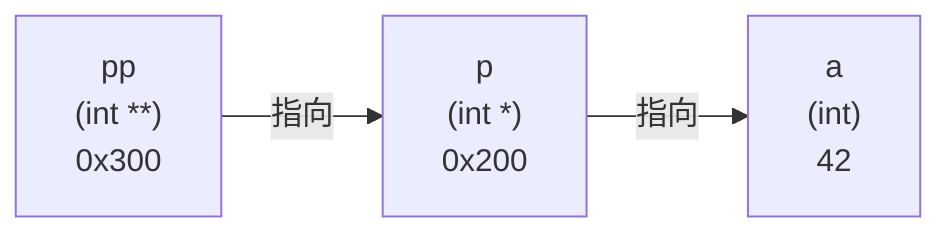

# 第 14 课：多级指针与函数指针

## 二级指针（指针的指针）

二级指针是**指向指针的指针**：

```c title="double_pointer.c"
#include <stdio.h>

int main(void)
{
    int a = 42;
    int *p = &a;      // 一级指针，指向 a
    int **pp = &p;     // 二级指针，指向 p
    
    printf("a   = %d\n", a);       // 42
    printf("*p  = %d\n", *p);      // 42
    printf("**pp = %d\n", **pp);   // 42
    
    // 通过二级指针修改 a
    **pp = 100;
    printf("a = %d\n", a);  // 100
    
    return 0;
}
```



### 二级指针的应用

最常见的用途：**在函数中修改指针本身**：

```c title="modify_pointer.c"
#include <stdio.h>
#include <stdlib.h>

// 在函数中分配内存（修改指针的值）
void allocate(int **pp, int n)
{
    *pp = (int *)malloc(n * sizeof(int));
    for (int i = 0; i < n; i++) {
        (*pp)[i] = i * 10;
    }
}

int main(void)
{
    int *arr = NULL;
    allocate(&arr, 5);  // 传入指针的地址
    
    for (int i = 0; i < 5; i++) {
        printf("%d ", arr[i]);
    }
    printf("\n");  // 0 10 20 30 40
    
    free(arr);
    return 0;
}
```

---

## 函数指针

函数指针是**指向函数的指针**，存储函数的入口地址。

### 声明与使用

```c title="func_pointer.c"
#include <stdio.h>

int add(int a, int b) { return a + b; }
int sub(int a, int b) { return a - b; }
int mul(int a, int b) { return a * b; }

int main(void)
{
    // 声明函数指针
    int (*fp)(int, int);  // fp 是指向"接受两个int参数，返回int"的函数指针
    
    fp = add;              // 指向 add 函数
    printf("add: %d\n", fp(3, 5));   // 8
    
    fp = sub;              // 指向 sub 函数
    printf("sub: %d\n", fp(3, 5));   // -2
    
    fp = mul;              // 指向 mul 函数
    printf("mul: %d\n", fp(3, 5));   // 15
    
    return 0;
}
```

### 函数指针的语法

```c
// 普通函数声明
int add(int a, int b);

// 函数指针声明（把函数名换成 (*指针名)）
int (*fp)(int, int);

// 用 typedef 简化
typedef int (*MathFunc)(int, int);
MathFunc fp = add;
fp(3, 5);  // 调用
```

---

## 回调函数

回调函数就是**把函数作为参数传给另一个函数**：

```c title="callback.c"
#include <stdio.h>

// 对数组每个元素执行操作
void array_apply(int *arr, int n, int (*func)(int))
{
    for (int i = 0; i < n; i++) {
        arr[i] = func(arr[i]);
    }
}

int double_it(int x) { return x * 2; }
int square(int x) { return x * x; }
int negate(int x) { return -x; }

void print_array(const int *arr, int n)
{
    for (int i = 0; i < n; i++) printf("%d ", arr[i]);
    printf("\n");
}

int main(void)
{
    int arr[] = {1, 2, 3, 4, 5};
    int n = 5;
    
    printf("原始: "); print_array(arr, n);
    
    array_apply(arr, n, double_it);
    printf("翻倍: "); print_array(arr, n);
    
    int arr2[] = {1, 2, 3, 4, 5};
    array_apply(arr2, n, square);
    printf("平方: "); print_array(arr2, n);
    
    return 0;
}
```

---

## qsort —— 标准库中的回调函数

`qsort` 是 C 标准库提供的快速排序函数，使用函数指针指定排序规则：

```c title="qsort_example.c"
#include <stdio.h>
#include <stdlib.h>
#include <string.h>

// 升序比较函数
int cmp_asc(const void *a, const void *b)
{
    return *(int *)a - *(int *)b;
}

// 降序比较函数
int cmp_desc(const void *a, const void *b)
{
    return *(int *)b - *(int *)a;
}

// 字符串比较函数
int cmp_str(const void *a, const void *b)
{
    return strcmp(*(const char **)a, *(const char **)b);
}

int main(void)
{
    // 整数排序
    int nums[] = {34, 12, 56, 78, 23, 45};
    int n = sizeof(nums) / sizeof(nums[0]);
    
    qsort(nums, n, sizeof(int), cmp_asc);
    printf("升序: ");
    for (int i = 0; i < n; i++) printf("%d ", nums[i]);
    printf("\n");  // 12 23 34 45 56 78
    
    qsort(nums, n, sizeof(int), cmp_desc);
    printf("降序: ");
    for (int i = 0; i < n; i++) printf("%d ", nums[i]);
    printf("\n");  // 78 56 45 34 23 12
    
    // 字符串排序
    const char *names[] = {"Charlie", "Alice", "Bob", "David"};
    qsort(names, 4, sizeof(char *), cmp_str);
    printf("排序: ");
    for (int i = 0; i < 4; i++) printf("%s ", names[i]);
    printf("\n");  // Alice Bob Charlie David
    
    return 0;
}
```

---

## 函数指针数组

把多个函数放在数组里，用下标调用：

```c title="func_array.c"
#include <stdio.h>

int add(int a, int b) { return a + b; }
int sub(int a, int b) { return a - b; }
int mul(int a, int b) { return a * b; }
int divide(int a, int b) { return b != 0 ? a / b : 0; }

int main(void)
{
    // 函数指针数组
    int (*ops[])(int, int) = {add, sub, mul, divide};
    const char *names[] = {"+", "-", "*", "/"};
    
    int a = 20, b = 4;
    for (int i = 0; i < 4; i++) {
        printf("%d %s %d = %d\n", a, names[i], b, ops[i](a, b));
    }
    
    // 简易计算器
    printf("\n选择运算 (0:加 1:减 2:乘 3:除): ");
    int choice;
    scanf("%d", &choice);
    if (choice >= 0 && choice < 4) {
        printf("结果: %d\n", ops[choice](a, b));
    }
    
    return 0;
}
```

### 嵌入式应用：命令解析器

```c title="cmd_parser.c"
#include <stdio.h>
#include <string.h>

// 命令处理函数
void cmd_help(void)  { printf("可用命令: help, status, reset\n"); }
void cmd_status(void) { printf("系统状态: 正常运行\n"); }
void cmd_reset(void)  { printf("系统重置中...\n"); }

// 命令表结构
typedef struct {
    const char *name;
    void (*handler)(void);
} Command;

int main(void)
{
    Command commands[] = {
        {"help",   cmd_help},
        {"status", cmd_status},
        {"reset",  cmd_reset},
    };
    int n_cmds = sizeof(commands) / sizeof(commands[0]);
    
    char input[50];
    printf("> ");
    scanf("%s", input);
    
    // 查找并执行命令
    int found = 0;
    for (int i = 0; i < n_cmds; i++) {
        if (strcmp(input, commands[i].name) == 0) {
            commands[i].handler();  // 调用对应的处理函数
            found = 1;
            break;
        }
    }
    
    if (!found) {
        printf("未知命令: %s\n", input);
    }
    
    return 0;
}
```

---

## 练习题

### 练习 1：函数指针基础

编写三个函数 `max`, `min`, `avg`，用函数指针调用它们。

### 练习 2：自定义排序

使用 `qsort` 按**绝对值大小**对整数数组排序。

??? note "参考答案"
    ```c
    #include <stdlib.h>
    
    int cmp_abs(const void *a, const void *b)
    {
        int va = abs(*(int *)a);
        int vb = abs(*(int *)b);
        return va - vb;
    }
    
    // 使用
    int arr[] = {-5, 3, -1, 4, -2};
    qsort(arr, 5, sizeof(int), cmp_abs);
    // 结果: -1 -2 3 4 -5
    ```

### 练习 3：状态机

用函数指针数组实现一个简单的 LED 状态机（开→闪烁→关→开...）。

---

## 本课小结

| 知识点 | 说明 |
|--------|------|
| 二级指针 | `int **pp`，指向指针的指针 |
| 函数指针 | `int (*fp)(int, int)`，指向函数 |
| 回调函数 | 把函数作为参数传递 |
| `qsort` | 标准库排序，用函数指针指定规则 |
| 函数指针数组 | 通过下标调用不同函数 |
| `typedef` | 简化函数指针类型声明 |

> **下一课**：[字符与字符串](../15-string-basic/README.md) —— 深入理解 C 字符串
