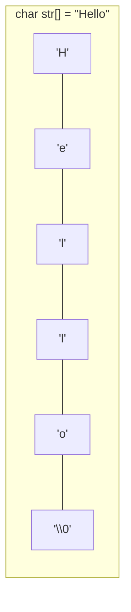

# 第 15 课：字符与字符串

## C 语言中的字符串

C 语言没有专门的字符串类型。字符串就是以 **`\0`（空字符）结尾的字符数组**。



---

## 字符串的声明与初始化

```c title="string_init.c"
#include <stdio.h>
#include <string.h>

int main(void)
{
    // 方式 1：字符数组（可修改）
    char s1[] = "Hello";           // 自动加 \0，大小为 6
    char s2[] = {'H','e','l','l','o','\0'};  // 等价写法
    
    // 方式 2：指定大小
    char s3[20] = "Hello";         // 剩余位置自动填 \0
    
    // 方式 3：字符串指针（指向只读区域）
    const char *s4 = "Hello";      // 指向字符串常量，不可修改内容
    
    printf("s1: %s (大小: %zu, 长度: %zu)\n", s1, sizeof(s1), strlen(s1));
    // s1: Hello (大小: 6, 长度: 5)
    
    // 字符串可以修改（用字符数组）
    s1[0] = 'h';
    printf("修改后: %s\n", s1);  // hello
    
    // s4[0] = 'h';  // ❌ 未定义行为！字符串常量不可修改
    
    return 0;
}
```

!!! warning "字符数组 vs 字符串指针"
    ```c
    char arr[] = "Hello";     // ✅ 可修改，数据在栈上
    const char *ptr = "Hello"; // ⚠️ 指向只读内存，不可修改
    
    arr[0] = 'h';   // ✅ OK
    // ptr[0] = 'h'; // ❌ 可能崩溃
    ```

---

## 字符串输入输出

### 输出

```c
char name[] = "World";

printf("%s\n", name);       // World
printf("Hello, %s!\n", name); // Hello, World!
puts(name);                  // World（自动换行）
```

### 输入

```c title="string_input.c"
#include <stdio.h>

int main(void)
{
    char name[50];
    
    // 方法 1：scanf（读到空格停止）
    printf("输入姓名(无空格): ");
    scanf("%49s", name);  // 限制最多读 49 个字符
    printf("你好, %s\n", name);
    
    // 清空缓冲区
    int c;
    while ((c = getchar()) != '\n' && c != EOF);
    
    // 方法 2：fgets（可以读空格，推荐）
    char line[100];
    printf("输入一行话: ");
    fgets(line, sizeof(line), stdin);
    
    // fgets 会保留换行符，去掉它
    size_t len = strlen(line);
    if (len > 0 && line[len - 1] == '\n') {
        line[len - 1] = '\0';
    }
    
    printf("你说的是: \"%s\"\n", line);
    
    return 0;
}
```

---

## 字符串遍历

```c title="string_traverse.c"
#include <stdio.h>

int main(void)
{
    char str[] = "Hello";
    
    // 方法 1：下标
    for (int i = 0; str[i] != '\0'; i++) {
        printf("str[%d] = '%c'\n", i, str[i]);
    }
    
    // 方法 2：指针
    for (char *p = str; *p != '\0'; p++) {
        printf("'%c' ", *p);
    }
    printf("\n");
    
    return 0;
}
```

---

## 手写字符串函数

### 求长度

```c
int my_strlen(const char *s)
{
    int len = 0;
    while (s[len] != '\0') {
        len++;
    }
    return len;
}
```

### 复制

```c
void my_strcpy(char *dest, const char *src)
{
    while (*src != '\0') {
        *dest++ = *src++;
    }
    *dest = '\0';
}
```

### 比较

```c
int my_strcmp(const char *s1, const char *s2)
{
    while (*s1 != '\0' && *s1 == *s2) {
        s1++;
        s2++;
    }
    return *s1 - *s2;  // 0 相等，正数 s1>s2，负数 s1<s2
}
```

---

## 综合示例

```c title="string_ops.c"
#include <stdio.h>

// 统计字符出现次数
int count_char(const char *str, char ch)
{
    int count = 0;
    while (*str != '\0') {
        if (*str == ch) count++;
        str++;
    }
    return count;
}

// 转大写
void to_upper(char *str)
{
    while (*str != '\0') {
        if (*str >= 'a' && *str <= 'z') {
            *str -= 32;
        }
        str++;
    }
}

// 判断回文
int is_palindrome(const char *str, int len)
{
    int left = 0, right = len - 1;
    while (left < right) {
        if (str[left] != str[right]) return 0;
        left++;
        right--;
    }
    return 1;
}

int main(void)
{
    char text[] = "Hello, World!";
    printf("'l' 出现 %d 次\n", count_char(text, 'l'));
    
    to_upper(text);
    printf("大写: %s\n", text);
    
    char word[] = "racecar";
    printf("\"%s\" %s回文\n", word,
           is_palindrome(word, 7) ? "是" : "不是");
    
    return 0;
}
```

---

## 练习题

### 练习 1：单词计数

编写函数统计字符串中有多少个单词（以空格分隔）。

### 练习 2：字符串反转

原地反转一个字符串。

### 练习 3：去除首尾空格

编写函数 `void trim(char *str)` 去除字符串首尾的空格。

??? note "参考答案"
    ```c
    #include <string.h>
    
    void trim(char *str)
    {
        // 去除尾部空格
        int len = strlen(str);
        while (len > 0 && str[len - 1] == ' ') {
            str[--len] = '\0';
        }
        
        // 去除首部空格
        char *start = str;
        while (*start == ' ') start++;
        
        if (start != str) {
            memmove(str, start, strlen(start) + 1);
        }
    }
    ```

---

## 本课小结

| 知识点 | 说明 |
|--------|------|
| C 字符串 | 以 `\0` 结尾的字符数组 |
| `char[]` | 可修改的字符串 |
| `const char *` | 指向字符串常量，不可修改 |
| `strlen` | 字符串长度（不含 `\0`） |
| `sizeof` | 数组大小（含 `\0`） |
| `fgets` | 安全读取整行输入 |

> **下一课**：[字符串处理函数](../16-string-functions/README.md) —— 标准库字符串函数
