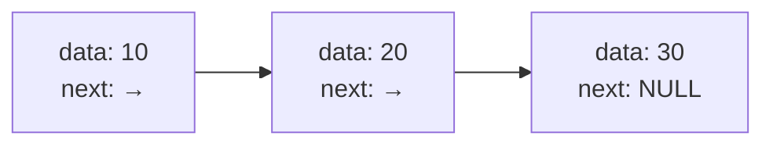

# 第 18 课：结构体与指针

## 结构体指针

```c
typedef struct {
    char name[20];
    int age;
} Person;

Person p = {"张三", 25};
Person *ptr = &p;

// 两种等价的访问方式
printf("%s\n", (*ptr).name);  // 先解引用再访问
printf("%s\n", ptr->name);    // 箭头运算符（推荐）
```

---

## 链表初步

链表是用指针把节点"串"起来的数据结构：



```c title="linked_list_intro.c"
#include <stdio.h>
#include <stdlib.h>

typedef struct Node {
    int data;
    struct Node *next;  // 指向下一个节点
} Node;

int main(void)
{
    // 创建节点
    Node n1 = {10, NULL};
    Node n2 = {20, NULL};
    Node n3 = {30, NULL};
    
    // 链接
    n1.next = &n2;
    n2.next = &n3;
    
    // 遍历
    Node *current = &n1;
    while (current != NULL) {
        printf("%d → ", current->data);
        current = current->next;
    }
    printf("NULL\n");
    // 10 → 20 → 30 → NULL
    
    return 0;
}
```

---

## 内存对齐

编译器会在结构体成员之间插入**填充字节**以满足对齐要求：

```c title="alignment.c"
#include <stdio.h>

struct A {
    char a;    // 1 字节 + 3 字节填充
    int b;     // 4 字节
    char c;    // 1 字节 + 3 字节填充
};  // 总大小: 12 字节（不是 6！）

struct B {
    char a;    // 1 字节
    char c;    // 1 字节 + 2 字节填充
    int b;     // 4 字节
};  // 总大小: 8 字节（调整顺序更省空间）

int main(void)
{
    printf("struct A: %zu 字节\n", sizeof(struct A));  // 12
    printf("struct B: %zu 字节\n", sizeof(struct B));  // 8
    return 0;
}
```

!!! tip "嵌入式优化技巧"
    按成员大小**从大到小**排列，可以减少填充，节省内存：
    ```c
    // ✅ 紧凑排列
    typedef struct {
        double value;  // 8 字节
        int id;        // 4 字节
        short type;    // 2 字节
        char status;   // 1 字节 + 1 字节填充
    } Sensor;  // 16 字节
    ```

---

## 练习题

### 练习 1

创建一个有 3 个节点的链表并遍历打印。

### 练习 2

比较不同成员排列顺序的结构体大小。

---

## 本课小结

| 知识点 | 说明 |
|--------|------|
| `->` | 结构体指针访问成员 |
| 自引用结构体 | `struct Node { struct Node *next; }` |
| 链表 | 用指针串联节点 |
| 内存对齐 | 编译器插入填充字节 |

> **下一课**：[联合体与枚举](../19-union-enum/README.md)
