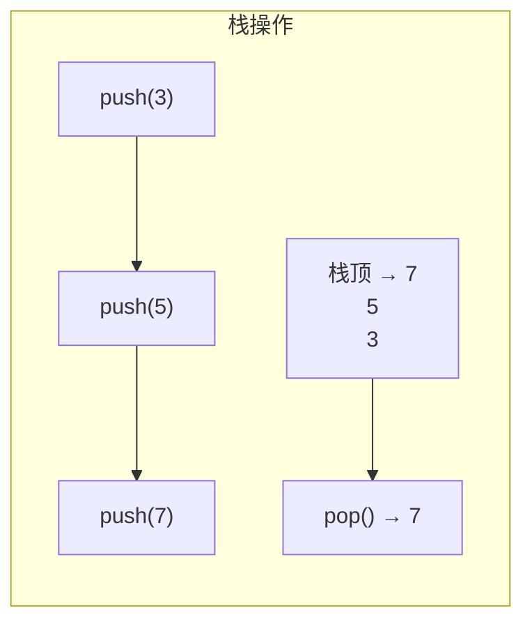

# 第 26 课：数据结构基础——栈与队列

## 栈 (Stack)

**后进先出 (LIFO)**：最后入栈的元素最先出栈。



```c title="stack.c"
#include <stdio.h>
#include <stdbool.h>

#define STACK_MAX 100

typedef struct {
    int data[STACK_MAX];
    int top;  // 栈顶索引，-1 表示空
} Stack;

void stack_init(Stack *s) { s->top = -1; }
bool stack_empty(Stack *s) { return s->top == -1; }
bool stack_full(Stack *s)  { return s->top == STACK_MAX - 1; }

bool stack_push(Stack *s, int val) {
    if (stack_full(s)) return false;
    s->data[++s->top] = val;
    return true;
}

bool stack_pop(Stack *s, int *val) {
    if (stack_empty(s)) return false;
    *val = s->data[s->top--];
    return true;
}

int stack_peek(Stack *s) {
    return s->data[s->top];
}

int main(void)
{
    Stack s;
    stack_init(&s);
    
    stack_push(&s, 10);
    stack_push(&s, 20);
    stack_push(&s, 30);
    
    int val;
    while (!stack_empty(&s)) {
        stack_pop(&s, &val);
        printf("%d ", val);  // 30 20 10
    }
    printf("\n");
    
    return 0;
}
```

### 应用：括号匹配检查

```c
bool check_brackets(const char *expr)
{
    Stack s;
    stack_init(&s);
    
    for (int i = 0; expr[i]; i++) {
        if (expr[i] == '(' || expr[i] == '[' || expr[i] == '{') {
            stack_push(&s, expr[i]);
        } else if (expr[i] == ')' || expr[i] == ']' || expr[i] == '}') {
            if (stack_empty(&s)) return false;
            int top;
            stack_pop(&s, &top);
            if ((expr[i] == ')' && top != '(') ||
                (expr[i] == ']' && top != '[') ||
                (expr[i] == '}' && top != '{'))
                return false;
        }
    }
    return stack_empty(&s);
}
```

---

## 队列 (Queue)

**先进先出 (FIFO)**：最先入队的元素最先出队。

### 环形队列

```c title="queue.c"
#include <stdio.h>
#include <stdbool.h>

#define QUEUE_MAX 100

typedef struct {
    int data[QUEUE_MAX];
    int front, rear;
    int count;
} Queue;

void queue_init(Queue *q) { q->front = q->rear = q->count = 0; }
bool queue_empty(Queue *q) { return q->count == 0; }
bool queue_full(Queue *q)  { return q->count == QUEUE_MAX; }

bool queue_enqueue(Queue *q, int val) {
    if (queue_full(q)) return false;
    q->data[q->rear] = val;
    q->rear = (q->rear + 1) % QUEUE_MAX;
    q->count++;
    return true;
}

bool queue_dequeue(Queue *q, int *val) {
    if (queue_empty(q)) return false;
    *val = q->data[q->front];
    q->front = (q->front + 1) % QUEUE_MAX;
    q->count--;
    return true;
}

int main(void)
{
    Queue q;
    queue_init(&q);
    
    queue_enqueue(&q, 10);
    queue_enqueue(&q, 20);
    queue_enqueue(&q, 30);
    
    int val;
    while (!queue_empty(&q)) {
        queue_dequeue(&q, &val);
        printf("%d ", val);  // 10 20 30
    }
    printf("\n");
    
    return 0;
}
```

---

## 嵌入式应用：串口接收缓冲区

```c
// 串口中断中，将数据放入队列
void USART_IRQHandler(void) {
    uint8_t byte = USART_ReadByte();
    queue_enqueue(&rx_queue, byte);
}

// 主循环中，从队列取数据处理
while (!queue_empty(&rx_queue)) {
    uint8_t data;
    queue_dequeue(&rx_queue, &data);
    process(data);
}
```

---

## 练习题

### 练习 1

用栈实现十进制转二进制。

### 练习 2

用两个栈模拟一个队列。

---

> **下一课**：[排序与查找算法](../27-sort-search/README.md)
