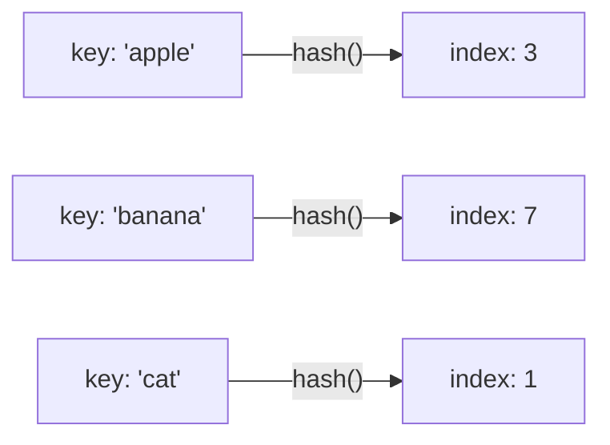

# 第 29 课：哈希表

## 什么是哈希表？

哈希表通过**哈希函数**将键映射到数组索引，实现 **O(1)** 的查找速度。



---

## 简易哈希表实现（链地址法）

```c title="hashtable.c"
#include <stdio.h>
#include <stdlib.h>
#include <string.h>

#define TABLE_SIZE 16

typedef struct Entry {
    char *key;
    int value;
    struct Entry *next;
} Entry;

typedef struct {
    Entry *buckets[TABLE_SIZE];
} HashTable;

// 简单哈希函数
unsigned int hash(const char *key)
{
    unsigned int h = 0;
    while (*key) {
        h = h * 31 + *key;
        key++;
    }
    return h % TABLE_SIZE;
}

HashTable *ht_create(void)
{
    HashTable *ht = (HashTable *)calloc(1, sizeof(HashTable));
    return ht;
}

// 插入或更新
void ht_set(HashTable *ht, const char *key, int value)
{
    unsigned int idx = hash(key);
    Entry *cur = ht->buckets[idx];
    
    while (cur) {
        if (strcmp(cur->key, key) == 0) {
            cur->value = value;  // 更新
            return;
        }
        cur = cur->next;
    }
    
    // 新建节点（头插法）
    Entry *entry = (Entry *)malloc(sizeof(Entry));
    entry->key = strdup(key);
    entry->value = value;
    entry->next = ht->buckets[idx];
    ht->buckets[idx] = entry;
}

// 查找
int ht_get(HashTable *ht, const char *key, int *value)
{
    unsigned int idx = hash(key);
    Entry *cur = ht->buckets[idx];
    
    while (cur) {
        if (strcmp(cur->key, key) == 0) {
            *value = cur->value;
            return 1;  // 找到
        }
        cur = cur->next;
    }
    return 0;  // 未找到
}

// 释放
void ht_free(HashTable *ht)
{
    for (int i = 0; i < TABLE_SIZE; i++) {
        Entry *cur = ht->buckets[i];
        while (cur) {
            Entry *tmp = cur;
            cur = cur->next;
            free(tmp->key);
            free(tmp);
        }
    }
    free(ht);
}

int main(void)
{
    HashTable *ht = ht_create();
    
    ht_set(ht, "apple", 5);
    ht_set(ht, "banana", 3);
    ht_set(ht, "cherry", 8);
    
    int val;
    if (ht_get(ht, "banana", &val)) {
        printf("banana = %d\n", val);  // 3
    }
    
    ht_free(ht);
    return 0;
}
```

---

## 应用：单词频率统计

```c
// 简化版：统计每个单词出现次数
void count_words(const char *text)
{
    HashTable *ht = ht_create();
    char buf[256];
    strcpy(buf, text);
    
    char *word = strtok(buf, " ,.!?\n");
    while (word) {
        int count = 0;
        ht_get(ht, word, &count);
        ht_set(ht, word, count + 1);
        word = strtok(NULL, " ,.!?\n");
    }
    
    // 打印结果...
    ht_free(ht);
}
```

---

## 练习题

### 练习 1

为哈希表增加删除功能 `ht_delete`。

### 练习 2

实现一个简易的"字典"程序：支持添加、查找、删除单词及释义。

---

> **下一课**：[二叉树基础](../30-binary-tree/README.md)
