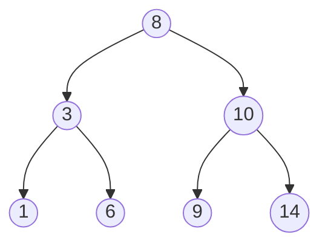

# 第 30 课：二叉树基础

## 什么是二叉树？

每个节点最多有**两个子节点**（左子节点和右子节点）。



---

## 二叉搜索树 (BST)

规则：左子树的值 < 根 < 右子树的值

```c title="bst.c"
#include <stdio.h>
#include <stdlib.h>

typedef struct TreeNode {
    int data;
    struct TreeNode *left;
    struct TreeNode *right;
} TreeNode;

// 创建节点
TreeNode *node_create(int data)
{
    TreeNode *node = (TreeNode *)malloc(sizeof(TreeNode));
    node->data = data;
    node->left = node->right = NULL;
    return node;
}

// 插入
TreeNode *bst_insert(TreeNode *root, int data)
{
    if (root == NULL) return node_create(data);
    
    if (data < root->data)
        root->left = bst_insert(root->left, data);
    else if (data > root->data)
        root->right = bst_insert(root->right, data);
    
    return root;
}

// 查找
TreeNode *bst_search(TreeNode *root, int data)
{
    if (root == NULL || root->data == data) return root;
    
    if (data < root->data)
        return bst_search(root->left, data);
    else
        return bst_search(root->right, data);
}

// 中序遍历（升序输出）
void inorder(TreeNode *root)
{
    if (root == NULL) return;
    inorder(root->left);
    printf("%d ", root->data);
    inorder(root->right);
}

// 前序遍历
void preorder(TreeNode *root)
{
    if (root == NULL) return;
    printf("%d ", root->data);
    preorder(root->left);
    preorder(root->right);
}

// 后序遍历
void postorder(TreeNode *root)
{
    if (root == NULL) return;
    postorder(root->left);
    postorder(root->right);
    printf("%d ", root->data);
}

// 释放
void tree_free(TreeNode *root)
{
    if (root == NULL) return;
    tree_free(root->left);
    tree_free(root->right);
    free(root);
}

int main(void)
{
    TreeNode *root = NULL;
    int values[] = {8, 3, 10, 1, 6, 9, 14};
    
    for (int i = 0; i < 7; i++)
        root = bst_insert(root, values[i]);
    
    printf("中序: "); inorder(root);   printf("\n");  // 1 3 6 8 9 10 14
    printf("前序: "); preorder(root);  printf("\n");  // 8 3 1 6 10 9 14
    printf("后序: "); postorder(root); printf("\n");  // 1 6 3 9 14 10 8
    
    TreeNode *found = bst_search(root, 6);
    printf("查找 6: %s\n", found ? "找到" : "未找到");
    
    tree_free(root);
    return 0;
}
```

---

## 三种遍历对比

| 遍历方式 | 顺序 | 用途 |
|----------|------|------|
| 前序 | 根→左→右 | 复制树 |
| 中序 | 左→根→右 | 排序输出 |
| 后序 | 左→右→根 | 释放树 |

---

## 练习题

### 练习 1

求二叉树的高度（最大深度）。

### 练习 2

求二叉树所有节点的和。

??? note "参考答案"
    ```c
    int tree_height(TreeNode *root) {
        if (!root) return 0;
        int lh = tree_height(root->left);
        int rh = tree_height(root->right);
        return (lh > rh ? lh : rh) + 1;
    }
    
    int tree_sum(TreeNode *root) {
        if (!root) return 0;
        return root->data + tree_sum(root->left) + tree_sum(root->right);
    }
    ```

---

> **下一课**：[综合项目：学生成绩管理系统](../31-final-project/README.md)
