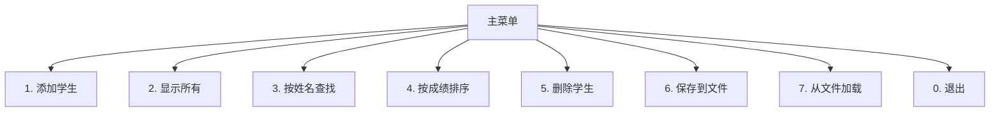

# 第 31 课：综合项目——学生成绩管理系统

## 项目概述

综合运用前 30 课所学知识，完成一个**完整的 C 语言项目**：

- 结构体、指针、动态内存
- 文件读写（数据持久化）
- 多文件编程
- 排序、查找算法

---

## 功能需求



---

## 项目结构

```
student_manager/
├── main.c           // 主程序（菜单循环）
├── student.h        // 结构体定义、函数声明
├── student.c        // 核心功能实现
└── Makefile         // 编译脚本
```

---

## 完整源码

### student.h

```c title="student.h"
#ifndef __STUDENT_H__
#define __STUDENT_H__

#define MAX_STUDENTS 100
#define NAME_LEN     32

typedef struct {
    int    id;
    char   name[NAME_LEN];
    float  chinese;
    float  math;
    float  english;
    float  total;
} Student;

typedef struct {
    Student data[MAX_STUDENTS];
    int count;
} StudentDB;

// 初始化
void db_init(StudentDB *db);

// 添加学生
int db_add(StudentDB *db, const char *name, float chi, float math, float eng);

// 显示所有
void db_show_all(const StudentDB *db);

// 按姓名查找
int db_find_by_name(const StudentDB *db, const char *name);

// 按总分排序（降序）
void db_sort_by_total(StudentDB *db);

// 删除
int db_remove(StudentDB *db, int index);

// 保存到文件
int db_save(const StudentDB *db, const char *filename);

// 从文件加载
int db_load(StudentDB *db, const char *filename);

#endif
```

### student.c

```c title="student.c"
#include <stdio.h>
#include <string.h>
#include "student.h"

static int next_id = 1;

void db_init(StudentDB *db)
{
    db->count = 0;
}

int db_add(StudentDB *db, const char *name, float chi, float math, float eng)
{
    if (db->count >= MAX_STUDENTS) return -1;
    
    Student *s = &db->data[db->count];
    s->id = next_id++;
    strncpy(s->name, name, NAME_LEN - 1);
    s->name[NAME_LEN - 1] = '\0';
    s->chinese = chi;
    s->math = math;
    s->english = eng;
    s->total = chi + math + eng;
    db->count++;
    
    return 0;
}

void db_show_all(const StudentDB *db)
{
    printf("\n%-4s %-10s %6s %6s %6s %6s\n",
           "ID", "姓名", "语文", "数学", "英语", "总分");
    printf("--------------------------------------------\n");
    
    for (int i = 0; i < db->count; i++) {
        const Student *s = &db->data[i];
        printf("%-4d %-10s %6.1f %6.1f %6.1f %6.1f\n",
               s->id, s->name, s->chinese, s->math, s->english, s->total);
    }
    printf("共 %d 名学生\n\n", db->count);
}

int db_find_by_name(const StudentDB *db, const char *name)
{
    for (int i = 0; i < db->count; i++) {
        if (strstr(db->data[i].name, name) != NULL) {
            return i;
        }
    }
    return -1;
}

void db_sort_by_total(StudentDB *db)
{
    for (int i = 0; i < db->count - 1; i++) {
        for (int j = 0; j < db->count - 1 - i; j++) {
            if (db->data[j].total < db->data[j + 1].total) {
                Student tmp = db->data[j];
                db->data[j] = db->data[j + 1];
                db->data[j + 1] = tmp;
            }
        }
    }
}

int db_remove(StudentDB *db, int index)
{
    if (index < 0 || index >= db->count) return -1;
    
    for (int i = index; i < db->count - 1; i++) {
        db->data[i] = db->data[i + 1];
    }
    db->count--;
    return 0;
}

int db_save(const StudentDB *db, const char *filename)
{
    FILE *fp = fopen(filename, "wb");
    if (!fp) return -1;
    
    fwrite(&db->count, sizeof(int), 1, fp);
    fwrite(db->data, sizeof(Student), db->count, fp);
    fclose(fp);
    return 0;
}

int db_load(StudentDB *db, const char *filename)
{
    FILE *fp = fopen(filename, "rb");
    if (!fp) return -1;
    
    fread(&db->count, sizeof(int), 1, fp);
    fread(db->data, sizeof(Student), db->count, fp);
    fclose(fp);
    
    // 更新 next_id
    for (int i = 0; i < db->count; i++) {
        if (db->data[i].id >= next_id) {
            next_id = db->data[i].id + 1;
        }
    }
    
    return 0;
}
```

### main.c

```c title="main.c"
#include <stdio.h>
#include <string.h>
#include "student.h"

void show_menu(void)
{
    printf("===== 学生成绩管理系统 =====\n");
    printf("  1. 添加学生\n");
    printf("  2. 显示所有学生\n");
    printf("  3. 按姓名查找\n");
    printf("  4. 按总分排序\n");
    printf("  5. 删除学生\n");
    printf("  6. 保存到文件\n");
    printf("  7. 从文件加载\n");
    printf("  0. 退出\n");
    printf("============================\n");
    printf("请选择: ");
}

int main(void)
{
    StudentDB db;
    db_init(&db);
    
    int choice;
    char name[NAME_LEN];
    float chi, math, eng;
    
    while (1) {
        show_menu();
        scanf("%d", &choice);
        
        switch (choice) {
        case 1:
            printf("姓名: "); scanf("%s", name);
            printf("语文: "); scanf("%f", &chi);
            printf("数学: "); scanf("%f", &math);
            printf("英语: "); scanf("%f", &eng);
            if (db_add(&db, name, chi, math, eng) == 0)
                printf("添加成功！\n");
            else
                printf("已满，无法添加。\n");
            break;
            
        case 2:
            db_show_all(&db);
            break;
            
        case 3:
            printf("输入姓名关键字: "); scanf("%s", name);
            int idx = db_find_by_name(&db, name);
            if (idx >= 0) {
                Student *s = &db.data[idx];
                printf("找到: %s 总分=%.1f\n", s->name, s->total);
            } else {
                printf("未找到。\n");
            }
            break;
            
        case 4:
            db_sort_by_total(&db);
            printf("已按总分排序。\n");
            db_show_all(&db);
            break;
            
        case 5:
            printf("输入要删除的序号(0-%d): ", db.count - 1);
            scanf("%d", &idx);
            if (db_remove(&db, idx) == 0)
                printf("删除成功。\n");
            else
                printf("序号无效。\n");
            break;
            
        case 6:
            if (db_save(&db, "students.dat") == 0)
                printf("保存成功。\n");
            else
                printf("保存失败。\n");
            break;
            
        case 7:
            if (db_load(&db, "students.dat") == 0)
                printf("加载成功，共 %d 名学生。\n", db.count);
            else
                printf("加载失败。\n");
            break;
            
        case 0:
            printf("再见！\n");
            return 0;
            
        default:
            printf("无效选择。\n");
        }
    }
}
```

### Makefile

```makefile title="Makefile"
CC = gcc
CFLAGS = -Wall -g

app: main.o student.o
	$(CC) $^ -o $@

%.o: %.c student.h
	$(CC) $(CFLAGS) -c $< -o $@

clean:
	rm -f *.o app students.dat

.PHONY: clean
```

---

## 编译与运行

```bash
make
./app
```

---

## 课程总结

恭喜你完成了 C 语言从零到精通的全部 31 课！回顾一下学习路线：

| 阶段 | 课程 | 核心内容 |
|------|------|----------|
| 入门 | 01-07 | 数据类型、运算符、控制流 |
| 函数与数组 | 08-10 | 函数定义、递归、数组 |
| 指针 | 11-14 | 指针基础、指针与数组/函数 |
| 字符串 | 15-16 | 字符串操作、string.h |
| 复合类型 | 17-19 | 结构体、联合体、枚举 |
| 内存管理 | 20-21 | 内存布局、动态分配 |
| 文件与编译 | 22-24 | 文件 I/O、预处理、多文件 |
| 高级主题 | 25-27 | 高级指针、栈/队列、排序 |
| 数据结构 | 28-30 | 链表、哈希表、二叉树 |
| 综合实战 | 31 | 完整项目实践 |

> **下一步建议**：学习 [C++ 嵌入式开发](../../cpp-embedded/)，或深入 [MCU 裸机开发](../../mcu/)！
