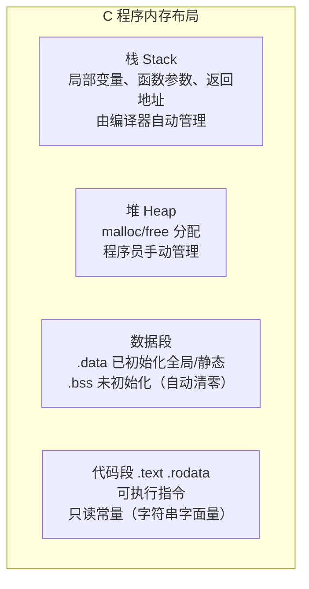
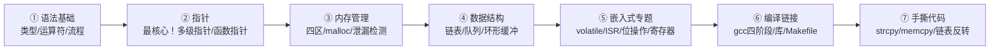

# 第 32 课：C 语言面试高频考点（嵌入式向）

> 结合国内嵌入式/C 岗位面试真题整理，覆盖华为、大疆、小米、蔚来等企业常考知识点。
> 涵盖指针、内存、关键字、位操作、数据结构、编译链接、手撕代码八大板块。

---

## 一、指针终极八问（面试必考）

### 1.1 指针基础辨析

```c
// 你能分清以下类型吗？
int *p[10];        // 指针数组：10 个元素，每个是 int*
int (*p)[10];      // 数组指针：指向 int[10] 的指针
int *f(int);       // 函数声明：返回 int* 的函数
int (*f)(int);     // 函数指针：指向 参数int→返回int 的函数
int *(*f)(int);    // 函数指针：指向 参数int→返回int* 的函数
int *(*f[10])(int);// 函数指针数组：10 个元素，每个是函数指针

// 记忆口诀："从内向外，从右向左" —— 右左法则
// 先看标识符，向右遇到 ) 或 ] 停止，向左看，再向右...
```

### 1.2 二级指针经典应用

```c
// 场景：函数中修改外部指针的指向
void getMemory(char **pp, int size) {
    *pp = (char*)malloc(size);   // 修改 pp 指向的指针
}

int main() {
    char *str = NULL;
    getMemory(&str, 100);        // 传入 str 的地址
    strcpy(str, "hello");
    free(str);
    return 0;
}
```

### 1.3 函数指针与回调

```c
// 函数指针定义
typedef int (*CompareFunc)(const void*, const void*);

int cmpInt(const void *a, const void *b) {
    return *(int*)a - *(int*)b;
}

// qsort 就是最经典的函数指针应用
int arr[] = {3, 1, 4, 1, 5};
qsort(arr, 5, sizeof(int), cmpInt);

// 嵌入式常见：中断回调注册
typedef void (*IRQHandler)(void);
IRQHandler handlers[256];

void registerHandler(int irq, IRQHandler handler) {
    handlers[irq] = handler;
}
```

### 1.4 指针与数组的差异

```c
char arr[] = "hello";      // 栈上分配 6 字节，内容为 "hello\0"
char *ptr  = "hello";      // 栈上 8 字节指针 → 指向 .rodata 中的字面量

arr[0] = 'H';   // ✅ 可修改
ptr[0] = 'H';   // ❌ 未定义行为！字面量在只读区

sizeof(arr) = 6   // 数组总大小
sizeof(ptr) = 8   // 指针本身大小（64位）

// 数组名作为函数参数时退化为指针
void func(int a[])  { sizeof(a); }   // 8（不是数组大小！）
void func(int a[10]){ sizeof(a); }   // 还是 8！
void func(int *a)   { sizeof(a); }   // 同上，三种写法等价
```

### 1.5 `void*` 万能指针

```c
// void* 可以接受任何指针类型，但不能直接解引用
void *vp;
int a = 42;
vp = &a;                     // ✅ 任意类型转 void*

int *ip = (int*)vp;          // 需要显式转换回来
printf("%d\n", *(int*)vp);   // 先转换再解引用

// malloc 返回 void* 的原因

// C 中 void* 可隐式转换，C++ 中必须显式转换
```

---

## 二、内存管理（嵌入式必考重灾区）

### 2.1 内存四区详解



```c
int global_init = 42;        // .data
int global_uninit;           // .bss（自动初始化为 0）
static int static_var = 10;  // .data
const char *msg = "hello";   // msg 在栈/.data，"hello" 在 .rodata

void func() {
    int local = 0;           // 栈
    static int s = 0;        // .data（只初始化一次！）
    char *p = malloc(100);   // p 在栈，指向的内存 在堆
}
```

### 2.2 `malloc/calloc/realloc/free` 深入

```c
// malloc：分配未初始化内存
int *p1 = (int*)malloc(10 * sizeof(int));

// calloc：分配并清零（多一个清零开销）
int *p2 = (int*)calloc(10, sizeof(int));

// realloc：扩容/缩容
int *p3 = (int*)realloc(p1, 20 * sizeof(int));
// ⚠️ 可能返回新地址！原 p1 失效，必须用返回值
// ⚠️ realloc(NULL, size) 等价于 malloc(size)
// ⚠️ realloc(ptr, 0) 可能等价于 free(ptr)（实现定义）

free(p3);   // p3 = NULL; 防止野指针！
p3 = NULL;

// 经典面试错误：
char *getStr() {
    char buf[100] = "hello";
    return buf;    // ❌ 返回栈内存地址！函数返回后 buf 失效
}
```

### 2.3 内存泄漏与检测

```c
// 常见泄漏场景
void leak1() {
    int *p = malloc(100);
    p = malloc(200);  // ❌ 第一个 100 字节泄漏了！
    free(p);
}

void leak2() {
    int *p = malloc(100);
    if (error) return;  // ❌ 提前返回，忘记 free
    free(p);
}

// 嵌入式检测手段
// ① 自己实现 malloc 包装，记录分配/释放日志
// ② 在 FreeRTOS 中监控 heap 使用量
// ③ Valgrind（PC 端）：valgrind --leak-check=full ./program
// ④ AddressSanitizer：gcc -fsanitize=address
```

### 2.4 栈溢出与堆碎片

```c
// 栈溢出——嵌入式常见灾难
void recursive() {
    char buf[4096];     // 每次调用占 4K 栈
    recursive();        // ❌ 栈溢出！
}

// 堆碎片——长时间运行的系统
void fragmentation() {
    for (int i = 0; i < 10000; i++) {
        char *p = malloc(500);
        // ... 使用 ...
        free(p);  // 频繁分配释放不同大小 → 碎片
    }
}

// 嵌入式对策：
// - 尽量静态分配（编译期确定）
// - 内存池预分配
// - 避免频繁 malloc 小对象
```

---

## 三、关键字全面解析

### 3.1 `static` 三种用法

```c
// ① 局部静态变量——只初始化一次，生命周期 = 整个程序
void counter() {
    static int count = 0;
    count++;
    printf("%d\n", count);  // 每次+1
}

// ② 文件内静态函数/变量——内部链接，外部不可见
static int internal = 0;
static void helper() { }    // 其他 .c 文件调用不到

// ③ 函数内静态变量——持久状态（无锁单例的 C 版本）
int* getBuffer() {
    static int buf[1024];   // 只分配一次
    return buf;
}
```

### 3.2 `const` 的 4 种组合

```c
const int a = 10;          // 常量整数
int const b = 10;          // 等价

const int *p1;             // p1 可变，*p1 不可变（指向常量）
int const *p2;             // 同上
int *const p3 = &a;        // p3 不可变，*p3 可变（常量指针）
const int *const p4 = &a;  // 都不可变

// 记忆：const 在 * 左边 → 内容不可改；在 * 右边 → 指针不可改
```

### 3.3 `volatile`（嵌入式灵魂）

```c
// 告诉编译器：不要优化对此变量的访问，每次都从内存读取
volatile int flag;          // ISR 中可能修改

// 三大使用场景：
// ① 中断服务程序中修改的变量
volatile int irq_received = 0;
void ISR_Handler() { irq_received = 1; }
void main_loop() {
    while (!irq_received) {}  // 不加 volatile 可能死循环（编译器优化）
}

// ② 内存映射的硬件寄存器
#define UART_STATUS (*(volatile uint32_t*)0x40001000)
while (!(UART_STATUS & 0x20)) {}  // 等待发送完成

// ③ 多线程共享变量（但 volatile 不保证原子性！）
//   C11 起用 _Atomic，C++ 用 std::atomic

// 常见误区：volatile 不能替代 mutex，不能保证原子操作
```

### 3.4 `extern` 跨文件引用

```c
// file1.c
int globalVar = 100;          // 定义
void func(void) { /*...*/ }   // 定义

// 头文件 declarations.h
extern int globalVar;          // 声明（不分配空间）
extern void func(void);        // 声明
```

### 3.5 `typedef` vs `#define`

```c
#define PTR int*               // ❌ 纯文本替换，有陷阱
typedef int* PTR;              // ✅ 真正的类型别名

PTR a, b;   // #define: int* a, b; → a 是指针，b 是 int！
            // typedef: int *a, *b; → 两个都是指针

// typedef 复杂类型
typedef void (*FuncPtr)(int, void*);  // 函数指针别名
typedef int Array10[10];              // 数组类型别名
Array10 arr;                           // 等价于 int arr[10];
```

---

## 四、结构体与内存对齐

### 4.1 结构体内存对齐规则

```c
// 对齐规则：
// ① 成员起始偏移量必须是 min(自身大小, 对齐系数) 的整数倍
// ② 结构体总大小必须是最大成员对齐值的整数倍
// ③ 默认对齐系数：GCC 按成员自然对齐，可用 #pragma pack 修改

struct A { char c; int i; };       // sizeof = 8
// c 偏移 0，占 1 字节；i 需要偏移为 4 的倍数 → 偏移 4
// 总大小 8，是最大对齐值 4 的倍数

struct B { char c; char d; int i; };  // sizeof = 8
// c(0), d(1), 填充 2 字节, i(4)

struct C { int i; char c; };       // sizeof = 8  ← 陷阱！
// i(0-3), c(4), 尾部填充 3 字节使总大小为 4 的倍数

// 优化：按成员大小降序排列减少填充
struct Bad  { char a; int b; char c; };   // 12 字节
struct Good { int b; char a; char c; };   // 8 字节 ⚡
```

### 4.2 `#pragma pack` 与通信协议

```c
// 嵌入式通信协议常需要紧凑布局
#pragma pack(1)
struct Packet {
    uint8_t  header;       // 1 字节
    uint16_t payload_len;  // 2 字节
    uint32_t timestamp;    // 4 字节
    uint8_t  data[10];     // 10 字节
};                         // 总共 17 字节（无填充）
#pragma pack()

// 用 _Static_assert（C11）验证
_Static_assert(sizeof(struct Packet) == 17, "不对齐！");
```

### 4.3 大小端判断

```c
// 面试常考：判断当前系统是大端还是小端
int isLittleEndian() {
    uint16_t val = 0x0001;
    return *(uint8_t*)&val == 0x01;
}
// 小端：低字节在低地址（x86、ARM 默认）
// 大端：高字节在低地址（网络字节序、部分 DSP）

// 大小端转换（网络编程常用）
uint32_t htonl(uint32_t hostlong);  // 主机序 → 网络序（大端）
uint32_t ntohl(uint32_t netlong);   // 网络序 → 主机序
```

---

## 五、位操作（嵌入式核心技能）

```c
// 位操作是嵌入式开发基本功，面试必考

// 置位
#define SET_BIT(reg, n)   ((reg) |=  (1U << (n)))
// 清零
#define CLR_BIT(reg, n)   ((reg) &= ~(1U << (n)))
// 取反
#define TOG_BIT(reg, n)   ((reg) ^=  (1U << (n)))
// 读取
#define GET_BIT(reg, n)   (((reg) >> (n)) & 1U)
// 写多个位（掩码）
#define WRITE_BITS(reg, mask, val)  ((reg) = ((reg) & ~(mask)) | ((val) & (mask)))

// 实战：GPIO 控制
#define GPIOA_MODER   (*(volatile uint32_t*)0x48000000)
#define PIN_SHIFT     10

// 清除 PIN10 的模式位（2 bit）→ 设置为输出模式（01）
SET_BIT(GPIOA_MODER, PIN_SHIFT * 2);      // 置位 bit20
CLR_BIT(GPIOA_MODER, PIN_SHIFT * 2 + 1);  // 清零 bit21

// 面试题：不用临时变量交换两个数
void swap_xor(int *a, int *b) {
    *a ^= *b;
    *b ^= *a;
    *a ^= *b;
}
// ⚠️ 小心：a==b 时结果归零！

// 统计二进制中 1 的个数（经典面试题）
int countOnes(uint32_t n) {
    int count = 0;
    while (n) {
        n &= (n - 1);  // 每次消除最低位的 1
        count++;
    }
    return count;
}
```

---

## 六、预处理器与宏的高级用法

```c
// # 字符串化运算符
#define STRINGIFY(x)  #x
printf("%s\n", STRINGIFY(hello));  // "hello"

// ## 连接运算符
#define CONCAT(a, b)  a##b
int CONCAT(myVar, 123) = 42;  // int myVar123 = 42;

// 变参宏（C99）
#define DEBUG(fmt, ...)  printf("[%s:%d] " fmt "\n", __FILE__, __LINE__, ##__VA_ARGS__)

// 防止头文件重复包含
#ifndef MY_HEADER_H
#define MY_HEADER_H
// ... 头文件内容 ...
#endif
// 或使用 #pragma once（非标准但广泛支持）

// 条件编译
#ifdef DEBUG_MODE
    #define LOG(msg) printf("DEBUG: %s\n", msg)
#else
    #define LOG(msg)
#endif

// do-while(0) 惯用法——宏的多语句安全包装
#define SAFE_MACRO(x)  do { func1(x); func2(x); } while(0)
// 解决 if 分支不使用花括号时的隐患：
// if (cond) SAFE_MACRO(a); else other();  ← 没有 do-while 会出错
```

---

## 七、编译链接全流程

### 7.1 四阶段详解


### 7.2 静态库与动态库

```bash
# 静态库 .a（Linux）/ .lib（Windows）
gcc -c add.c -o add.o
ar rcs libadd.a add.o
gcc main.c -L. -ladd -o main        # 链接静态库

# 动态库 .so（Linux）/ .dll（Windows）
gcc -fPIC -c add.c -o add.o
gcc -shared -o libadd.so add.o
gcc main.c -L. -ladd -o main        # 运行时需设置 LD_LIBRARY_PATH
```

### 7.3 `static` 和 `inline` 的链接影响

```c
// static 函数：内部链接，每个 .c 独立副本，不参与全局符号解析
static int helper(int x) { return x * 2; }

// inline 函数：建议编译器展开，多个翻译单元可重复定义
inline int fast_add(int a, int b) { return a + b; }

// 嵌入式常用：static inline 组合——头文件中定义，每个编译单元一份
static inline void delay_cycles(uint32_t n) {
    for (volatile uint32_t i = 0; i < n; i++) {}
}
```

---

## 八、字符串与标准库函数实现（手撕代码高频）

### 8.1 `strlen` 实现

```c
// 面试考察点：const 正确性、计数器类型、时间复杂度
size_t myStrlen(const char *str) {
    const char *p = str;
    while (*p) p++;
    return p - str;    // 指针差 = 元素个数
}
```

### 8.2 `strcpy` 实现

```c
char* myStrcpy(char *dst, const char *src) {
    char *ret = dst;
    while ((*dst++ = *src++)) {}  // 包括复制 '\0'
    return ret;  // 链式调用：strcpy(a, strcpy(b, c))
}
```

### 8.3 `strcmp` 实现

```c
int myStrcmp(const char *s1, const char *s2) {
    while (*s1 && (*s1 == *s2)) {
        s1++; s2++;
    }
    return *(unsigned char*)s1 - *(unsigned char*)s2;
}
```

### 8.4 `memcpy` 实现（注意重叠问题）

```c
void* myMemcpy(void *dst, const void *src, size_t n) {
    char *d = (char*)dst;
    const char *s = (const char*)src;
    // 不考虑重叠：从头到尾复制
    for (size_t i = 0; i < n; i++) d[i] = s[i];
    return dst;
}

// 面试加分：讲述 memmove 处理重叠
void* myMemmove(void *dst, const void *src, size_t n) {
    char *d = (char*)dst;
    const char *s = (const char*)src;
    if (d < s) {
        for (size_t i = 0; i < n; i++) d[i] = s[i];    // 正向
    } else if (d > s) {
        for (size_t i = n; i > 0; i--) d[i-1] = s[i-1]; // 反向
    }
    return dst;
}
```

### 8.5 `itoa` 整数转字符串

```c
char* myItoa(int num, char *str, int base) {
    if (base < 2 || base > 36) { *str = '\0'; return str; }
    
    char *p = str;
    if (num < 0 && base == 10) { *p++ = '-'; num = -num; }
    
    char *start = p;
    do {
        int digit = num % base;
        *p++ = (digit < 10) ? ('0' + digit) : ('a' + digit - 10);
        num /= base;
    } while (num);
    *p = '\0';
    
    // 反转
    for (char *a = start, *b = p - 1; a < b; a++, b--) {
        char tmp = *a; *a = *b; *b = tmp;
    }
    return str;
}
```

---

## 九、链表手撕代码（面试必考）

### 9.1 链表定义

```c
typedef struct Node {
    int data;
    struct Node *next;
} Node;
```

### 9.2 反转单链表

```c
// 迭代法——O(n) 时间，O(1) 空间
Node* reverseList(Node *head) {
    Node *prev = NULL;
    Node *curr = head;
    while (curr) {
        Node *next = curr->next;  // 暂存下一个
        curr->next = prev;        // 反转指向
        prev = curr;
        curr = next;
    }
    return prev;
}

// 递归法
Node* reverseRecursive(Node *head) {
    if (!head || !head->next) return head;
    Node *newHead = reverseRecursive(head->next);
    head->next->next = head;
    head->next = NULL;
    return newHead;
}
```

### 9.3 检测链表是否有环（快慢指针）

```c
// Floyd 判圈算法
int hasCycle(Node *head) {
    Node *slow = head, *fast = head;
    while (fast && fast->next) {
        slow = slow->next;
        fast = fast->next->next;
        if (slow == fast) return 1;  // 有环
    }
    return 0;
}
```

### 9.4 合并两个有序链表

```c
Node* mergeSorted(Node *a, Node *b) {
    Node dummy = {0, NULL};
    Node *tail = &dummy;
    
    while (a && b) {
        if (a->data < b->data) { tail->next = a; a = a->next; }
        else                   { tail->next = b; b = b->next; }
        tail = tail->next;
    }
    tail->next = a ? a : b;
    return dummy.next;
}
```

---

## 十、嵌入式 C 语言专属考点

### 10.1 中断服务程序 ISR 规范

```c
// ISR 中：不能阻塞、不能调用不可重入函数、尽量短
volatile int flag = 0;

void UART_IRQHandler(void) {
    // ✅ 只做标志位设置和数据读取
    flag = 1;
    rx_buffer[rx_index++] = UART->DR;
    
    // ❌ 不能在 ISR 中：printf、malloc、延时、加锁
}

// 中断嵌套与临界区保护
void critical_section(void) {
    __disable_irq();          // 关中断
    // ... 临界区代码 ...
    __enable_irq();           // 开中断
}
```

### 10.2 `restrict` 关键字（C99）

```c
// 告诉编译器指针是访问内存的唯一方式，便于优化
void vecAdd(int *restrict a, int *restrict b, int *restrict c, int n) {
    for (int i = 0; i < n; i++) a[i] = b[i] + c[i];
}
// restrict 承诺 a/b/c 指向的内存不重叠，编译器可做 SIMD 优化
```

### 10.3 环形缓冲区（嵌入式通信必会）

```c
typedef struct {
    uint8_t *buf;
    int head;       // 写位置
    int tail;       // 读位置
    int size;       // 容量
    int count;      // 当前数据量
} RingBuffer;

int ringBufPut(RingBuffer *rb, uint8_t data) {
    if (rb->count == rb->size) return -1;  // 满
    rb->buf[rb->head] = data;
    rb->head = (rb->head + 1) % rb->size;
    rb->count++;
    return 0;
}

int ringBufGet(RingBuffer *rb, uint8_t *data) {
    if (rb->count == 0) return -1;  // 空
    *data = rb->buf[rb->tail];
    rb->tail = (rb->tail + 1) % rb->size;
    rb->count--;
    return 0;
}
```

### 10.4 看门狗与复位

```c
// 独立看门狗 IWDG —— 系统跑飞后自动复位
void IWDG_Init(void) {
    IWDG->KR = 0x5555;          // 解锁
    IWDG->PR = 0x04;            // 预分频
    IWDG->RLR = 0xFFF;          // 重装载值
    IWDG->KR = 0xCCCC;          // 启动
}

void IWDG_Feed(void) {
    IWDG->KR = 0xAAAA;          // 喂狗！
}
// 面试要点：看门狗原理、窗口看门狗区别、喂狗时机选择
```

---

## 十一、面试陷阱题精选

```c
// 题 1：以下输出什么？
unsigned int a = 10;
int b = -20;
printf("%u\n", a + b);  // 无符号+有符号 → 转为无符号运算
// a + b = 10 + (-20) = -10 → 转为 unsigned: 2^32 - 10 = 4294967286

// 题 2：以下循环多少次？
for (unsigned char i = 0; i < 256; i++) { }
// unsigned char 范围 0~255，i=255 后 ++ 回到 0
// 永远 < 256，死循环！

// 题 3：数组下标越界
int arr[5] = {1, 2, 3, 4, 5};
printf("%d\n", 5[arr]);   // 等价于 arr[5]，越界访问！UB
printf("%d\n", arr[-1]);  // 同样 UB
// 2[arr] 等价于 *(2 + arr) 等价于 arr[2] ← C 的数组下标交换律

// 题 4：宏的经典陷阱
#define SQUARE(x)  x * x
SQUARE(2 + 3)        // 展开为 2+3*2+3 = 11！不是 25！
#define SQUARE(x)  ((x) * (x))    // ✅ 正确写法

// 题 5：浮点数比较
float f = 0.1 + 0.2;
if (f == 0.3) { }    // ❌ 可能不相等！浮点精度问题
if (fabs(f - 0.3) < 1e-6) { }  // ✅ 用 epsilon 比较

// 题 6：野指针
int *p;
*p = 10;             // ❌ 未初始化的野指针，未定义行为
// 解法：永远初始化指针为 NULL

int *q = malloc(100);
free(q);
*q = 20;             // ❌ 悬空指针！free 后继续使用
```

---

## 十二、面试准备路线图



### 面试沟通要点

1. **嵌入式岗位**强调：内存精简、实时性、硬件交互、位操作
2. **画图展示**：内存布局图、链表操作图比纯口述清晰
3. **结合项目**：串口环形缓冲、传感器驱动、bootloader 等
4. **C 和 C++ 关系**：嵌入式 C++ 岗位常问"为什么选 C 而不是 C++"

### 推荐资源

| 资源 | 说明 |
|------|------|
| 《C 程序设计语言》K&R | C 语言圣经，面试前通读 |
| 《C 和指针》 | 指针专题深入 |
| 《嵌入式 C 语言自我修养》 | 国内经典，贴合面试 |
| 《C 陷阱与缺陷》 | 避免常见坑 |
| LeetCode 链表/数组专题 | 手撕代码训练 |
| 牛客网 C 语言专项 | 国内面试真题 |

---

> **祝面试顺利！** 🎉 返回 [课程总览](../index.md)
