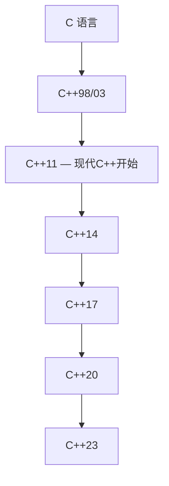

# 第 01 课：从 C 到 C++

## C++ 是什么？

C++ 是 C 语言的超集，由 Bjarne Stroustrup 于 1979 年在贝尔实验室开始设计。它在 C 的基础上增加了：

- **面向对象编程**（类、继承、多态）
- **泛型编程**（模板）
- **标准库**（STL）
- **异常处理**
- **RAII 资源管理**



---

## C 和 C++ 的区别

| 特性 | C | C++ |
|------|---|-----|
| 编程范式 | 过程式 | 过程式 + 面向对象 + 泛型 |
| 文件扩展名 | `.c` | `.cpp` / `.cc` / `.cxx` |
| 编译器 | `gcc` | `g++` |
| 输入输出 | `printf/scanf` | `cout/cin`（也支持 printf） |
| 内存管理 | `malloc/free` | `new/delete`（也支持 malloc） |
| 字符串 | `char[]` | `std::string` |
| 布尔类型 | `_Bool`（C99） | `bool`（内建） |

---

## 第一个 C++ 程序

```cpp title="hello.cpp"
#include <iostream>  // C++ 头文件不带 .h

int main()
{
    std::cout << "Hello, C++!" << std::endl;
    return 0;
}
```

```bash
# 编译运行
g++ hello.cpp -o hello -std=c++17
./hello
```

---

## C++ 的新特性速览

### bool 类型

```cpp
bool is_ready = true;
bool is_empty = false;
std::cout << std::boolalpha << is_ready << std::endl;  // true
```

### auto 自动类型推导

```cpp
auto x = 42;        // int
auto pi = 3.14;     // double
auto name = "C++";  // const char*
auto s = std::string("hello");  // std::string
```

### nullptr（替代 NULL）

```cpp
int *p = nullptr;  // C++11 推荐用 nullptr
if (p == nullptr) {
    std::cout << "空指针" << std::endl;
}
```

### 初始化方式

```cpp
int a = 10;       // C 风格
int b(20);        // 构造式
int c{30};        // 列表初始化（C++11，推荐）
int d = {40};     // 也可以

// {} 可以防止窄化转换
// int x{3.14};   // 编译错误！
int x = 3.14;     // 只是警告，值为 3
```

---

## 编译选项

```bash
# 常用编译选项
g++ -std=c++17 -Wall -Wextra -g main.cpp -o app

# -std=c++17  指定 C++ 标准
# -Wall       开启常见警告
# -Wextra     开启更多警告
# -g          生成调试信息
# -O2         开启优化
```

---

## 练习题

### 练习 1：个人信息输出

**要求**：

- 使用 `cout` 输出你的姓名、年龄和爱好
- 使用 `endl` 换行，每项信息占一行
- 使用 `std::string` 存储字符串（不要用 `char[]`）

??? note "参考答案"

    ```cpp title="exercise01.cpp"
    #include <iostream>
    #include <string>

    int main()
    {
        std::string name = "张三";
        int age = 20;
        std::string hobby = "嵌入式开发";

        std::cout << "姓名: " << name << std::endl;
        std::cout << "年龄: " << age << std::endl;
        std::cout << "爱好: " << hobby << std::endl;

        return 0;
    }
    ```

    **预期输出**：
    ```
    姓名: 张三
    年龄: 20
    爱好: 嵌入式开发
    ```

### 练习 2：auto 类型推导

**要求**：

- 用 `auto` 声明至少 5 种不同类型的变量（int, double, bool, string, char）
- 打印每个变量的值
- 使用 `typeid(变量).name()` 打印类型名（需要 `#include <typeinfo>`）

??? note "参考答案"

    ```cpp title="exercise02.cpp"
    #include <iostream>
    #include <string>
    #include <typeinfo>

    int main()
    {
        auto a = 42;                         // int
        auto b = 3.14;                       // double
        auto c = true;                       // bool
        auto d = std::string("hello C++");   // std::string
        auto e = 'A';                        // char
        auto f = 100L;                       // long
        auto g = nullptr;                    // std::nullptr_t

        std::cout << "a = " << a << "  类型: " << typeid(a).name() << std::endl;
        std::cout << "b = " << b << "  类型: " << typeid(b).name() << std::endl;
        std::cout << "c = " << std::boolalpha << c << "  类型: " << typeid(c).name() << std::endl;
        std::cout << "d = " << d << "  类型: " << typeid(d).name() << std::endl;
        std::cout << "e = " << e << "  类型: " << typeid(e).name() << std::endl;
        std::cout << "f = " << f << "  类型: " << typeid(f).name() << std::endl;

        return 0;
    }
    ```

    **预期输出**（MSVC 下，g++ 会显示缩写）：
    ```
    a = 42  类型: int
    b = 3.14  类型: double
    c = true  类型: bool
    d = hello C++  类型: class std::basic_string<char,...>
    e = A  类型: char
    f = 100  类型: long
    ```

---

> **下一课**：[命名空间与输入输出](../02-namespace-io/README.md)
