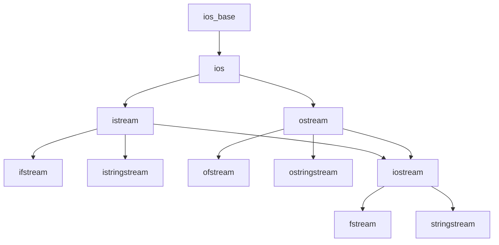

# 第 08 课：IO 流与文件操作

## C++ IO 流体系



---

## 文件写入

```cpp title="file_write.cpp"
#include <fstream>
#include <iostream>

int main()
{
    std::ofstream ofs("data.txt");
    if (!ofs.is_open()) {
        std::cerr << "打开文件失败" << std::endl;
        return 1;
    }
    
    ofs << "姓名: 张三" << std::endl;
    ofs << "年龄: 20" << std::endl;
    ofs << "成绩: 95.5" << std::endl;
    
    ofs.close();  // 析构时也会自动关闭（RAII）
    return 0;
}
```

## 文件读取

```cpp title="file_read.cpp"
#include <fstream>
#include <iostream>
#include <string>

int main()
{
    std::ifstream ifs("data.txt");
    if (!ifs) {
        std::cerr << "文件不存在" << std::endl;
        return 1;
    }
    
    // 逐行读取
    std::string line;
    while (std::getline(ifs, line)) {
        std::cout << line << std::endl;
    }
    
    return 0;
}
```

---

## stringstream

用于**字符串和其他类型之间的转换**：

```cpp
#include <sstream>

// 拼接
std::ostringstream oss;
oss << "温度: " << 25.6 << "°C, 湿度: " << 65 << "%";
std::string result = oss.str();

// 解析
std::istringstream iss("42 3.14 hello");
int n; double d; std::string s;
iss >> n >> d >> s;
// n=42, d=3.14, s="hello"
```

---

## 二进制文件

```cpp
#include <fstream>

struct Record {
    int id;
    char name[20];
    double score;
};

// 写入
Record r = {1, "张三", 95.5};
std::ofstream ofs("data.bin", std::ios::binary);
ofs.write(reinterpret_cast<char*>(&r), sizeof(r));
ofs.close();

// 读取
Record r2;
std::ifstream ifs("data.bin", std::ios::binary);
ifs.read(reinterpret_cast<char*>(&r2), sizeof(r2));
```

---

## 练习题

### 练习 1：学生信息文件读写

**要求**：

- 定义 `Student` 结构体（姓名、年龄、成绩）
- 将 5 个学生信息写入 `students.txt` 文件
- 从文件中读取并打印
- 每行格式：`姓名 年龄 成绩`

??? note "参考答案"

    ```cpp title="exercise01.cpp"
    #include <iostream>
    #include <fstream>
    #include <string>
    #include <iomanip>

    struct Student {
        std::string name;
        int age;
        double score;
    };

    int main()
    {
        // 写入
        Student students[] = {
            {"张三", 20, 95.5},
            {"李四", 21, 88.0},
            {"王五", 19, 72.3},
            {"赵六", 22, 91.2},
            {"钱七", 20, 85.7}
        };

        std::ofstream ofs("students.txt");
        if (!ofs) {
            std::cerr << "无法创建文件" << std::endl;
            return 1;
        }
        for (const auto &s : students) {
            ofs << s.name << " " << s.age << " " << s.score << std::endl;
        }
        ofs.close();
        std::cout << "已写入 5 个学生信息\n" << std::endl;

        // 读取
        std::ifstream ifs("students.txt");
        if (!ifs) {
            std::cerr << "文件不存在" << std::endl;
            return 1;
        }

        std::cout << std::left << std::setw(8) << "姓名"
                  << std::right << std::setw(5) << "年龄"
                  << std::setw(8) << "成绩" << std::endl;
        std::cout << std::string(21, '-') << std::endl;

        Student s;
        while (ifs >> s.name >> s.age >> s.score) {
            std::cout << std::left << std::setw(8) << s.name
                      << std::right << std::setw(5) << s.age
                      << std::fixed << std::setprecision(1)
                      << std::setw(8) << s.score << std::endl;
        }

        return 0;
    }
    ```

    **预期输出**：
    ```
    已写入 5 个学生信息

    姓名       年龄    成绩
    ---------------------
    张三        20    95.5
    李四        21    88.0
    王五        19    72.3
    赵六        22    91.2
    钱七        20    85.7
    ```

### 练习 2：解析 CSV

**要求**：

- 用 `stringstream` + `getline` 解析 CSV 行 `"张三,85,92,78"`
- 提取姓名和三科成绩
- 计算并打印平均分

??? note "参考答案"

    ```cpp title="exercise02.cpp"
    #include <iostream>
    #include <sstream>
    #include <string>
    #include <vector>

    int main()
    {
        std::vector<std::string> csv_lines = {
            "张三,85,92,78",
            "李四,90,88,95",
            "王五,72,65,80"
        };

        for (const auto &line : csv_lines) {
            std::istringstream iss(line);
            std::string name, token;
            std::vector<int> scores;

            // 用逗号为分隔符读取
            std::getline(iss, name, ',');
            while (std::getline(iss, token, ',')) {
                scores.push_back(std::stoi(token));
            }

            double avg = 0;
            for (int s : scores) avg += s;
            avg /= scores.size();

            std::cout << name << ": ";
            for (size_t i = 0; i < scores.size(); i++) {
                if (i > 0) std::cout << ", ";
                std::cout << scores[i];
            }
            std::cout << "  平均: " << std::fixed << std::setprecision(1)
                      << avg << std::endl;
        }

        return 0;
    }
    ```

    **预期输出**：
    ```
    张三: 85, 92, 78  平均: 85.0
    李四: 90, 88, 95  平均: 91.0
    王五: 72, 65, 80  平均: 72.3
    ```

---

> **下一课**：[构造函数与析构函数](../09-constructor-destructor/README.md)
