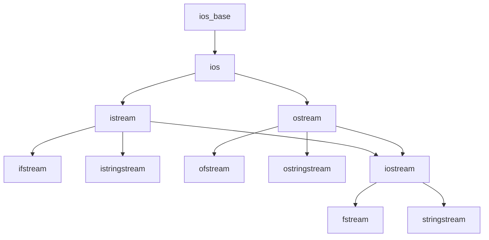

# 第 08 课：IO 流与文件操作

## C++ IO 流体系



---

## 文件写入

```cpp title="file_write.cpp"
#include <fstream>
#include <iostream>

int main()
{
    std::ofstream ofs("data.txt");
    if (!ofs.is_open()) {
        std::cerr << "打开文件失败" << std::endl;
        return 1;
    }
    
    ofs << "姓名: 张三" << std::endl;
    ofs << "年龄: 20" << std::endl;
    ofs << "成绩: 95.5" << std::endl;
    
    ofs.close();  // 析构时也会自动关闭（RAII）
    return 0;
}
```

## 文件读取

```cpp title="file_read.cpp"
#include <fstream>
#include <iostream>
#include <string>

int main()
{
    std::ifstream ifs("data.txt");
    if (!ifs) {
        std::cerr << "文件不存在" << std::endl;
        return 1;
    }
    
    // 逐行读取
    std::string line;
    while (std::getline(ifs, line)) {
        std::cout << line << std::endl;
    }
    
    return 0;
}
```

---

## stringstream

用于**字符串和其他类型之间的转换**：

```cpp
#include <sstream>

// 拼接
std::ostringstream oss;
oss << "温度: " << 25.6 << "°C, 湿度: " << 65 << "%";
std::string result = oss.str();

// 解析
std::istringstream iss("42 3.14 hello");
int n; double d; std::string s;
iss >> n >> d >> s;
// n=42, d=3.14, s="hello"
```

---

## 二进制文件

```cpp
#include <fstream>

struct Record {
    int id;
    char name[20];
    double score;
};

// 写入
Record r = {1, "张三", 95.5};
std::ofstream ofs("data.bin", std::ios::binary);
ofs.write(reinterpret_cast<char*>(&r), sizeof(r));
ofs.close();

// 读取
Record r2;
std::ifstream ifs("data.bin", std::ios::binary);
ifs.read(reinterpret_cast<char*>(&r2), sizeof(r2));
```

---

## 练习题

### 练习 1

把 5 个学生信息写入文件，再读取出来打印。

### 练习 2

用 stringstream 解析 CSV 行 `"张三,85,92,78"`。

---

> **下一课**：[构造函数与析构函数](../09-constructor-destructor/README.md)
