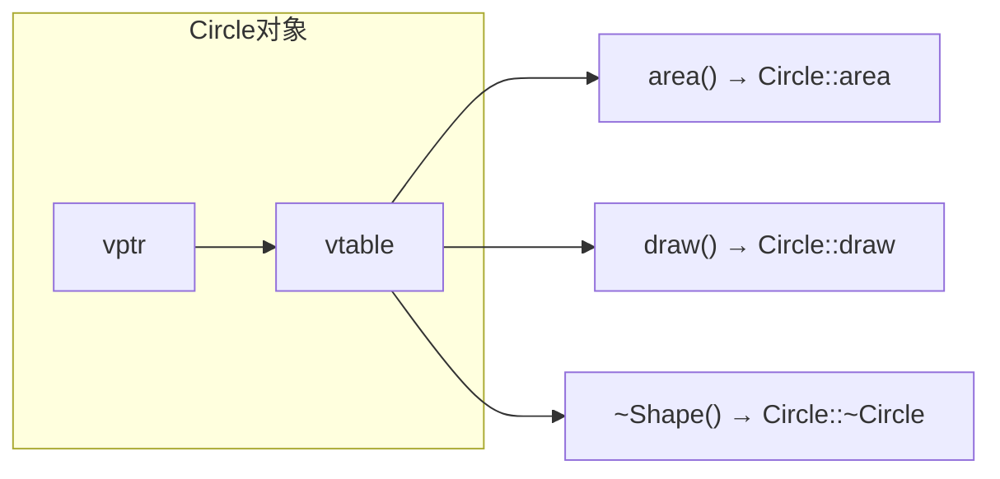

# 第 13 课：多态与虚函数

## 什么是多态？

用**基类指针/引用**调用方法，实际执行的是**子类的版本**：

```cpp title="polymorphism.cpp"
#include <iostream>
#include <vector>
#include <memory>

class Shape {
public:
    virtual double area() const { return 0; }  // 虚函数
    virtual void draw() const { std::cout << "Shape\n"; }
    virtual ~Shape() = default;  // 虚析构函数！
};

class Circle : public Shape {
    double radius;
public:
    Circle(double r) : radius(r) {}
    double area() const override { return 3.14159 * radius * radius; }
    void draw() const override { std::cout << "○ 圆形\n"; }
};

class Rectangle : public Shape {
    double w, h;
public:
    Rectangle(double w, double h) : w(w), h(h) {}
    double area() const override { return w * h; }
    void draw() const override { std::cout << "□ 矩形\n"; }
};

int main()
{
    std::vector<std::unique_ptr<Shape>> shapes;
    shapes.push_back(std::make_unique<Circle>(5));
    shapes.push_back(std::make_unique<Rectangle>(3, 4));
    
    for (auto &s : shapes) {
        s->draw();
        std::cout << "面积: " << s->area() << std::endl;
    }
    return 0;
}
```

---

## 虚函数表 (vtable)



- 每个含虚函数的类有一个**虚函数表**
- 每个对象有一个 `vptr` 指向它所属类的 vtable
- 调用虚函数时通过 vtable 找到正确的函数（运行时绑定）

---

## override 与 final

```cpp
class Base {
public:
    virtual void foo() const;
};

class Derived : public Base {
public:
    void foo() const override;  // 明确标注覆盖（拼写错误会编译报错）
};

class Final : public Base {
public:
    void foo() const final;  // 禁止子类再覆盖
};

class Leaf final : public Base {  // 禁止继承
};
```

---

## 虚析构函数

```cpp
class Base {
public:
    virtual ~Base() = default;  // 必须虚析构！
};

Base *p = new Derived();
delete p;  // 如果没有虚析构，只调用 Base 的析构函数 → 内存泄漏
```

!!! danger "重要规则"
    **如果类有虚函数，析构函数必须是虚的！**

---

## 练习题

### 练习 1：虚函数多态

**要求**：

- 设计 `Animal` 基类，包含 `virtual void speak()` 纯虚函数
- 派生 `Dog`、`Cat`、`Bird` 三个子类，各自实现 `speak()`
- 用基类指针数组存储不同动物，循环调用 `speak()` 观察多态
- 注意基类析构函数必须是 `virtual`

??? note "参考答案"

    ```cpp title="exercise01.cpp"
    #include <iostream>
    #include <vector>
    #include <memory>

    class Animal {
    public:
        virtual void speak() const = 0;
        virtual ~Animal() = default;
    };

    class Dog : public Animal {
    public:
        void speak() const override { std::cout << "狗: 汪汪汪！" << std::endl; }
    };

    class Cat : public Animal {
    public:
        void speak() const override { std::cout << "猫: 喵喵喵~" << std::endl; }
    };

    class Bird : public Animal {
    public:
        void speak() const override { std::cout << "鸟: 叽叽叽!" << std::endl; }
    };

    int main()
    {
        std::vector<std::unique_ptr<Animal>> zoo;
        zoo.push_back(std::make_unique<Dog>());
        zoo.push_back(std::make_unique<Cat>());
        zoo.push_back(std::make_unique<Bird>());
        zoo.push_back(std::make_unique<Dog>());

        std::cout << "动物园:" << std::endl;
        for (const auto &animal : zoo) {
            animal->speak();  // 多态调用
        }

        return 0;
    }
    ```

    **预期输出**：
    ```
    动物园:
    狗: 汪汪汪！
    猫: 喵喵喵~
    鸟: 叽叽叽!
    狗: 汪汪汪！
    ```

### 练习 2：不加 virtual 析构的后果

**要求**：

- 定义基类 `Base`（析构函数不加 `virtual`）和派生类 `Derived`
- 派生类构造时 `new` 一块内存，析构时 `delete`
- 用基类指针 `delete` 派生类对象，观察是否调用了派生类析构
- 然后加上 `virtual`，对比结果

??? note "参考答案"

    ```cpp title="exercise02.cpp"
    #include <iostream>

    class Base {
    public:
        Base() { std::cout << "Base 构造" << std::endl; }
        // 故意不加 virtual，观察问题
        ~Base() { std::cout << "Base 析构" << std::endl; }
    };

    class Derived : public Base {
        int *data;
    public:
        Derived() : data(new int[100]) {
            std::cout << "Derived 构造 (分配内存)" << std::endl;
        }
        ~Derived() {
            delete[] data;
            std::cout << "Derived 析构 (释放内存)" << std::endl;
        }
    };

    int main()
    {
        std::cout << "=== 用基类指针 delete ===" << std::endl;
        Base *p = new Derived();
        delete p;  // ⚠ Derived 析构不会被调用！内存泄漏！

        std::cout << "\n修复方法: 给 Base 析构加 virtual" << std::endl;

        return 0;
    }
    ```

    **不加 virtual 的输出**（Derived 析构未调用，内存泄漏！）：
    ```
    === 用基类指针 delete ===
    Base 构造
    Derived 构造 (分配内存)
    Base 析构

    修复方法: 给 Base 析构加 virtual
    ```

    **加 virtual 后的正确输出**：
    ```
    === 用基类指针 delete ===
    Base 构造
    Derived 构造 (分配内存)
    Derived 析构 (释放内存)
    Base 析构
    ```

---

> **下一课**：[抽象类与接口](../14-abstract-interface/README.md)
