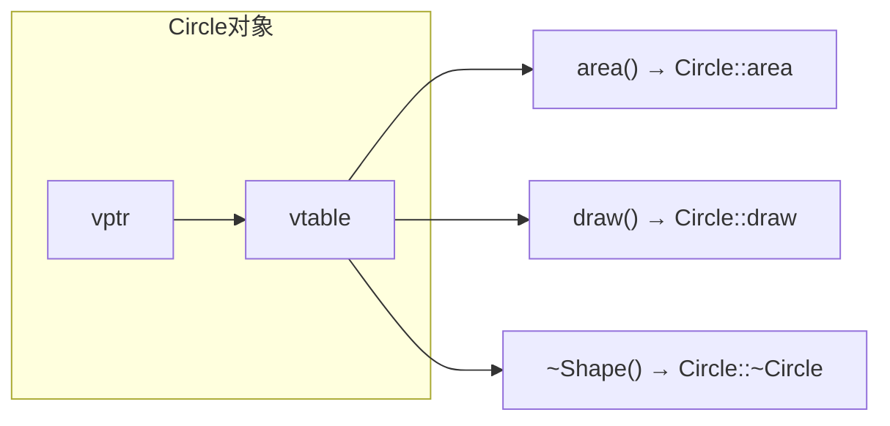

# 第 13 课：多态与虚函数

## 什么是多态？

用**基类指针/引用**调用方法，实际执行的是**子类的版本**：

```cpp title="polymorphism.cpp"
#include <iostream>
#include <vector>
#include <memory>

class Shape {
public:
    virtual double area() const { return 0; }  // 虚函数
    virtual void draw() const { std::cout << "Shape\n"; }
    virtual ~Shape() = default;  // 虚析构函数！
};

class Circle : public Shape {
    double radius;
public:
    Circle(double r) : radius(r) {}
    double area() const override { return 3.14159 * radius * radius; }
    void draw() const override { std::cout << "○ 圆形\n"; }
};

class Rectangle : public Shape {
    double w, h;
public:
    Rectangle(double w, double h) : w(w), h(h) {}
    double area() const override { return w * h; }
    void draw() const override { std::cout << "□ 矩形\n"; }
};

int main()
{
    std::vector<std::unique_ptr<Shape>> shapes;
    shapes.push_back(std::make_unique<Circle>(5));
    shapes.push_back(std::make_unique<Rectangle>(3, 4));
    
    for (auto &s : shapes) {
        s->draw();
        std::cout << "面积: " << s->area() << std::endl;
    }
    return 0;
}
```

---

## 虚函数表 (vtable)



- 每个含虚函数的类有一个**虚函数表**
- 每个对象有一个 `vptr` 指向它所属类的 vtable
- 调用虚函数时通过 vtable 找到正确的函数（运行时绑定）

---

## override 与 final

```cpp
class Base {
public:
    virtual void foo() const;
};

class Derived : public Base {
public:
    void foo() const override;  // 明确标注覆盖（拼写错误会编译报错）
};

class Final : public Base {
public:
    void foo() const final;  // 禁止子类再覆盖
};

class Leaf final : public Base {  // 禁止继承
};
```

---

## 虚析构函数

```cpp
class Base {
public:
    virtual ~Base() = default;  // 必须虚析构！
};

Base *p = new Derived();
delete p;  // 如果没有虚析构，只调用 Base 的析构函数 → 内存泄漏
```

!!! danger "重要规则"
    **如果类有虚函数，析构函数必须是虚的！**

---

## 练习题

### 练习 1

设计一个动物园系统：`Animal` 基类，`Dog`/`Cat`/`Bird` 子类，多态调用 `speak()` 和 `move()`。

### 练习 2

用 `vector<unique_ptr<Shape>>` 存储多种图形，计算总面积。

---

> **下一课**：[抽象类与接口](../14-abstract-interface/README.md)
