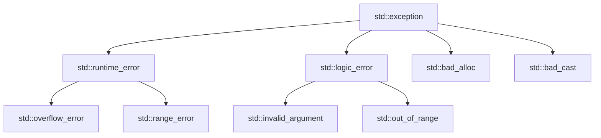

# 第 17 课：异常处理

## try / catch / throw

```cpp
#include <stdexcept>

double divide(double a, double b) {
    if (b == 0) throw std::runtime_error("除数不能为零");
    return a / b;
}

int main() {
    try {
        std::cout << divide(10, 0) << std::endl;
    } catch (const std::runtime_error &e) {
        std::cerr << "错误: " << e.what() << std::endl;
    } catch (const std::exception &e) {
        std::cerr << "异常: " << e.what() << std::endl;
    } catch (...) {
        std::cerr << "未知异常" << std::endl;
    }
    return 0;
}
```

---

## 标准异常层次



---

## 自定义异常

```cpp
class DeviceError : public std::runtime_error {
    int error_code;
public:
    DeviceError(int code, const std::string &msg)
        : std::runtime_error(msg), error_code(code) {}
    int code() const { return error_code; }
};

void init_sensor() {
    throw DeviceError(0x03, "传感器初始化超时");
}

try {
    init_sensor();
} catch (const DeviceError &e) {
    std::cerr << "设备错误 [0x" << std::hex << e.code() << "]: "
              << e.what() << std::endl;
}
```

---

## noexcept

```cpp
void safe_func() noexcept {  // 承诺不抛异常
    // 如果抛了异常 → std::terminate()
}

// 移动构造应该标记 noexcept（STL 容器优化会检查）
MyClass(MyClass &&other) noexcept { /* ... */ }
```

---

## 异常安全级别

| 级别 | 保证 | 说明 |
|------|------|------|
| 无异常保证 | 无 | 最差 |
| 基本保证 | 不泄漏资源 | 最低要求 |
| 强异常保证 | 失败则回滚 | 事务语义 |
| 不抛异常 | `noexcept` | 最强 |

---

## 练习题

### 练习 1：安全除法

**要求**：

- 实现 `double safe_divide(double a, double b)` 函数
- 当 `b == 0` 时抛出 `std::invalid_argument` 异常
- 在 `main` 中用 `try/catch` 捕获并处理
- 测试正常和异常两种情况

??? note "参考答案"

    ```cpp title="exercise01.cpp"
    #include <iostream>
    #include <stdexcept>

    double safe_divide(double a, double b) {
        if (b == 0) {
            throw std::invalid_argument("除数不能为零");
        }
        return a / b;
    }

    int main()
    {
        // 正常情况
        try {
            double result = safe_divide(10, 3);
            std::cout << "10 / 3 = " << result << std::endl;
        } catch (const std::exception &e) {
            std::cerr << "错误: " << e.what() << std::endl;
        }

        // 异常情况
        try {
            double result = safe_divide(10, 0);
            std::cout << "10 / 0 = " << result << std::endl;
        } catch (const std::invalid_argument &e) {
            std::cerr << "捕获异常: " << e.what() << std::endl;
        }

        std::cout << "程序继续运行..." << std::endl;
        return 0;
    }
    ```

    **预期输出**：
    ```
    10 / 3 = 3.33333
    捕获异常: 除数不能为零
    程序继续运行...
    ```

### 练习 2：自定义异常类

**要求**：

- 定义 `InsufficientFundsException` 继承 `std::runtime_error`
- 包含 `balance`（当前余额）和 `amount`（请求金额）信息
- 在取款函数中使用，余额不足时抛出
- 捕获后打印详细错误信息

??? note "参考答案"

    ```cpp title="exercise02.cpp"
    #include <iostream>
    #include <stdexcept>
    #include <string>

    class InsufficientFundsException : public std::runtime_error {
        double balance_;
        double amount_;
    public:
        InsufficientFundsException(double balance, double amount)
            : std::runtime_error("余额不足"),
              balance_(balance), amount_(amount) {}

        double balance() const { return balance_; }
        double amount() const { return amount_; }
    };

    class Account {
        double balance_ = 0;
    public:
        Account(double b) : balance_(b) {}

        void withdraw(double amount) {
            if (amount > balance_) {
                throw InsufficientFundsException(balance_, amount);
            }
            balance_ -= amount;
            std::cout << "取款 " << amount << " 成功，余额: " << balance_ << std::endl;
        }
    };

    int main()
    {
        Account acc(1000);

        try {
            acc.withdraw(300);   // 成功
            acc.withdraw(500);   // 成功
            acc.withdraw(400);   // 余额不足
        } catch (const InsufficientFundsException &e) {
            std::cerr << "异常: " << e.what() << std::endl;
            std::cerr << "  当前余额: " << e.balance() << std::endl;
            std::cerr << "  请求金额: " << e.amount() << std::endl;
        }

        return 0;
    }
    ```

    **预期输出**：
    ```
    取款 300 成功，余额: 700
    取款 500 成功，余额: 200
    异常: 余额不足
      当前余额: 200
      请求金额: 400
    ```

---

> **下一课**：[智能指针](../18-smart-pointer/README.md)
