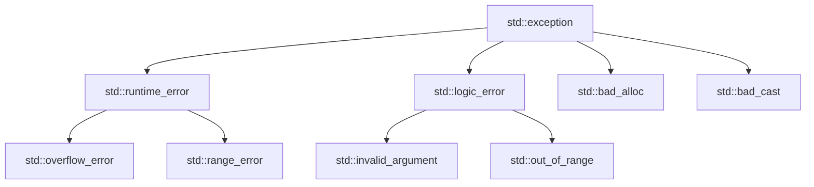

# 第 17 课：异常处理

## try / catch / throw

```cpp
#include <stdexcept>

double divide(double a, double b) {
    if (b == 0) throw std::runtime_error("除数不能为零");
    return a / b;
}

int main() {
    try {
        std::cout << divide(10, 0) << std::endl;
    } catch (const std::runtime_error &e) {
        std::cerr << "错误: " << e.what() << std::endl;
    } catch (const std::exception &e) {
        std::cerr << "异常: " << e.what() << std::endl;
    } catch (...) {
        std::cerr << "未知异常" << std::endl;
    }
    return 0;
}
```

---

## 标准异常层次



---

## 自定义异常

```cpp
class DeviceError : public std::runtime_error {
    int error_code;
public:
    DeviceError(int code, const std::string &msg)
        : std::runtime_error(msg), error_code(code) {}
    int code() const { return error_code; }
};

void init_sensor() {
    throw DeviceError(0x03, "传感器初始化超时");
}

try {
    init_sensor();
} catch (const DeviceError &e) {
    std::cerr << "设备错误 [0x" << std::hex << e.code() << "]: "
              << e.what() << std::endl;
}
```

---

## noexcept

```cpp
void safe_func() noexcept {  // 承诺不抛异常
    // 如果抛了异常 → std::terminate()
}

// 移动构造应该标记 noexcept（STL 容器优化会检查）
MyClass(MyClass &&other) noexcept { /* ... */ }
```

---

## 异常安全级别

| 级别 | 保证 | 说明 |
|------|------|------|
| 无异常保证 | 无 | 最差 |
| 基本保证 | 不泄漏资源 | 最低要求 |
| 强异常保证 | 失败则回滚 | 事务语义 |
| 不抛异常 | `noexcept` | 最强 |

---

## 练习题

### 练习 1

为银行账户类的取款方法添加异常处理（余额不足时抛异常）。

### 练习 2

自定义 `NetworkError` 异常类，包含错误码和错误信息。

---

> **下一课**：[智能指针](../18-smart-pointer/README.md)
