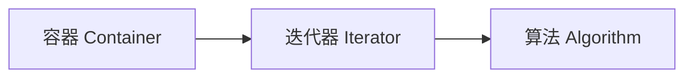

# 第 21 课：STL 概述与容器

## STL 三大组件



---

## 序列容器

### vector（动态数组，最常用）

```cpp
#include <vector>

std::vector<int> v = {1, 2, 3, 4, 5};

v.push_back(6);         // 尾部添加
v.pop_back();            // 尾部删除
v.insert(v.begin(), 0);  // 头部插入
v.erase(v.begin());      // 头部删除

std::cout << v.size() << std::endl;      // 元素数量
std::cout << v.capacity() << std::endl;  // 预分配容量
v.reserve(100);  // 预分配空间（减少扩容）
v.shrink_to_fit();  // 释放多余空间

// 遍历
for (int x : v) std::cout << x << " ";
for (auto it = v.begin(); it != v.end(); ++it) std::cout << *it << " ";
```

### deque（双端队列）

```cpp
#include <deque>

std::deque<int> dq = {2, 3, 4};
dq.push_front(1);  // 头部添加 O(1)
dq.push_back(5);   // 尾部添加 O(1)
```

### list（双向链表）

```cpp
#include <list>

std::list<int> lst = {1, 2, 3};
lst.push_front(0);
lst.push_back(4);
lst.sort();       // 自带排序
lst.reverse();    // 反转
lst.unique();     // 去除相邻重复
```

### array（固定大小数组，C++11）

```cpp
#include <array>

std::array<int, 5> arr = {1, 2, 3, 4, 5};
std::cout << arr.size() << std::endl;  // 5（编译期确定）
```

---

## 容器对比

| 容器 | 随机访问 | 头部插删 | 尾部插删 | 中间插删 |
|------|---------|---------|---------|---------|
| `vector` | O(1) | O(n) | O(1) | O(n) |
| `deque` | O(1) | O(1) | O(1) | O(n) |
| `list` | O(n) | O(1) | O(1) | O(1) |
| `array` | O(1) | — | — | — |

!!! tip "选择指南"
    - 默认用 `vector`
    - 需要头尾都快速操作用 `deque`
    - 需要频繁中间插删用 `list`

---

## 练习题

### 练习 1

用 `vector` 实现一个成绩管理系统：添加、排序、查找、删除。

### 练习 2

比较 `vector` 和 `list` 在头部插入 10000 个元素的性能差异。

---

> **下一课**：[迭代器与算法](../22-iterators-algorithms/README.md)
