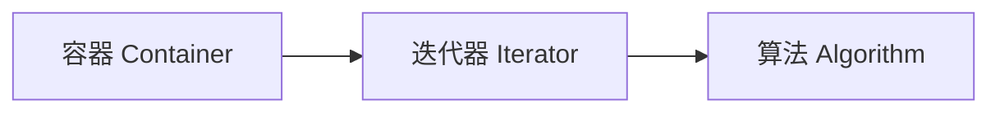

# 第 21 课：STL 概述与容器

## STL 三大组件



---

## 序列容器

### vector（动态数组，最常用）

```cpp
#include <vector>

std::vector<int> v = {1, 2, 3, 4, 5};

v.push_back(6);         // 尾部添加
v.pop_back();            // 尾部删除
v.insert(v.begin(), 0);  // 头部插入
v.erase(v.begin());      // 头部删除

std::cout << v.size() << std::endl;      // 元素数量
std::cout << v.capacity() << std::endl;  // 预分配容量
v.reserve(100);  // 预分配空间（减少扩容）
v.shrink_to_fit();  // 释放多余空间

// 遍历
for (int x : v) std::cout << x << " ";
for (auto it = v.begin(); it != v.end(); ++it) std::cout << *it << " ";
```

### deque（双端队列）

```cpp
#include <deque>

std::deque<int> dq = {2, 3, 4};
dq.push_front(1);  // 头部添加 O(1)
dq.push_back(5);   // 尾部添加 O(1)
```

### list（双向链表）

```cpp
#include <list>

std::list<int> lst = {1, 2, 3};
lst.push_front(0);
lst.push_back(4);
lst.sort();       // 自带排序
lst.reverse();    // 反转
lst.unique();     // 去除相邻重复
```

### array（固定大小数组，C++11）

```cpp
#include <array>

std::array<int, 5> arr = {1, 2, 3, 4, 5};
std::cout << arr.size() << std::endl;  // 5（编译期确定）
```

---

## 容器对比

| 容器 | 随机访问 | 头部插删 | 尾部插删 | 中间插删 |
|------|---------|---------|---------|---------|
| `vector` | O(1) | O(n) | O(1) | O(n) |
| `deque` | O(1) | O(1) | O(1) | O(n) |
| `list` | O(n) | O(1) | O(1) | O(1) |
| `array` | O(1) | — | — | — |

!!! tip "选择指南"
    - 默认用 `vector`
    - 需要头尾都快速操作用 `deque`
    - 需要频繁中间插删用 `list`

---

## 练习题

### 练习 1：成绩管理系统

**要求**：

- 用 `vector` 存储学生成绩
- 实现添加、排序（升序/降序）、查找最高分/最低分/平均分
- 删除不及格（<60）的成绩
- 打印每步操作后的状态

??? note "参考答案"

    ```cpp title="exercise01.cpp"
    #include <iostream>
    #include <vector>
    #include <algorithm>
    #include <numeric>

    void print_scores(const std::string &label, const std::vector<int> &scores) {
        std::cout << label << ": [";
        for (size_t i = 0; i < scores.size(); i++) {
            if (i > 0) std::cout << ", ";
            std::cout << scores[i];
        }
        std::cout << "]" << std::endl;
    }

    int main()
    {
        std::vector<int> scores = {78, 92, 55, 88, 45, 100, 67, 38, 95, 72};
        print_scores("原始成绩", scores);

        // 排序
        std::sort(scores.begin(), scores.end());
        print_scores("升序排序", scores);

        // 最值和平均
        auto [min_it, max_it] = std::minmax_element(scores.begin(), scores.end());
        double avg = std::accumulate(scores.begin(), scores.end(), 0.0) / scores.size();
        std::cout << "最低分: " << *min_it << "  最高分: " << *max_it
                  << "  平均分: " << avg << std::endl;

        // 删除不及格
        scores.erase(
            std::remove_if(scores.begin(), scores.end(), [](int s) { return s < 60; }),
            scores.end()
        );
        print_scores("删除不及格后", scores);

        return 0;
    }
    ```

    **预期输出**：
    ```
    原始成绩: [78, 92, 55, 88, 45, 100, 67, 38, 95, 72]
    升序排序: [38, 45, 55, 67, 72, 78, 88, 92, 95, 100]
    最低分: 38  最高分: 100  平均分: 73
    删除不及格后: [67, 72, 78, 88, 92, 95, 100]
    ```

### 练习 2：vector vs list 性能对比

**要求**：

- 分别用 `vector` 和 `list` 在头部插入 100000 个元素
- 用 `<chrono>` 测量各自耗时
- 打印对比结果，观察差异

??? note "参考答案"

    ```cpp title="exercise02.cpp"
    #include <iostream>
    #include <vector>
    #include <list>
    #include <chrono>

    int main()
    {
        const int N = 100000;

        // vector 头部插入
        {
            auto start = std::chrono::high_resolution_clock::now();
            std::vector<int> v;
            for (int i = 0; i < N; i++) {
                v.insert(v.begin(), i);
            }
            auto end = std::chrono::high_resolution_clock::now();
            auto ms = std::chrono::duration_cast<std::chrono::milliseconds>(end - start).count();
            std::cout << "vector 头部插入 " << N << " 个元素: " << ms << " ms" << std::endl;
        }

        // list 头部插入
        {
            auto start = std::chrono::high_resolution_clock::now();
            std::list<int> lst;
            for (int i = 0; i < N; i++) {
                lst.push_front(i);
            }
            auto end = std::chrono::high_resolution_clock::now();
            auto ms = std::chrono::duration_cast<std::chrono::milliseconds>(end - start).count();
            std::cout << "list   头部插入 " << N << " 个元素: " << ms << " ms" << std::endl;
        }

        std::cout << "\n结论: list 头部插入远快于 vector（O(1) vs O(n)）" << std::endl;

        return 0;
    }
    ```

    **预期输出**（耗时因机器而异）：
    ```
    vector 头部插入 100000 个元素: 2356 ms
    list   头部插入 100000 个元素: 5 ms

    结论: list 头部插入远快于 vector（O(1) vs O(n)）
    ```

---

> **下一课**：[迭代器与算法](../22-iterators-algorithms/README.md)
