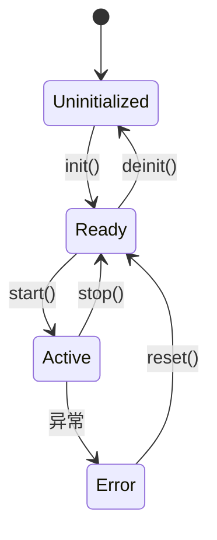

# 第 34 课：项目实战 — 驱动框架

## 项目目标

用 CRTP + RAII + 状态机，构建一个**零虚函数开销**的嵌入式驱动抽象框架。

---

## 驱动状态机



```cpp
enum class DriverState {
    Uninitialized,
    Ready,
    Active,
    Error
};
```

---

## CRTP 驱动基类

```cpp
template <typename Derived>
class DriverBase {
    DriverState state_ = DriverState::Uninitialized;

protected:
    Derived& impl() { return static_cast<Derived&>(*this); }

public:
    bool init() {
        if (state_ != DriverState::Uninitialized) return false;
        if (impl().do_init()) {
            state_ = DriverState::Ready;
            return true;
        }
        state_ = DriverState::Error;
        return false;
    }
    
    bool start() {
        if (state_ != DriverState::Ready) return false;
        if (impl().do_start()) {
            state_ = DriverState::Active;
            return true;
        }
        state_ = DriverState::Error;
        return false;
    }
    
    void stop() {
        if (state_ == DriverState::Active) {
            impl().do_stop();
            state_ = DriverState::Ready;
        }
    }
    
    void deinit() {
        stop();
        if (state_ == DriverState::Ready) {
            impl().do_deinit();
            state_ = DriverState::Uninitialized;
        }
    }
    
    void reset() {
        impl().do_deinit();
        state_ = DriverState::Uninitialized;
        init();
    }
    
    DriverState state() const { return state_; }
};
```

---

## RAII 驱动守卫

```cpp
template <typename Driver>
class DriverGuard {
    Driver &drv_;
public:
    explicit DriverGuard(Driver &drv) : drv_(drv) {
        drv_.init();
        drv_.start();
    }
    ~DriverGuard() {
        drv_.deinit();
    }
    DriverGuard(const DriverGuard&) = delete;
    DriverGuard& operator=(const DriverGuard&) = delete;
    
    Driver& get() { return drv_; }
};
```

---

## 具体驱动实现

### SPI 驱动

```cpp
class SpiDriver : public DriverBase<SpiDriver> {
    friend class DriverBase<SpiDriver>;
    
    bool do_init() {
        // 配置 SPI 寄存器：时钟、模式、速率
        std::cout << "SPI: 初始化 CPOL=0 CPHA=0 1MHz\n";
        return true;
    }
    
    bool do_start() {
        // 使能 SPI
        std::cout << "SPI: 使能\n";
        return true;
    }
    
    void do_stop() {
        std::cout << "SPI: 停止\n";
    }
    
    void do_deinit() {
        std::cout << "SPI: 反初始化\n";
    }
    
public:
    uint8_t transfer(uint8_t data) {
        // SPI 全双工传输
        std::cout << "SPI: 发送 0x" << std::hex << (int)data << std::dec << "\n";
        return 0xFF;  // 模拟接收
    }
};
```

### I2C 驱动

```cpp
class I2cDriver : public DriverBase<I2cDriver> {
    friend class DriverBase<I2cDriver>;
    uint8_t addr_ = 0;
    
    bool do_init() {
        std::cout << "I2C: 初始化 400kHz\n";
        return true;
    }
    bool do_start() { return true; }
    void do_stop() {}
    void do_deinit() { std::cout << "I2C: 反初始化\n"; }
    
public:
    void set_slave(uint8_t addr) { addr_ = addr; }
    
    bool write_reg(uint8_t reg, uint8_t val) {
        std::cout << "I2C[0x" << std::hex << (int)addr_ 
                  << "]: 写 R" << (int)reg << "=0x" << (int)val << std::dec << "\n";
        return true;
    }
    
    uint8_t read_reg(uint8_t reg) {
        std::cout << "I2C[0x" << std::hex << (int)addr_
                  << "]: 读 R" << (int)reg << std::dec << "\n";
        return 0;
    }
};
```

---

## 使用示例

```cpp
int main() {
    // RAII 自动管理生命周期
    SpiDriver spi;
    {
        DriverGuard guard(spi);
        guard.get().transfer(0xAA);
        guard.get().transfer(0x55);
    }  // 自动 deinit
    
    // I2C 读取传感器
    I2cDriver i2c;
    i2c.init();
    i2c.start();
    i2c.set_slave(0x68);       // MPU6050 地址
    i2c.write_reg(0x6B, 0x00); // 唤醒
    uint8_t who = i2c.read_reg(0x75);  // WHO_AM_I
    i2c.deinit();
    
    return 0;
}
```

---

## 练习题

### 练习：实现 UART 驱动

**要求**：

- 在现有 CRTP 驱动框架基础上实现 `UartDriver`
- 支持 `send(const char*)` 和 `recv()` 接口
- 用 `DriverGuard` RAII 管理生命周期
- 模拟数据发送和接收

??? note "参考答案"

    ```cpp title="exercise.cpp"
    #include <iostream>
    #include <string>
    #include <cstdint>

    enum class DriverState { Uninitialized, Ready, Active, Error };

    template <typename Derived>
    class DriverBase {
        DriverState state_ = DriverState::Uninitialized;
    public:
        bool init() {
            if (state_ != DriverState::Uninitialized) return false;
            if (static_cast<Derived*>(this)->do_init()) {
                state_ = DriverState::Ready;
                return true;
            }
            return false;
        }
        bool start() {
            if (state_ != DriverState::Ready) return false;
            state_ = DriverState::Active;
            return true;
        }
        void stop() { if (state_ == DriverState::Active) state_ = DriverState::Ready; }
        void deinit() {
            stop();
            static_cast<Derived*>(this)->do_deinit();
            state_ = DriverState::Uninitialized;
        }
    };

    template <typename Driver>
    class DriverGuard {
        Driver &drv_;
    public:
        DriverGuard(Driver &d) : drv_(d) { drv_.init(); drv_.start(); }
        ~DriverGuard() { drv_.deinit(); }
        Driver& get() { return drv_; }
    };

    class UartDriver : public DriverBase<UartDriver> {
        friend class DriverBase<UartDriver>;
        uint32_t baud_;

        bool do_init() {
            std::cout << "UART: 初始化 " << baud_ << " 8N1" << std::endl;
            return true;
        }
        void do_deinit() {
            std::cout << "UART: 关闭" << std::endl;
        }
    public:
        UartDriver(uint32_t baud = 115200) : baud_(baud) {}

        void send(const char *data) {
            std::cout << "UART TX: " << data << std::endl;
        }

        std::string recv() {
            std::string data = "OK";
            std::cout << "UART RX: " << data << std::endl;
            return data;
        }
    };

    int main()
    {
        UartDriver uart(9600);
        {
            DriverGuard guard(uart);
            guard.get().send("AT");
            auto resp = guard.get().recv();
            guard.get().send("AT+RST");
            guard.get().recv();
        }  // 自动 deinit

        std::cout << "UART 已自动关闭" << std::endl;
        return 0;
    }
    ```

    **预期输出**：
    ```
    UART: 初始化 9600 8N1
    UART TX: AT
    UART RX: OK
    UART TX: AT+RST
    UART RX: OK
    UART: 关闭
    UART 已自动关闭
    ```

---

> **下一课**：[项目实战：JSON 解析器](../35-project-json-parser/README.md)
