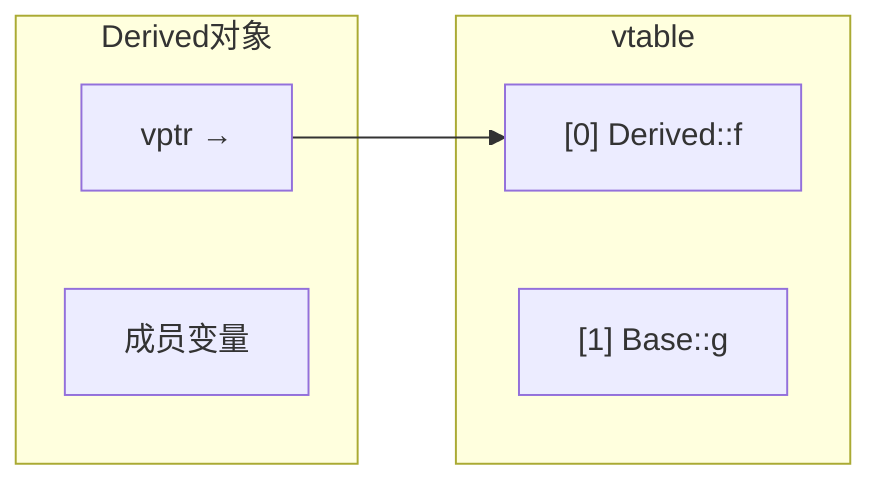

# 第 36 课：面试高频考点

## 一、虚函数与多态

### 虚函数表（vtable）

```cpp
class Base {
public:
    virtual void f() { std::cout << "Base::f\n"; }
    virtual void g() { std::cout << "Base::g\n"; }
};

class Derived : public Base {
public:
    void f() override { std::cout << "Derived::f\n"; }
};
```



**面试要点**：

- 每个有虚函数的类有一个 vtable，每个对象有一个 vptr（通常 8 字节）
- 虚函数通过 vptr → vtable → 函数指针 间接调用
- 构造函数中调用虚函数不会触发多态
- 析构函数必须声明 `virtual`，否则 `delete` 基类指针会内存泄漏

---

## 二、内存布局

```cpp
class A { int a; };              // 4 字节
class B : public A { int b; };   // 8 字节
class C : virtual public A {};   // 4 + 8(vptr) = 16 字节（含对齐）

// sizeof 常见陷阱
class Empty {};                   // sizeof = 1
class WithVirtual { virtual void f(); };  // sizeof = 8 (vptr)
```

**面试要点**：

| 对象组成 | 大小 |
|---------|------|
| 空类 | 1 字节 |
| 有虚函数 | +8 字节（vptr） |
| 虚继承 | +8 字节（虚基类指针） |
| 成员对齐 | 按最大成员对齐 |

---

## 三、智能指针

```cpp
// shared_ptr 循环引用问题
struct Node {
    std::shared_ptr<Node> next;  // ❌ 循环引用 → 内存泄漏
};

struct Node {
    std::weak_ptr<Node> next;    // ✅ 打破循环
};
```

**面试要点**：

| 指针 | 用途 | 线程安全 |
|------|------|---------|
| `unique_ptr` | 独占所有权 | 否 |
| `shared_ptr` | 共享所有权 | 引用计数是 |
| `weak_ptr` | 观察，不拥有 | 是 |

- `make_shared` 比 `shared_ptr(new T)` 高效（一次分配）
- `unique_ptr` 零开销，优先使用

---

## 四、STL 容器选择

| 需求 | 容器 |
|------|------|
| 随机访问 + 尾部增删 | `vector` |
| 头尾增删 | `deque` |
| 中间频繁插删 | `list` |
| 有序键值对 | `map` |
| 快速查找 | `unordered_map` |
| 固定大小 | `array` |

**vector 扩容**：容量不够时分配 2x 空间 → 拷贝全部元素 → 迭代器失效！

---

## 五、移动语义

```cpp
// 面试题：以下代码输出什么？
std::string a = "hello";
std::string b = std::move(a);
std::cout << a.size() << std::endl;  // 0 或未定义（通常为 0）
std::cout << b << std::endl;          // hello
```

**面试要点**：

- `std::move` 只是转换为右值引用，不移动
- 移动后对象处于"有效但未指定"状态
- 移动构造/赋值应标记 `noexcept`（否则 vector 扩容不会用移动）

---

## 六、const 与 constexpr

```cpp
const int a = 10;          // 运行时常量
constexpr int b = 10;      // 编译期常量

const int* p1;             // 指向 const int 的指针（值不可改）
int* const p2 = &x;       // 指向 int 的 const 指针（指针不可改）
const int* const p3 = &x; // 都不可改
```

---

## 七、多线程常见问题

```cpp
// 死锁：两个线程按不同顺序获取锁
std::mutex m1, m2;
// 线程1: lock(m1) → lock(m2)
// 线程2: lock(m2) → lock(m1)  ← 死锁！

// 解决：std::scoped_lock（C++17）
std::scoped_lock lock(m1, m2);  // 同时获取，避免死锁
```

---

## 八、C++ 新标准要点速查

| 特性 | 标准 | 一句话 |
|------|------|--------|
| auto / range-for | C++11 | 类型推导 / 简化循环 |
| 智能指针 | C++11 | RAII 管理堆内存 |
| 移动语义 | C++11 | 避免不必要的拷贝 |
| Lambda | C++11 | 匿名函数 |
| constexpr | C++11 | 编译期计算 |
| 泛型 Lambda | C++14 | auto 参数 |
| 结构化绑定 | C++17 | auto [a,b] = pair |
| optional | C++17 | 可选值 |
| if constexpr | C++17 | 编译期分支 |
| Concepts | C++20 | 模板约束 |
| Ranges | C++20 | 管道式容器操作 |

---

## 九、编程题精选

### 实现 String 类

```cpp
class String {
    char *data_;
    size_t len_;
public:
    String(const char *s = "") : len_(strlen(s)), data_(new char[strlen(s)+1]) {
        strcpy(data_, s);
    }
    ~String() { delete[] data_; }
    
    // 拷贝
    String(const String &other) : len_(other.len_), data_(new char[other.len_+1]) {
        strcpy(data_, other.data_);
    }
    String& operator=(const String &other) {
        if (this != &other) {
            String tmp(other);
            std::swap(data_, tmp.data_);
            std::swap(len_, tmp.len_);
        }
        return *this;
    }
    
    // 移动
    String(String &&other) noexcept : data_(other.data_), len_(other.len_) {
        other.data_ = nullptr;
        other.len_ = 0;
    }
    String& operator=(String &&other) noexcept {
        if (this != &other) {
            delete[] data_;
            data_ = other.data_;
            len_ = other.len_;
            other.data_ = nullptr;
            other.len_ = 0;
        }
        return *this;
    }
};
```

### 实现 shared_ptr

```cpp
template <typename T>
class SharedPtr {
    T *ptr_ = nullptr;
    int *ref_count_ = nullptr;

public:
    explicit SharedPtr(T *p = nullptr) : ptr_(p), ref_count_(new int(1)) {}
    
    SharedPtr(const SharedPtr &other)
        : ptr_(other.ptr_), ref_count_(other.ref_count_) {
        ++(*ref_count_);
    }
    
    SharedPtr& operator=(const SharedPtr &other) {
        if (this != &other) {
            release();
            ptr_ = other.ptr_;
            ref_count_ = other.ref_count_;
            ++(*ref_count_);
        }
        return *this;
    }
    
    ~SharedPtr() { release(); }
    
    T& operator*() const { return *ptr_; }
    T* operator->() const { return ptr_; }
    int use_count() const { return *ref_count_; }

private:
    void release() {
        if (--(*ref_count_) == 0) {
            delete ptr_;
            delete ref_count_;
        }
    }
};
```

---

## 推荐面试准备资源

- **《Effective Modern C++》** — Scott Meyers
- **《C++ Primer》** 第 5 版
- [cppreference.com](https://cppreference.com)
- [LearnCpp.com](https://learncpp.com)

---

> **恭喜完成 C++ 全部 36 课！** 返回 [课程总览](../index.md)
