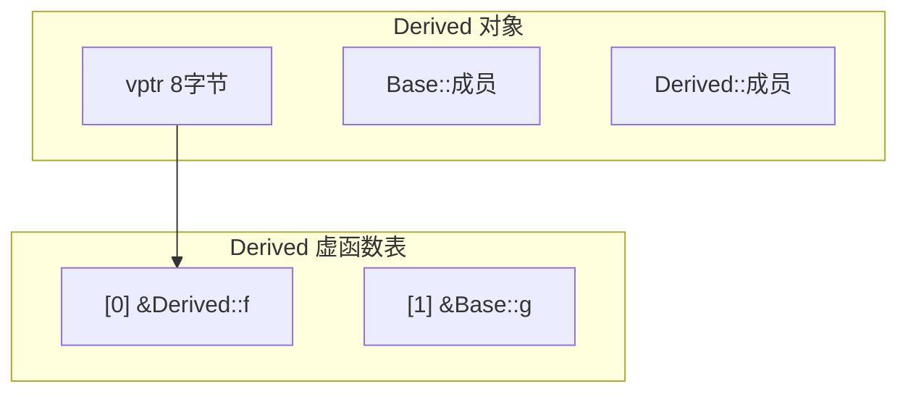
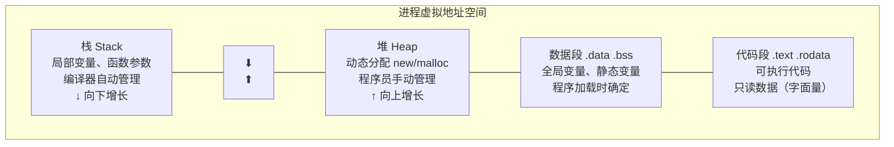
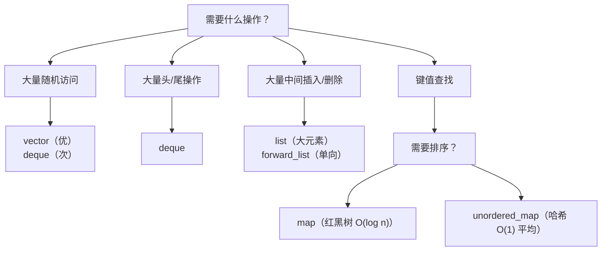
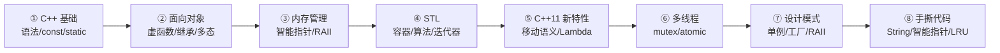

# 第 36 课：C++ 面试高频考点（国内版）

> 结合国内大厂（华为、腾讯、字节、百度、大疆、蔚来等）嵌入式/C++ 岗位面试真题整理。
> 涵盖基础、OOP、内存、STL、新标准、多线程、模板、设计模式、编译原理、手撕代码十大板块。

---

## 一、C 与 C++ 基础高频

### 1.1 C 和 C++ 的区别

| 维度 | C | C++ |
|------|---|-----|
| 编程范式 | 面向过程 | 面向对象 + 泛型 + 函数式 |
| 函数重载 | 不支持 | 支持（name mangling） |
| 引用 | 无 | `int &ref = a;` |
| 默认参数 | 不支持 | 支持 `void f(int a=0)` |
| 内存管理 | `malloc/free` | `new/delete`（调用构造/析构） |
| 类型安全 | 弱（`void*` 隐式转换） | 强（需要显式转换） |
| 命名空间 | 无 | `namespace` |
| 异常处理 | 无 | `try/catch/throw` |
| 模板/泛型 | 无 | `template` |
| 标准库 | 标准 C 库 | STL（容器/算法/迭代器） |

### 1.2 `extern "C"` 的作用

```cpp
// C++ 编译器会进行 name mangling（函数名修饰），C 不会
// 在 C++ 中调用 C 编译的库时，需要告知编译器按 C 链接方式处理

#ifdef __cplusplus
extern "C" {
#endif

void c_function(int a);  // 按 C 方式链接，不进行 name mangling

#ifdef __cplusplus
}
#endif
```

> **面试追问**：一个 C 函数被多个 `extern "C"` 包裹会出错吗？→ 不会，`extern "C"` 可以嵌套。

### 1.3 `struct` 和 `class` 的区别

| | struct | class |
|---|--------|-------|
| 默认访问权限 | `public` | `private` |
| 默认继承方式 | `public` | `private` |
| 模板参数 | C++ 中两者都可做模板参数 | |

> **仅此而已**，底层完全一样。面试官常追问"还有别的区别吗"来考察你是否被网上谬论误导。

### 1.4 `const` 关键字的 5 种用法

```cpp
// ① 常量变量
const int MAX = 100;
int const MAX2 = 100;       // 等价写法

// ② 指向常量的指针 vs 常量指针（顺时针螺旋法则记忆）
const int *p1;              // p1 指向的内容不可改（指向 const int 的指针）
int const *p2;              // 同上
int *const p3 = &a;         // p3 本身不可改（常量指针）
const int *const p4 = &a;   // 都不可改

// ③ const 成员函数——承诺不修改成员变量
class Foo {
    int getValue() const { return val_; }  // 常成员函数
    //  mutable int cache_;               // mutable 成员可在 const 函数中修改
    int val_;
};

// ④ const 引用——避免拷贝，保护原数据
void print(const std::string &s);

// ⑤ const 函数返回值
const int* getPtr();        // 返回的指针指向的内容不可被修改
```

### 1.5 `static` 关键字的 4 种用法

| 用法 | 效果 | 生命周期 |
|------|------|---------|
| 局部静态变量 | 只初始化一次，函数退出不销毁 | 整个程序 |
| 全局/命名空间静态变量 | 限制作用域在本文件（内部链接） | 整个程序 |
| 静态成员变量 | 类共享，类外定义 | 整个程序 |
| 静态成员函数 | 无 `this` 指针，只能访问静态成员 | — |

```cpp
// 经典面试题：以下函数每次调用返回什么？
int counter() {
    static int count = 0;  // 只初始化一次！
    return ++count;
}
// 第一次调用 → 1，第二次 → 2，第三次 → 3...
```

### 1.6 `volatile`——嵌入式高频

```cpp
// 告诉编译器不要优化该变量的访问，每次都从内存读取
volatile int flag;          // 可能在中断中修改

// 常见场景：ISR（中断服务程序）共享变量、内存映射寄存器
#define GPIOA_ODR (*((volatile uint32_t *)0x40020014))

// volatile 不保证原子性！多线程同步需要用 mutex / atomic
```

### 1.7 `inline` 内联函数

```cpp
// 建议编译器在调用处展开，减少函数调用开销
// 适用于短小频繁调用的函数
inline int add(int a, int b) { return a + b; }

// 注意：
// - inline 是建议而非强制，编译器可能忽略
// - 在头文件中定义（多个编译单元需要看到定义）
// - 递归函数、大函数不宜 inline
// - 虚函数可以 inline（但多态调用时不展开）
```

### 1.8 `#define` vs `const` / `typedef`

| 宏 `#define` | `const` / `typedef` |
|--------------|---------------------|
| 预处理阶段文本替换 | 编译阶段类型检查 |
| 无作用域 | 有作用域 |
| 无类型安全 | 有类型安全 |
| 无法调试 | 可调试 |

```cpp
#define PI 3.14159        // ❌ 无类型
constexpr double PI = 3.14159;  // ✅ 类型安全 + 编译期

#define PTR int*          // ❌ PTR a, b  → b 是 int!
typedef int* PTR;         // ✅ PTR a, b → 都是 int*
using PTR = int*;         // ✅ C++11 推荐
```

---

## 二、面向对象（国内面试核心重灾区）

### 2.1 三大特性：封装、继承、多态

#### 封装
```cpp
class Motor {
private:
    int speed_;   // 外部不可直接访问
public:
    void setSpeed(int s) { speed_ = s; }  // 通过接口控制
};
```

#### 继承（三种方式）

| 基类成员 | public 继承 | protected 继承 | private 继承 |
|---------|------------|---------------|-------------|
| public | public | protected | private |
| protected | protected | protected | private |
| private | 不可访问 | 不可访问 | 不可访问 |

> **面试精要**：private 继承是"has-a 的语法糖"，实现继承而非接口继承。C++ 中 `class B : private A` ≈ Java 中 B 持有 A 的成员。

#### 多态（静态 vs 动态）

| | 静态多态（编译期） | 动态多态（运行期） |
|---|---|---|
| 实现方式 | 函数重载、模板 | virtual 函数 |
| 绑定时机 | 编译期 | 运行期 |
| 性能 | 零开销 | 有 vtable 间接调用开销 |

### 2.2 虚函数机制——面试必问

```cpp
class Base {
public:
    virtual void f() { cout << "Base::f\n"; }
    virtual void g() { cout << "Base::g\n"; }
    void h() { cout << "Base::h\n"; }  // 非虚函数
};

class Derived : public Base {
public:
    void f() override { cout << "Derived::f\n"; }
};
```

**内存布局**：



**面试追问清单**：

1. **构造函数中可以调用虚函数吗？** → 可以调用，但不触发多态！此时派生类尚未构造，vptr 指向当前类的虚表。
2. **析构函数为什么必须是 virtual？** → `Base *p = new Derived; delete p;` 若 ~Base 非 virtual，只调用 ~Base 不调用 ~Derived，资源泄漏。
3. **虚函数表存在哪里？** → 只读数据段（.rodata），编译期生成，全局唯一。
4. **vptr 什么时候初始化？** → 构造函数体中，编译器在每个构造函数开头安插 vptr 初始化代码。
5. **虚函数可以是 static 吗？** → 不可以。虚函数依赖对象 vptr，static 函数无 this。

### 2.3 多继承与虚继承（菱形继承）

```cpp
// 菱形继承问题
class A { public: int a; };
class B : public A {};
class C : public A {};
class D : public B, public C {};  // D 中有两份 A！a 访问歧义

// 解决方法：虚继承
class A { public: int a; };
class B : virtual public A {};    // 虚继承
class C : virtual public A {};    // 虚继承
class D : public B, public C {};  // D 中只有一份 A

// 虚继承代价：
// - 子类多一个 vbptr（虚基类表指针），通常 8 字节
// - 访问虚基类成员需要间接寻址
```

### 2.4 纯虚函数与抽象类

```cpp
class IDevice {
public:
    virtual ~IDevice() = default;          // 虚析构
    virtual int read() = 0;                // 纯虚函数
    virtual void write(int val) = 0;
};

class Sensor : public IDevice {
public:
    int read() override { return 42; }
    void write(int) override {}
};

// IDevice dev;  // ❌ 抽象类不能实例化
Sensor s;        // ✅
```

> **面试要点**：接口类（所有函数纯虚）的析构仍应声明 `virtual`，否则 `delete` 基类指针出错。

### 2.5 `override` 和 `final`

```cpp
class Base {
    virtual void f(int) const;
};

class Derived : public Base {
    void f(int) override;   // ✅ 编译器检查是否真的重写了基类虚函数
    // void f(float) override; // ❌ 编译错误：没有重写任何虚函数
};

class FinalClass final {};               // 不能被继承
class A { virtual void f() final; };     // 子类不能重写 f
```

### 2.6 构造/析构顺序（高频）

```cpp
class A { public: A() { cout << "A() "; } ~A() { cout << "~A() "; } };
class B : public A { public: B() { cout << "B() "; } ~B() { cout << "~B() "; } };
class C : public B { public: C() { cout << "C() "; } ~C() { cout << "~C() "; } };

C c;
// 输出：A() B() C() ~C() ~B() ~A()
// 构造：基类 → 派生类，成员按声明顺序
// 析构：派生类 → 基类（完全相反！）
```

---

## 三、内存管理（嵌入式/后端必考）

### 3.1 C++ 内存分区



| 分区 | 内容 | 生命周期 |
|------|------|---------|
| 栈 | 局部变量、函数参数、返回地址 | 函数调用期间 |
| 堆 | `new/malloc` 分配的内存 | 手动释放 |
| 全局/静态区 | 全局变量、静态变量、虚函数表 | 整个程序 |
| 常量区 | 字符串字面量、constexpr | 整个程序 |
| 代码区 | 可执行指令 | 整个程序 |

```cpp
int global_var = 1;          // .data（已初始化全局变量）
static int static_var = 2;   // .data（静态变量）
const char* str = "hello";   // "hello" 在 .rodata，str 在栈/数据段
char arr[] = "hello";        // "hello" 在栈上（可修改）
```

### 3.2 `new/delete` vs `malloc/free`

| | new/delete | malloc/free |
|---|-----------|-------------|
| 类型 | C++ 运算符 | C 库函数 |
| 构造/析构 | 自动调用 | 不调用 |
| 返回类型 | 类型安全指针 | `void*` 需强转 |
| 分配失败 | `std::bad_alloc` 异常 | 返回 NULL |
| 重载 | 可重载 `operator new` | 不可重载 |
| 大小 | 编译器自动计算 | 手动传字节数 |

```cpp
// 关键区别演示
class Foo {
public:
    Foo() { cout << "构造\n"; }
    ~Foo() { cout << "析构\n"; }
};

Foo *p1 = new Foo;      // 输出 "构造"
delete p1;               // 输出 "析构"

Foo *p2 = (Foo*)malloc(sizeof(Foo));  // 什么也不输出！
free(p2);                              // 什么也不输出！

// 正确使用 placement new（内存池场景）
void *mem = malloc(sizeof(Foo));
Foo *p3 = new(mem) Foo();  // placement new：在指定地址构造
p3->~Foo();                // 手动析构
free(mem);
```

### 3.3 `new[]` 和 `delete[]` 配对

```cpp
int *arr = new int[10];
delete[] arr;    // ✅ 调用 10 次析构 + 释放整块内存
// delete arr;   // ❌ 未定义行为！

// 原理：new[] 会在数组头额外分配 8 字节存储元素个数
// delete[] 会读取这个计数，逐一析构
```

### 3.4 内存泄漏检测与预防

```cpp
// ① RAII 自动管理（首选）
void safeFunc() {
    std::unique_ptr<Resource> res = std::make_unique<Resource>();
    // 无论怎样退出，res 自动释放
}

// ② 智能指针避免裸 new
auto data = std::make_shared<std::vector<int>>();  // 一次分配控制块+对象

// ③ 工具检测
// - Valgrind（Linux）: valgrind --leak-check=full ./program
// - AddressSanitizer（GCC/Clang）: -fsanitize=address
// - Visual Studio CRT: _CrtDumpMemoryLeaks()
```

### 3.5 深拷贝 vs 浅拷贝

```cpp
class Buffer {
    char *data_;
    size_t size_;
public:
    // 浅拷贝（默认）——只复制指针值，两个对象指向同一块内存！
    // 深拷贝——复制指针指向的内容
    Buffer(const Buffer &other) : size_(other.size_), data_(new char[size_]) {
        memcpy(data_, other.data_, size_);
    }
    Buffer& operator=(const Buffer &other) {
        if (this != &other) {
            delete[] data_;
            size_ = other.size_;
            data_ = new char[size_];
            memcpy(data_, other.data_, size_);
        }
        return *this;
    }
    ~Buffer() { delete[] data_; }
};
// 这就是"三五法则"：自定义了析构函数，就应同时自定义拷贝构造和拷贝赋值。
// 加上移动构造和移动赋值，就是"五法则"。
```

### 3.6 内存对齐

```cpp
struct A { char c; int i; };          // sizeof = 8（c 后 3 字节填充）
struct B { char c; char d; int i; };  // sizeof = 8
struct C { int i; char c; };          // sizeof = 8（c 后 3 字节尾部填充）

#pragma pack(1)  // 1 字节对齐（嵌入式通信协议常用）
struct D { char c; int i; };          // sizeof = 5
#pragma pack()   // 恢复默认

// alignof 查询对齐要求
static_assert(alignof(int) == 4);

// alignas 指定对齐
alignas(16) int aligned_var;
```

---

## 四、STL 深入面试题

### 4.1 六大组件

| 组件 | 说明 | 代表 |
|------|------|------|
| 容器 | 存储数据 | vector, list, map, set |
| 算法 | 操作数据 | sort, find, transform |
| 迭代器 | 容器与算法的桥梁 | begin(), end() |
| 仿函数 | 行为类似函数 | `std::less<T>` |
| 适配器 | 修改接口 | stack, queue, priority_queue |
| 空间配置器 | 内存管理 | `std::allocator<T>` |

### 4.2 容器选择决策树



### 4.3 `vector` 扩容机制——高频

```cpp
// g++ 扩容因子为 2，MSVC 为 1.5
std::vector<int> v;
v.push_back(1);  // cap=1
v.push_back(2);  // cap=2  ← 2 倍扩容
v.push_back(3);  // cap=4  ← 重新分配 → 迭代器全部失效！

// 扩容步骤：
// ① 分配新内存（大小 = 旧容量 × k）
// ② 将旧元素拷贝/移动到新内存
// ③ 释放旧内存
// ④ 更新 begin/end/capacity 指针

// reserve vs resize
v.reserve(100);   // 只分配容量，size 不变
v.resize(100);    // 分配 + 构造 100 个默认元素，size=100

// shrink_to_fit（C++11）
v.shrink_to_fit(); // 请求释放多余容量（不保证）
```

**面试追问——为什么扩容因子是 2 或 1.5？**
- 因子为 2：每次新内存大小恰好超过之前所有释放的内存之和，无法复用已释放内存。
- 因子为 1.5：若干次扩容后，之前释放的内存碎片可被复用，内存利用率更高。
- 这是一个经典的"内存碎片 vs 均摊时间复杂度"的权衡问题。

### 4.4 `map` vs `unordered_map`

| | map | unordered_map |
|---|-----|---------------|
| 底层结构 | 红黑树（平衡二叉搜索树） | 哈希表 |
| 有序性 | 按 key 排序 | 无序 |
| 查找 | O(log n) | O(1) 平均，O(n) 最坏 |
| 插入/删除 | O(log n) | O(1) 平均 |
| 内存 | 较少（每节点两个指针） | 较多（桶数组 + 链表） |
| 适用场景 | 需要有序遍历、范围查找 | 纯粹快速查找 |
| 迭代器失效 | 删除当前元素不影响其他 | rehash 时全部失效 |

### 4.5 迭代器失效场景汇总

| 容器 | 操作 | 哪类迭代器失效 |
|------|------|--------------|
| vector | push_back 触发扩容 | **全部** |
| vector | insert/erase | 插入点之后的所有 |
| deque | 两端插入 | 所有（地址可能变） |
| deque | 中间插入 | **全部** |
| list | erase | 仅被删除的 |
| map/set | erase | 仅被删除的 |
| unordered_map | insert 触发 rehash | **全部** |

### 4.6 `emplace_back` vs `push_back`

```cpp
struct Point { int x, y; Point(int a, int b) : x(a), y(b) {} };

std::vector<Point> v;
v.push_back(Point(1, 2));   // 构造临时对象 → 移动（或拷贝）到容器
v.emplace_back(1, 2);       // 直接在容器内部原地构造！少一次移动

// emplace_back 使用完美转发，参数直接传递给构造函数
```

---

## 五、C++11/14/17/20 高频新特性

### 5.1 移动语义与右值引用（面试重灾区）

```cpp
// 左值：有名字、可取地址、生命周期长
int a = 10;          // a 是左值
int &ref = a;        // 左值引用

// 右值：字面量、临时对象、std::move 的返回值
int &&rref = 10;     // 右值引用绑定到字面量
int &&rref2 = std::move(a);  // std::move 将左值"转义"为右值

// 移动构造
class Buffer {
    char *data_;
    size_t size_;
public:
    // 移动构造——"偷"资源而非拷贝
    Buffer(Buffer &&other) noexcept
        : data_(other.data_), size_(other.size_) {
        other.data_ = nullptr;  // 关键！置空源对象
        other.size_ = 0;
    }
};

// 移动后对象处于"有效但未指定状态"（valid but unspecified）
// 可安全赋值、析构，但内容未定义
```

**面试必问清单**：

| 概念 | 一句话 |
|------|--------|
| 左值 | 能取地址的就是左值 |
| 右值 | 不能取地址，即将被销毁 |
| `std::move` | 无条件将左值转为右值引用，**本身不移动任何东西** |
| `std::forward` | 有条件转发（左值→左值，右值→右值），用于完美转发 |
| 万能引用 | `T&&` + 类型推导（`auto&&` 或 `template T&&`）|
| 引用折叠 | `T& &` → `T&`，`T&& &` → `T&`，`T& &&` → `T&`，`T&& &&` → `T&&` |
| noexcept | 移动构造应标记 `noexcept`（否则 vector 扩容时不会用移动！） |

### 5.2 Lambda 表达式

```cpp
// 完整语法：[捕获](参数) mutable -> 返回类型 { 函数体 }

// 捕获方式
int a = 1, b = 2;
auto f1 = [a, &b]() { return a + b; };   // a 值捕获（只读），b 引用捕获
auto f2 = [=]() { return a + b; };        // = 全部值捕获
auto f3 = [&]() { a++; b++; };            // & 全部引用捕获
auto f4 = [=, &b]() { b++; };             // 混合：b 引用，其余值
auto f5 = [this]() { return member_; };   // 捕获 this 指针

// mutable 允许修改值捕获的副本
auto f6 = [a]() mutable { a++; return a; };
f6();  // a 副本变为 2，原 a 仍为 1

// 泛型 lambda（C++14）
auto f7 = [](auto x, auto y) { return x + y; };

// Lambda 本质：编译器生成匿名仿函数类，捕获变量成为其成员。
```

### 5.3 智能指针三国杀

```cpp
// unique_ptr —— 独占所有权，零开销
auto p1 = std::make_unique<Foo>();         // C++14
// std::unique_ptr<Foo> p2 = p1;          // ❌ 不可拷贝
std::unique_ptr<Foo> p3 = std::move(p1);  // ✅ 可移动

// shared_ptr —— 共享所有权，引用计数
auto sp1 = std::make_shared<Foo>();        // 控制块+对象一次分配
auto sp2 = sp1;                            // 引用计数 = 2

// weak_ptr —— 打破 shared_ptr 循环引用
struct Node {
    std::shared_ptr<Node> next;  // ❌ 循环引用 → 内存泄漏
};
struct Node {
    std::weak_ptr<Node> next;    // ✅ 不增加引用计数
};

// 使用 weak_ptr 前需要 lock()
if (auto sp = wp.lock()) { sp->doSomething(); }
```

| | unique_ptr | shared_ptr | weak_ptr |
|---|-----------|------------|----------|
| 所有权 | 独占 | 共享 | 无（观察） |
| 拷贝 | 禁止 | 引用计数 +1 | 不影响计数 |
| 开销 | 零（裸指针等价） | 控制块 16 字节 + 原子操作 | 同 shared_ptr |
| 典型场景 | 工厂、PIMPL | 共享资源 | 缓存、循环引用 |

### 5.4 `auto` 与 `decltype`

```cpp
auto i = 0;              // int
auto s = "hello";        // const char*
auto v = {1, 2, 3};     // std::initializer_list<int>（陷阱！）
auto fn = [](int x) { return x * 2; };

// auto 会丢弃 const/引用
const int &cr = i;
auto a = cr;             // int（丢弃了 const 和 &）
auto &b = cr;            // const int&（保留）
const auto &c = cr;      // const int&

// decltype 保留完整类型
decltype(cr) d = cr;     // const int&

// 尾置返回类型（C++11）
template <typename T, typename U>
auto add(T t, U u) -> decltype(t + u) { return t + u; }
// C++14 后可直接 auto add(T t, U u) { return t + u; }
```

### 5.5 其他高频特性速查

```cpp
// nullptr —— 真正的空指针类型 std::nullptr_t
void f(int);
void f(void*);
f(NULL);    // 可能调用 f(int)！歧义
f(nullptr); // 确定调用 f(void*)

// enum class —— 强类型枚举
enum class Color { Red, Green, Blue };
Color c = Color::Red;  // 必须带作用域，不会隐式转 int

// 范围 for 循环
for (auto &item : container) { /* ... */ }
// 本质是对 begin()/end() 的语法糖

// constexpr——编译期计算
constexpr int fib(int n) { return n <= 1 ? 1 : fib(n-1) + fib(n-2); }
int arr[fib(5)];  // ✅ 编译期确定数组大小

// using 别名（替代 typedef）
using FuncPtr = void(*)(int);  // 比 typedef 更直观

// 委托构造
class Foo {
    Foo() : Foo(0) {}          // 委托给 Foo(int)
    Foo(int v) : val_(v) {}
    int val_;
};

// 初始化列表
std::vector<int> v = {1, 2, 3};
std::map<int, std::string> m = {{1,"a"}, {2,"b"}};

// = default / = delete
struct NonCopyable {
    NonCopyable(const NonCopyable&) = delete;            // 禁止拷贝
    NonCopyable& operator=(const NonCopyable&) = delete;
    ~NonCopyable() = default;                            // 使用默认析构
};

// 结构化绑定（C++17）
std::pair<int, std::string> p = {1, "hello"};
auto [id, name] = p;  // id=1, name="hello"

// if constexpr（C++17）——编译期分支
template<typename T>
auto getValue(T t) {
    if constexpr (std::is_pointer_v<T>)
        return *t;
    else
        return t;
}
```

---

## 六、多线程与并发（嵌入式后台常考）

### 6.1 基础线程操作

```cpp
#include <thread>
#include <mutex>

std::mutex mtx;
int shared = 0;

void worker() {
    std::lock_guard<std::mutex> lock(mtx);  // RAII 自动解锁
    shared++;
}

int main() {
    std::thread t1(worker);
    std::thread t2(worker);
    t1.join();  // 等待线程结束
    t2.join();
}
```

### 6.2 死锁与解决方案

```cpp
std::mutex m1, m2;

// ❌ 死锁：不同顺序加锁
void f1() { lock(m1); lock(m2); /* ... */ }
void f2() { lock(m2); lock(m1); /* ... */ }

// ✅ 方案一：std::scoped_lock（C++17，推荐）
void safeFunc() {
    std::scoped_lock lck(m1, m2);  // 同时获取，内部避免死锁
}

// ✅ 方案二：std::lock + lock_guard（C++11）
std::lock(m1, m2);  // 原子性同时加锁
std::lock_guard<std::mutex> lk1(m1, std::adopt_lock);
std::lock_guard<std::mutex> lk2(m2, std::adopt_lock);

// ✅ 方案三：固定加锁顺序（约定）
```

### 6.3 `std::atomic`——无锁编程基础

```cpp
std::atomic<int> counter(0);
counter++;                     // 原子递增
int val = counter.load();      // 原子读取
counter.store(100);            // 原子写入

// 内存序（memory order）
counter.fetch_add(1, std::memory_order_relaxed);  // 只保证原子性
counter.fetch_add(1, std::memory_order_seq_cst);  // 默认，顺序一致性

// atomic 适用：计数器、标志位、无锁队列节点
// 不适用：复杂数据结构（用 mutex）
```

### 6.4 `std::call_once` 单例安全初始化

```cpp
class Singleton {
    static std::unique_ptr<Singleton> instance_;
    static std::once_flag flag_;
public:
    static Singleton& get() {
        std::call_once(flag_, []{ instance_.reset(new Singleton); });
        return *instance_;
    }
};
```

### 6.5 `condition_variable`——生产者消费者

```cpp
std::mutex mtx;
std::condition_variable cv;
std::queue<int> q;
bool done = false;

// 生产者
void producer() {
    for (int i = 0; i < 100; i++) {
        std::lock_guard lk(mtx);
        q.push(i);
        cv.notify_one();
    }
    done = true;
    cv.notify_all();
}

// 消费者
void consumer() {
    while (true) {
        std::unique_lock lk(mtx);
        cv.wait(lk, []{ return !q.empty() || done; });  // 条件变量等待
        while (!q.empty()) { /* 消费 */ q.pop(); }
        if (done) break;
    }
}
```

---

## 七、模板与泛型深入

### 7.1 模板特化（全特化/偏特化）

```cpp
// 主模板
template <typename T>
struct MyClass { void info() { cout << "通用版本\n"; } };

// 全特化
template <>
struct MyClass<int> { void info() { cout << "int 特化\n"; } };

// 偏特化（指针类型）
template <typename T>
struct MyClass<T*> { void info() { cout << "指针偏特化\n"; } };

// 函数模板只支持全特化，不支持偏特化（但可以重载）
```

### 7.2 SFINAE（替换失败不是错误）

```cpp
// C++11 enable_if 实现——编译期条件选择
template <typename T>
typename std::enable_if<std::is_integral<T>::value, T>::type
process(T val) { return val * 2; }  // 仅整数类型可用

// C++17 if constexpr（更简洁）
template <typename T>
T process(T val) {
    if constexpr (std::is_integral_v<T>)
        return val * 2;
    else
        return val;
}
```

### 7.3 完美转发

```cpp
// 问题：转发函数如何保留参数的左右值属性？
template <typename T>
void wrapper(T&& arg) {           // T&& 是万能引用
    target(std::forward<T>(arg)); // forward 保持原始值类型
}
wrapper(42);   // arg 是 int&&，forward 转发为右值
int x = 42;
wrapper(x);    // arg 是 int&，forward 转发为左值

// 原理：引用折叠 + remove_reference
```

---

## 八、设计模式（高频口试题）

### 8.1 单例模式（Singleton）——必问

```cpp
// C++11 最简洁实现（线程安全，由 C++11 保证）
class Singleton {
public:
    static Singleton& getInstance() {
        static Singleton instance;  // C++11 保证局部静态变量初始化线程安全！
        return instance;
    }
    
    Singleton(const Singleton&) = delete;
    Singleton& operator=(const Singleton&) = delete;
    
private:
    Singleton() = default;
};
// 这就是著名的 Meyers Singleton，C++11 后是最佳实践。
```

### 8.2 工厂模式

```cpp
// 简单工厂
class DeviceFactory {
public:
    enum Type { SENSOR, MOTOR, DISPLAY };
    static std::unique_ptr<IDevice> create(Type t) {
        switch(t) {
            case SENSOR: return std::make_unique<Sensor>();
            case MOTOR:  return std::make_unique<Motor>();
            default:     return nullptr;
        }
    }
};

// 工厂方法模式——由子类决定创建哪个产品
class Application {
    virtual std::unique_ptr<Document> createDocument() = 0;
public:
    void newDocument() {
        auto doc = createDocument();  // 延迟到子类决定
        doc->open();
    }
};
```

### 8.3 观察者模式

```cpp
class Observer {
public:
    virtual void update(int data) = 0;
    virtual ~Observer() = default;
};

class Subject {
    std::vector<Observer*> observers_;
public:
    void attach(Observer *o) { observers_.push_back(o); }
    void notify(int data) {
        for (auto o : observers_) o->update(data);
    }
};
```

### 8.4 策略模式

```cpp
// 算法族可互换——STL sort 的比较器就是策略模式
class SortStrategy {
public:
    virtual void sort(std::vector<int> &data) = 0;
    virtual ~SortStrategy() = default;
};

class QuickSort : public SortStrategy {
public:
    void sort(std::vector<int> &data) override { /* 快速排序 */ }
};

class BubbleSort : public SortStrategy {
public:
    void sort(std::vector<int> &data) override { /* 冒泡排序 */ }
};

class DataProcessor {
    std::unique_ptr<SortStrategy> strategy_;
public:
    void setStrategy(std::unique_ptr<SortStrategy> s) { strategy_ = std::move(s); }
    void process(std::vector<int> &data) { strategy_->sort(data); }
};
```

### 8.5 RAII 惯用法（资源获取即初始化）

| 资源类型 | 获取 | RAII 守卫 |
|---------|------|-----------|
| 堆内存 | `new` | `unique_ptr` / `shared_ptr` |
| 互斥锁 | `lock()` | `lock_guard` / `scoped_lock` |
| 文件 | `fopen` | `ifstream`（自动关闭） |
| 文件描述符 | `open()` | 自定义 RAII 类 |
| 数据库连接 | connect | 自定义 RAII 类 |

```cpp
// RAII 经典示范
template<typename T>
class ScopeGuard {
    T &resource_;
public:
    ScopeGuard(T &r) : resource_(r) { resource_.acquire(); }
    ~ScopeGuard() { resource_.release(); }
};
```

---

## 九、编译链接原理（校招高频）

### 9.1 编译流程四阶段


| 阶段 | 做了什么 |
|------|---------|
| 预处理 | `#include` 展开、`#define` 替换、`#ifdef` 条件编译、去注释 |
| 编译 | 词法分析 → 语法分析 → 语义分析 → 生成汇编代码 |
| 汇编 | 汇编代码 → 机器指令（二进制 .o 文件） |
| 链接 | 多 .o 合并，符号解析，重定位 |

### 9.2 静态链接 vs 动态链接

| | 静态链接 .a, .lib | 动态链接 .so, .dll |
|---|-------------------|---------------------|
| 打包时机 | 编译时打入可执行文件 | 运行时加载 |
| 文件大小 | 大（包含库代码） | 小 |
| 更新库 | 需重新编译链接 | 替换 .so 即可 |
| 内存共享 | 每个进程独立副本 | 多进程可共享同一份 |
| 加载速度 | 较快 | 稍慢（需加载器介入） |

### 9.3 `extern` 和 `static` 的链接属性

```cpp
// 外部链接（默认）——其他文件可见
int global;               // 外部链接
extern int other_global;  // 声明，定义在其他文件

// 内部链接——仅本文件可见
static int local_global;  // 内部链接
namespace { int hidden; } // 匿名命名空间（C++ 推荐方式，内部链接）
```

### 9.4 ODR（单一定义规则）

- 同一翻译单元内，一个实体只能定义一次
- 整个程序中，非内联函数/全局变量只能定义一次
- `inline` 函数、模板、类定义可在多个翻译单元定义（必须一致）
- 违反 ODR = 未定义行为（不要求编译器诊断）

---

## 十、sizeof 与类型转换

### 10.1 `sizeof` 经典考题

```cpp
// 基本类型——平台相关（以下为 64 位 Linux）
sizeof(char)    = 1
sizeof(short)   = 2
sizeof(int)     = 4
sizeof(long)    = 8（Linux 64）/ 4（Windows 64: LLP64）
sizeof(void*)   = 8

// 经典面试题
char str[] = "hello";
sizeof(str)     = 6    // 包含 '\0'！
strlen(str)     = 5    // 不包含 '\0'

char *p = str;
sizeof(p)       = 8    // 指针大小，64 位系统

struct { char a; int b; } s;
sizeof(s)       = 8    // 对齐填充

class Empty {};
sizeof(Empty)   = 1    // 空类占 1 字节保证地址唯一

class Virtual { virtual void f(); };
sizeof(Virtual) = 8    // vptr 8 字节
```

### 10.2 四种 C++ 类型转换

```cpp
// static_cast —— 编译期类型转换（最常用）
int i = static_cast<int>(3.14);          // 基本类型
Derived *d = static_cast<Derived*>(b);   // 向上/向下转换（不检查，不安全）
void *vp = static_cast<void*>(&i);       // void* 转换

// dynamic_cast —— 运行时安全检查（用于多态类型）
Base *b = new Derived;
Derived *d = dynamic_cast<Derived*>(b);  // 成功，返回指针
if (d) { /* 安全使用 */ }
// 失败返回 nullptr（指针）或抛 std::bad_cast（引用）
// 要求必须至少有一个虚函数（RTTI）

// const_cast —— 去掉 const 属性（危险操作）
const int ci = 10;
int *p = const_cast<int*>(&ci);   // ❌ 危险！修改 ci 是 UB
// 合法场景：接口兼容，实际不修改

// reinterpret_cast —— 最危险的转换（逐位重新解释）
int *ip = new int(42);
char *cp = reinterpret_cast<char*>(ip);  // 按字节操作
// 仅用于底层编程、序列化、内存映射
```

---

## 十一、面试陷阱题精选

### 11.1 经典陷阱

```cpp
// 题 1：以下代码输出什么？
int a[] = {1, 2, 3, 4};
int *p = a;
cout << *p++ << endl;      // 输出 1，然后 p 指向 a[1]
// *p++ 等价于 *(p++)，后置++优先级高于*但先返回旧值

// 题 2：以下代码能运行吗？
char *str = "hello";       // ❌ C++11 起已弃用/非法
str[0] = 'H';              // ❌ 未定义行为！字符串字面量在只读区
// 正确写法：
char str[] = "hello";      // 栈上分配，可修改
str[0] = 'H';              // ✅

// 题 3：默认生成的成员函数有哪些？
class Foo {};  // 编译器自动生成（=default）：
// ① 默认构造函数 Foo()
// ② 析构函数 ~Foo()
// ③ 拷贝构造函数 Foo(const Foo&)
// ④ 拷贝赋值 Foo& operator=(const Foo&)
// ⑤ 移动构造函数 Foo(Foo&&)          (C++11)
// ⑥ 移动赋值 Foo& operator=(Foo&&)   (C++11)

// 题 4：以下两种初始化有何区别？
std::string s1("hello");       // 直接初始化
std::string s2 = "hello";      // 拷贝初始化
// C++17 后强制复制消除，二者完全相同
```

### 11.2 多态陷阱

```cpp
// 题 5：以下输出什么？
class A {
public:
    A() { foo(); }           // 构造函数中调用
    virtual void foo() { cout << "A::foo "; }
};

class B : public A {
public:
    B() { foo(); }
    virtual void foo() { cout << "B::foo "; }
};

B b;  // 输出：A::foo B::foo
// 原因：A 构造时 B 未构造完成，vptr 指向 A 的虚表
```

### 11.3 异常安全

```cpp
// 题 6：以下代码安全吗？
void unsafeSwap(String &a, String &b) {
    String tmp = a;   // 可能抛异常
    a = b;            // 可能抛异常（如果 a 已修改，状态不一致）
    b = tmp;          // 可能抛异常
}
// ❌ 不满足强异常安全保证

// ✅ 使用 copy-and-swap 惯用法
void safeSwap(String &a, String &b) noexcept {
    std::swap(a, b);  // C++ 保证 swap 不抛异常
}
```

---

## 十二、手撕代码题精选（嵌入式向）

### 12.1 实现 strcpy

```cpp
// 面试考察点：返回值、const 正确性、'\0' 处理、重叠处理
char* myStrcpy(char* dst, const char* src) {
    assert(dst != nullptr && src != nullptr);
    char* ret = dst;
    while ((*dst++ = *src++)) {}  // 循环到 '\0' 为止
    return ret;  // 返回 dst 起始地址，支持链式调用
}
```

### 12.2 实现 trim（去除首尾空格）

```cpp
#include <cctype>

std::string trim(const std::string &s) {
    auto start = s.begin();
    while (start != s.end() && std::isspace(*start)) ++start;
    
    auto end = s.end();
    while (end != start && std::isspace(*(end - 1))) --end;
    
    return std::string(start, end);
}
```

### 12.3 实现一个线程安全的阻塞队列

```cpp
template <typename T>
class BlockingQueue {
    std::queue<T> q_;
    std::mutex mtx_;
    std::condition_variable cv_;
    size_t cap_;
public:
    explicit BlockingQueue(size_t cap = 100) : cap_(cap) {}

    void push(T val) {
        std::unique_lock lk(mtx_);
        cv_.wait(lk, [this]{ return q_.size() < cap_; });
        q_.push(std::move(val));
        cv_.notify_one();
    }

    T pop() {
        std::unique_lock lk(mtx_);
        cv_.wait(lk, [this]{ return !q_.empty(); });
        T val = std::move(q_.front());
        q_.pop();
        cv_.notify_one();
        return val;
    }
};
```

### 12.4 实现一个简单的内存池（嵌入式高频）

```cpp
template <typename T, size_t BlockSize = 4096>
class MemoryPool {
    union Slot {       // 空闲槽位复用为链表节点
        T element;
        Slot *next;
    };
    Slot *freeList_ = nullptr;
    std::vector<void*> blocks_;

    void allocateBlock() {
        char *block = static_cast<char*>(::operator new(BlockSize));
        blocks_.push_back(block);
        Slot *slots = reinterpret_cast<Slot*>(block);
        for (size_t i = 0; i < BlockSize / sizeof(Slot) - 1; ++i)
            slots[i].next = &slots[i + 1];
        slots[BlockSize / sizeof(Slot) - 1].next = freeList_;
        freeList_ = slots;
    }

public:
    ~MemoryPool() {
        for (auto block : blocks_) ::operator delete(block);
    }

    T* allocate() {
        if (!freeList_) allocateBlock();
        Slot *slot = freeList_;
        freeList_ = slot->next;
        return &slot->element;
    }

    void deallocate(T *p) {
        Slot *slot = reinterpret_cast<Slot*>(p);
        slot->next = freeList_;
        freeList_ = slot;
    }
};
```

### 12.5 实现 LRU Cache

```cpp
class LRUCache {
    int cap_;
    std::list<std::pair<int, int>> cache_;         // key-value
    std::unordered_map<int, decltype(cache_.begin())> map_;  // key → 迭代器

public:
    explicit LRUCache(int capacity) : cap_(capacity) {}

    int get(int key) {
        auto it = map_.find(key);
        if (it == map_.end()) return -1;
        // 移到最前面（最近使用）
        cache_.splice(cache_.begin(), cache_, it->second);
        return it->second->second;  // 返回值
    }

    void put(int key, int value) {
        auto it = map_.find(key);
        if (it != map_.end()) {
            it->second->second = value;
            cache_.splice(cache_.begin(), cache_, it->second);
            return;
        }
        if (cache_.size() == cap_) {
            map_.erase(cache_.back().first);
            cache_.pop_back();
        }
        cache_.emplace_front(key, value);
        map_[key] = cache_.begin();
    }
};
```

### 12.6 实现 String 类（经典必考）

```cpp
class String {
    char *data_;
    size_t len_;
public:
    String(const char *s = "") : len_(strlen(s)), data_(new char[len_ + 1]) {
        strcpy(data_, s);
    }

    ~String() { delete[] data_; }

    // 拷贝
    String(const String &other) : len_(other.len_), data_(new char[len_ + 1]) {
        strcpy(data_, other.data_);
    }

    String& operator=(const String &other) {
        if (this != &other) {
            String tmp(other);  // 拷贝+交换手法，强异常安全
            swap(tmp);
        }
        return *this;
    }

    // 移动（C++11）
    String(String &&other) noexcept : data_(other.data_), len_(other.len_) {
        other.data_ = nullptr;
        other.len_ = 0;
    }

    String& operator=(String &&other) noexcept {
        if (this != &other) {
            delete[] data_;
            data_ = other.data_;
            len_ = other.len_;
            other.data_ = nullptr;
            other.len_ = 0;
        }
        return *this;
    }

    void swap(String &other) noexcept {
        std::swap(data_, other.data_);
        std::swap(len_, other.len_);
    }

    size_t size() const { return len_; }
    const char* c_str() const { return data_; }
    char& operator[](size_t i) { return data_[i]; }
    const char& operator[](size_t i) const { return data_[i]; }
};
```

---

## 📋 面试准备建议

### 技术面准备路线



### 推荐的面试准备资源

| 资源 | 适用场景 |
|------|---------|
| 《C++ Primer》第 5 版 | 系统学习 C++ 基础 |
| 《Effective C++》《More Effective C++》 | 理解 C++ 陷阱和最佳实践 |
| 《Effective Modern C++》 | 深入 C++11/14 新特性 |
| 《STL 源码剖析》— 侯捷 | 理解 STL 内部实现 |
| 《深入理解 C++11》 | C++11 新特性详解 |
| [cppreference.com](https://cppreference.com) | 日常查阅标准库 |
| LeetCode Hot 100 | 算法题练习 |
| 牛客网 C++ 专项练习 | 国内面试题库 |

### 面试沟通技巧

1. **由浅入深**：先讲结论，再展开细节。面试官追问时再深入。
2. **画图辅助**：虚函数表、内存布局画出来比纯口述好十倍。
3. **结合实际**：嵌入式岗位多举实际项目中的例子（驱动架构、内存池、中断安全等）。
4. **诚实不足**：不会就说不会，但可以补充相关知识点展示知识广度。
5. **反问环节**：准备 2-3 个有深度的问题（技术栈、团队分工、项目挑战）。

---

> **祝你面试顺利！** 🎉 返回 [课程总览](../index.md)
