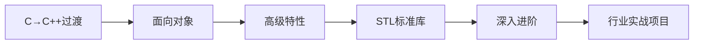

# C++ —— 从零基础到高薪开发

## 课程概述

C++ 是嵌入式开发、游戏引擎、高频交易、操作系统等领域的**核心语言**。掌握现代 C++ 是拿到高薪 Offer 的硬性要求。

本课程假设你已学完 C 语言基础，从 C 到 C++ 的过渡开始，系统学习面向对象、模板、STL、现代 C++（11/14/17/20），直到行业实战项目。

---

## 学习路线

### 第一部分 · 基础语法

| 课号 | 标题 | 关键知识点 | 难度 |
|------|------|----------|------|
| 01 | [从 C 到 C++](01-c-to-cpp/README.md) | C++历史、bool、auto、输入输出、编译 | ⭐ |
| 02 | [命名空间与输入输出](02-namespace-io/README.md) | namespace、cout/cin、using、endl | ⭐ |
| 03 | [引用与 const](03-reference-const/README.md) | 左值引用、const引用、引用 vs 指针 | ⭐⭐ |
| 04 | [函数增强](04-function-enhanced/README.md) | 默认参数、函数重载、内联函数 | ⭐⭐ |
| 05 | [类与对象入门](05-class-intro/README.md) | class、封装、成员函数、访问控制 | ⭐⭐ |
| 06 | [new/delete 与内存管理](06-new-delete/README.md) | new/delete、数组分配、内存泄漏 | ⭐⭐ |
| 07 | [string 字符串类](07-string-class/README.md) | string操作、查找、截取、与C字符串转换 | ⭐ |
| 08 | [IO 流与文件操作](08-iostream/README.md) | ifstream/ofstream、流格式化、序列化 | ⭐⭐ |

### 第二部分 · 面向对象编程

| 课号 | 标题 | 关键知识点 | 难度 |
|------|------|----------|------|
| 09 | [构造函数与析构函数](09-constructor-destructor/README.md) | 默认/参数/初始化列表构造、析构顺序 | ⭐⭐ |
| 10 | [拷贝控制](10-copy-control/README.md) | 拷贝构造、拷贝赋值、深拷贝/浅拷贝 | ⭐⭐⭐ |
| 11 | [运算符重载](11-operator-overload/README.md) | +、<<、[]、()、类型转换运算符 | ⭐⭐⭐ |
| 12 | [继承](12-inheritance/README.md) | 单继承、多继承、protected、构造顺序 | ⭐⭐⭐ |
| 13 | [多态与虚函数](13-polymorphism/README.md) | 虚函数、vtable、override、动态绑定 | ⭐⭐⭐ |
| 14 | [抽象类与接口](14-abstract-interface/README.md) | 纯虚函数、接口设计、多态实战 | ⭐⭐⭐ |

### 第三部分 · 高级特性

| 课号 | 标题 | 关键知识点 | 难度 |
|------|------|----------|------|
| 15 | [模板基础](15-template-basic/README.md) | 函数模板、类模板、模板参数推导 | ⭐⭐⭐ |
| 16 | [模板进阶](16-template-advanced/README.md) | 特化、偏特化、变参模板、SFINAE | ⭐⭐⭐⭐ |
| 17 | [异常处理](17-exception/README.md) | try/catch/throw、标准异常、异常安全 | ⭐⭐ |
| 18 | [智能指针](18-smart-pointer/README.md) | unique_ptr、shared_ptr、weak_ptr、循环引用 | ⭐⭐⭐ |
| 19 | [类型转换](19-type-cast/README.md) | static_cast、dynamic_cast、const_cast、RTTI | ⭐⭐⭐ |
| 20 | [RAII 与资源管理](20-raii/README.md) | RAII原则、锁Guard、文件Guard、异常安全 | ⭐⭐⭐ |

### 第四部分 · STL 标准库

| 课号 | 标题 | 关键知识点 | 难度 |
|------|------|----------|------|
| 21 | [STL 概述与容器](21-stl-containers/README.md) | vector、deque、list、array、forward_list | ⭐⭐ |
| 22 | [迭代器与算法](22-iterators-algorithms/README.md) | 迭代器类型、sort、find、transform、for_each | ⭐⭐⭐ |
| 23 | [关联容器与哈希](23-associative-containers/README.md) | map、set、unordered_map、multimap | ⭐⭐⭐ |
| 24 | [Lambda 与函数对象](24-lambda-functor/README.md) | Lambda语法、捕获、std::function、回调 | ⭐⭐⭐ |
| 25 | [现代 C++（11/14）](25-modern-cpp-11-14/README.md) | auto、range-for、nullptr、constexpr、移动 | ⭐⭐⭐ |
| 26 | [现代 C++（17/20）](26-modern-cpp-17-20/README.md) | optional、variant、string_view、concepts | ⭐⭐⭐⭐ |

### 第五部分 · 深入进阶

| 课号 | 标题 | 关键知识点 | 难度 |
|------|------|----------|------|
| 27 | [移动语义与完美转发](27-move-semantics/README.md) | 右值引用、std::move、std::forward、RVO | ⭐⭐⭐⭐ |
| 28 | [多线程编程](28-multithreading/README.md) | thread、mutex、condition_variable、atomic | ⭐⭐⭐⭐ |
| 29 | [设计模式](29-design-patterns/README.md) | 单例、工厂、观察者、策略、CRTP | ⭐⭐⭐⭐ |
| 30 | [模板元编程](30-metaprogramming/README.md) | type_traits、constexpr if、编译期计算 | ⭐⭐⭐⭐⭐ |
| 31 | [内存模型与性能优化](31-memory-performance/README.md) | 缓存友好、内存池、对象池、基准测试 | ⭐⭐⭐⭐ |
| 32 | [C++ 在嵌入式中的应用](32-embedded-cpp/README.md) | 零开销抽象、HAL模板、中断安全RAII | ⭐⭐⭐⭐ |

### 第六部分 · 行业实战项目

| 课号 | 标题 | 关键知识点 | 难度 |
|------|------|----------|------|
| 33 | [项目：网络通信库](33-project-network/README.md) | Socket封装、TCP服务器、事件循环 | ⭐⭐⭐⭐ |
| 34 | [项目：嵌入式驱动框架](34-project-driver-framework/README.md) | CRTP+RAII+状态机，完整驱动抽象 | ⭐⭐⭐⭐⭐ |
| 35 | [项目：JSON 解析器](35-project-json-parser/README.md) | 递归下降、variant、完整解析/序列化 | ⭐⭐⭐⭐ |
| 36 | [C++ 面试高频题精讲](36-interview/README.md) | 虚函数原理、内存布局、智能指针、STL | ⭐⭐⭐⭐⭐ |

---

## 为什么 C++ 是高薪必备？

| 领域 | 薪资区间 | C++ 要求 |
|------|---------|---------|
| 嵌入式/自动驾驶 | 25-60W | 现代C++、RAII、模板 |
| 量化交易/高频 | 50-150W | 性能优化、内存模型 |
| 游戏引擎 | 30-80W | OOP、设计模式、内存管理 |
| 基础架构 | 30-70W | 多线程、网络、系统编程 |
| 音视频处理 | 25-50W | 性能优化、STL |

---

## 推荐参考资源

| 资源 | 类型 | 网址 |
|------|------|------|
| LearnCpp.com | 在线教程（最佳） | [learncpp.com](https://www.learncpp.com/) |
| C++ Reference | 标准参考 | [cppreference.com](https://en.cppreference.com/) |
| C++ Primer | 经典书籍 | 第5版（中文版） |
| Effective Modern C++ | 进阶书籍 | Scott Meyers |
| CppCon 视频 | 大会演讲 | [YouTube CppCon](https://www.youtube.com/user/CppCon) |
