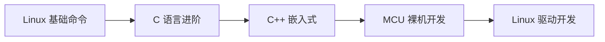

# 嵌入式开发知识库

> 系统性的嵌入式开发学习资料，涵盖 Linux 驱动、MCU 裸机、C/C++ 进阶。

## 📚 内容结构

每个知识模块按以下四层组织：

```
课程模块/
├── README.md          # 原理讲解 + 逻辑流程
├── hardware/          # 硬件原理图、接线说明、引脚定义
└── code/              # 驱动代码 + 测试例程
```

## 🗺️ 知识地图

| 模块 | 内容 | 状态 |
|------|------|------|
| [Linux 基础命令](linux-basics/index.md) | Shell 入门、文件操作、权限、进程、网络、脚本 | ✅ 已完成 |
| [C 语言进阶](c-language/index.md) | 指针、状态机、环形缓冲区、位操作 | 🚧 构建中 |
| [C++ 嵌入式](cpp-embedded/index.md) | HAL 模板类、RAII、STL 容器、多线程 | 🚧 构建中 |
| [MCU 裸机开发](mcu/index.md) | Cortex-M 内核、外设驱动、FreeRTOS | 🚧 构建中 |
| [Linux 驱动开发](linux-driver/index.md) | 字符设备、平台驱动、设备树、GPIO/I2C/SPI/UART | 🚧 构建中 |

## 🔧 推荐学习路线



1. **[Linux 基础命令](linux-basics/index.md)** — 熟悉 Linux 环境，Shell 操作、文件管理、编译工具链
2. **[C 语言进阶](c-language/index.md)** — 指针、内存管理、数据结构，嵌入式编程的基石
3. **[C++ 嵌入式](cpp-embedded/index.md)** — 面向对象、模板、RAII、STL 在嵌入式中的应用
4. **[MCU 裸机开发](mcu/index.md)** — Cortex-M 内核、外设驱动、FreeRTOS 实战
5. **[Linux 驱动开发](linux-driver/index.md)** — 字符设备、平台驱动、设备树、总线子系统

> 每个课程都包含硬件连接说明、原理讲解和可运行的代码

!!! tip "在线编辑"
    本库托管在 GitHub，每个页面右上角有 ✏️ 编辑按钮，可直接在网页上修改内容并提交。
