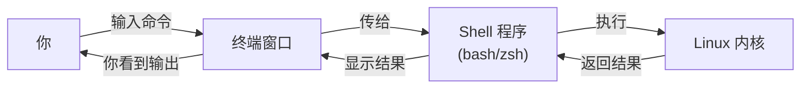

# 01 - Shell 是什么

## 什么是终端和 Shell？

你可能习惯了用鼠标点击图标来操作电脑。但在 Linux 的世界里，大部分工作是通过**输入文字命令**来完成的。

### 三个概念

| 概念 | 通俗解释 | 类比 |
|------|---------|------|
| **终端（Terminal）** | 你输入命令的那个黑色窗口 | 就像微信的聊天窗口 |
| **Shell** | 理解你命令的"翻译官"程序 | 就像微信的输入法 |
| **命令（Command）** | 你输入的具体指令 | 就像你发的每条消息 |



### 常见的 Shell

| Shell | 说明 |
|-------|------|
| **bash** | 最常用的 Shell（大多数 Linux 默认）|
| **zsh** | 功能更强（macOS 默认）|
| **sh** | 最原始的 Shell |

查看你当前使用的 Shell：

```bash
echo $SHELL
# 输出示例：/bin/bash
```

---

## 打开终端

### 在 Ubuntu/Debian 桌面环境

- 按 `Ctrl + Alt + T` 打开终端

### 通过 SSH 远程连接

如果你的 Linux 在开发板或云服务器上：

```bash
ssh 用户名@IP地址
# 例如
ssh root@192.168.1.100
```

### Windows 用户

- **推荐**：安装 [MobaXterm](https://mobaxterm.mobatek.net/) 或 [PuTTY](https://putty.org/)
- 或者使用 WSL（Windows 子系统 Linux）

---

## 命令提示符

打开终端后你会看到类似这样的提示符：

```
username@hostname:~$
```

各部分含义：

| 部分 | 含义 | 示例 |
|------|------|------|
| `username` | 当前登录的用户名 | `pi` |
| `hostname` | 电脑的名字 | `raspberrypi` |
| `~` | 当前所在的目录（`~` 表示家目录）| `~` = `/home/pi` |
| `$` | 普通用户提示符（root 用户是 `#`）| `$` |

!!! warning "看到 `#` 提示符？"
    `#` 表示你是 **root 用户**（超级管理员）。root 下操作要格外小心，一个错误命令可能损坏整个系统。

---

## 你的第一个命令

试试输入以下命令（输入后按回车）：

```bash
# 显示当前日期和时间
date

# 显示当前登录的用户名
whoami

# 显示当前所在的目录
pwd

# 查看系统运行了多久
uptime
```

输出示例：

```
$ date
2026年 05月 02日 星期六 14:30:00 CST

$ whoami
pi

$ pwd
/home/pi

$ uptime
 14:30:00 up 3 days, 2:15, 1 user, load average: 0.15, 0.10, 0.08
```

---

## 必学技巧

### 1. Tab 自动补全

这是 Linux 命令行最重要的技巧，**没有之一**。

```bash
# 输入 "cd /ho" 然后按 Tab 键
cd /ho<Tab>
# 自动补全为：cd /home/

# 输入 "ls /etc/net" 然后按 Tab 键
ls /etc/net<Tab>
# 自动补全为：ls /etc/network/
```

!!! tip "双击 Tab"
    如果有多个匹配项，按两次 Tab 会列出所有可能的选项。

### 2. 历史命令

```bash
# 按 ↑ 方向键：调出上一条命令
# 按 ↓ 方向键：调出下一条命令

# 搜索历史命令
history          # 显示所有历史命令
history | grep ssh  # 搜索包含 ssh 的历史命令

# 快捷搜索：按 Ctrl+R，然后输入关键词
```

### 3. 快捷键

| 快捷键 | 作用 |
|--------|------|
| `Ctrl + C` | **强制终止**当前运行的命令 |
| `Ctrl + D` | 退出终端（等同于 `exit`）|
| `Ctrl + L` | 清屏（等同于 `clear`）|
| `Ctrl + A` | 光标跳到行首 |
| `Ctrl + E` | 光标跳到行尾 |
| `Ctrl + U` | 删除光标前的所有内容 |
| `Ctrl + K` | 删除光标后的所有内容 |
| `Ctrl + W` | 删除光标前的一个单词 |

### 4. 获取帮助

不知道一个命令怎么用？有三种方法：

```bash
# 方法1：man 手册（最详细，按 q 退出）
man ls

# 方法2：--help 参数（简洁版）
ls --help

# 方法3：tldr（太长不看版，需要安装）
# sudo apt install tldr
tldr ls
```

---

## 命令的基本格式

几乎所有 Linux 命令都遵循这个格式：

```
命令名 [选项] [参数]
```

| 部分 | 说明 | 示例 |
|------|------|------|
| 命令名 | 要执行什么操作 | `ls` |
| 选项 | 怎么执行（通常以 `-` 开头）| `-l`、`-a`、`--all` |
| 参数 | 对谁执行 | `/home`、`file.txt` |

```bash
# 示例
ls -la /home
# │  ││ └── 参数：对 /home 目录操作
# │  │└─── 选项 -a：显示隐藏文件
# │  └──── 选项 -l：以列表格式显示
# └─────── 命令：列出目录内容
```

!!! note "短选项 vs 长选项"
    - 短选项：`-l`、`-a`，可以合并写成 `-la`
    - 长选项：`--all`、`--human-readable`，不能合并
    - 两种写法效果一样：`ls -a` = `ls --all`

---

## 练习

!!! question "动手试试"
    1. 打开终端，输入 `date` 查看当前时间
    2. 输入 `whoami` 看看你是谁
    3. 输入 `ls /` 看看根目录下有什么
    4. 练习用 Tab 补全：输入 `ls /e` 然后按 Tab
    5. 按 `↑` 键调出历史命令，再按回车重新执行
    6. 用 `man ls` 查看 ls 的手册，按 `q` 退出
