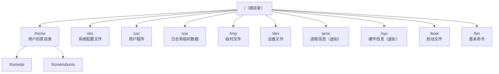

# 02 - 文件与目录操作

## Linux 目录结构

Linux 的文件系统是一棵**倒过来的树**，所有东西都从根目录 `/` 开始。



### 嵌入式开发常用目录

| 目录 | 作用 | 嵌入式场景 |
|------|------|----------|
| `/dev` | 设备文件 | 串口 `/dev/ttyUSB0`、GPIO `/dev/gpiochip0` |
| `/sys` | 硬件接口 | GPIO/LED 控制、PWM 配置 |
| `/proc` | 内核信息 | CPU 信息、内存信息 |
| `/lib/modules` | 内核模块 | 你编译的 `.ko` 驱动文件 |
| `/etc` | 配置文件 | 网络配置、启动脚本 |

---

## 路径表示

| 概念 | 符号 | 示例 |
|------|------|------|
| 根目录 | `/` | `cd /` |
| 家目录 | `~` | `cd ~` 等同于 `cd /home/用户名` |
| 当前目录 | `.` | `cp file.txt ./backup/` |
| 上级目录 | `..` | `cd ..` 回到上一层 |
| 绝对路径 | 以 `/` 开头 | `/home/pi/project/main.c` |
| 相对路径 | 不以 `/` 开头 | `../src/main.c` |

```bash
# 绝对路径（从根目录开始）
cd /home/pi/Documents

# 相对路径（从当前位置开始）
cd Documents      # 进入当前目录下的 Documents
cd ../Downloads    # 回到上一层，再进入 Downloads
```

!!! tip "什么时候用绝对路径？什么时候用相对路径？"
    - **写脚本 / 配置文件** → 用绝对路径（确保任何位置都能找到）
    - **日常操作** → 用相对路径（打字更少）

---

## pwd - 显示当前目录

```bash
$ pwd
/home/pi/projects
# 告诉你"你现在在哪"
```

---

## ls - 列出目录内容

这是你用得最多的命令。

```bash
# 基本用法
ls                    # 列出当前目录的文件
ls /etc               # 列出 /etc 目录的文件

# 常用选项
ls -l                 # 详细信息（权限、大小、时间）
ls -a                 # 显示隐藏文件（以 . 开头的文件）
ls -la                # 两个选项一起用
ls -lh                # 文件大小用人类可读格式（KB/MB/GB）
ls -lt                # 按修改时间排序（最新的在前）
ls -lS                # 按文件大小排序（最大的在前）
ls -R                 # 递归列出所有子目录
```

### 理解 `ls -l` 的输出

```
$ ls -l
drwxr-xr-x 2 pi pi  4096 May  1 10:00 Documents
-rw-r--r-- 1 pi pi  1234 May  1 09:00 hello.c
-rwxr-xr-x 1 pi pi  8456 May  1 09:05 hello
lrwxrwxrwx 1 pi pi     7 May  1 08:00 link -> hello.c
│└┬┘└┬┘└┬┘ │ │  │   │    └──────┬─────┘ └──┬──┘
│ │  │  │  │ │  │   │          │           └─ 文件名
│ │  │  │  │ │  │   │          └─ 最后修改时间
│ │  │  │  │ │  │   └─ 文件大小（字节）
│ │  │  │  │ │  └─ 所属组
│ │  │  │  │ └─ 所有者
│ │  │  │  └─ 硬链接数
│ │  │  └─ 其他用户权限
│ │  └─ 组权限
│ └─ 所有者权限
└─ 文件类型：d=目录, -=普通文件, l=链接
```

---

## cd - 切换目录

```bash
cd /home/pi           # 进入指定目录（绝对路径）
cd Documents          # 进入当前目录下的 Documents（相对路径）
cd ..                 # 回到上级目录
cd ../..              # 回到上两级目录
cd ~                  # 回到家目录
cd                    # 同上，回到家目录（省略 ~）
cd -                  # 回到上一次所在的目录（来回切换很方便）
```

!!! tip "cd - 的妙用"
    在两个目录之间来回切换时非常好用：
    ```bash
    cd /etc/network      # 去 A 目录
    cd /home/pi/project  # 去 B 目录
    cd -                 # 回到 A 目录
    cd -                 # 回到 B 目录
    ```

---

## mkdir - 创建目录

```bash
mkdir myproject                  # 创建单个目录
mkdir dir1 dir2 dir3             # 一次创建多个目录
mkdir -p a/b/c/d                 # 创建多级目录（父目录不存在会自动创建）
mkdir -p project/{src,include,build,docs}  # 用花括号一次创建多个子目录
```

**实际场景** - 创建一个 C 项目结构：

```bash
mkdir -p mydriver/{src,include,build,test}
# 创建的结构：
# mydriver/
# ├── src/
# ├── include/
# ├── build/
# └── test/
```

---

## touch - 创建空文件 / 更新时间戳

```bash
touch newfile.txt                # 创建空文件（文件已存在则更新修改时间）
touch file1.c file2.c file3.c   # 一次创建多个文件
```

---

## cp - 复制文件和目录

```bash
# 复制文件
cp source.txt dest.txt           # 复制并重命名
cp file.txt /backup/             # 复制到其他目录

# 复制目录（必须加 -r）
cp -r myproject/ backup/         # 递归复制整个目录

# 常用选项
cp -i file.txt dest/             # 覆盖前询问确认
cp -v file.txt dest/             # 显示复制过程（verbose）
cp -a src/ dest/                 # 保留所有属性（权限、时间戳）
```

---

## mv - 移动 / 重命名

```bash
# 重命名
mv oldname.txt newname.txt

# 移动到其他目录
mv file.txt /home/pi/Documents/

# 移动并重命名
mv file.txt /backup/file_bak.txt

# 移动整个目录（不需要 -r）
mv myproject/ /home/pi/Desktop/
```

---

## rm - 删除文件和目录

```bash
# 删除文件
rm file.txt

# 删除目录（必须加 -r）
rm -r mydir/

# 强制删除（不询问确认）
rm -f file.txt

# 强制递归删除（危险！）
rm -rf mydir/

# 安全习惯：先看看要删什么
ls mydir/           # 先确认内容
rm -ri mydir/       # 加 -i 让每个文件都确认
```

!!! danger "rm -rf 的危险性"
    `rm -rf /` 会**删除整个系统**的所有文件！
    
    - **永远不要**在 root 用户下随便用 `rm -rf`
    - **永远不要**在 `rm -rf` 后面用变量（如果变量为空会变成 `rm -rf /`）
    - 删除前先用 `ls` 确认路径是否正确

---

## find - 查找文件

这是 Linux 中最强大的查找工具。

```bash
# 按文件名查找
find /home -name "*.c"                    # 查找所有 .c 文件
find . -name "Makefile"                   # 在当前目录下查找 Makefile
find / -name "*.ko" 2>/dev/null           # 查找所有内核模块

# 按类型查找
find . -type f                            # 只查找文件
find . -type d                            # 只查找目录

# 按大小查找
find . -size +10M                         # 大于 10MB 的文件
find . -size -1k                          # 小于 1KB 的文件

# 按时间查找
find . -mtime -7                          # 7天内修改过的文件
find . -mtime +30                         # 30天前修改过的文件

# 组合条件
find . -name "*.c" -size +1k              # .c 文件且大于 1KB

# 找到后执行操作
find . -name "*.o" -delete                # 删除所有 .o 文件
find . -name "*.c" -exec grep "main" {} \;  # 在所有 .c 文件中搜索 main
```

### 嵌入式常用 find 场景

```bash
# 找到所有设备节点
find /dev -name "tty*"

# 找到内核源码中的某个头文件
find /usr/src/linux -name "gpio.h"

# 清理编译中间文件
find . -name "*.o" -o -name "*.d" | xargs rm -f
```

---

## ln - 创建链接

Linux 有两种链接，你可以理解为 Windows 的"快捷方式"。

```bash
# 软链接（符号链接）—— 最常用，像快捷方式
ln -s /opt/toolchain/bin/arm-gcc /usr/local/bin/arm-gcc

# 硬链接 —— 用得少，了解即可
ln file1.txt file2.txt
```

| 类型 | 特点 | 使用场景 |
|------|------|---------|
| 软链接 `-s` | 指向文件路径，原文件删除后失效 | 创建快捷方式、切换版本 |
| 硬链接 | 指向文件数据，原文件删除后仍有效 | 备份、防误删 |

**嵌入式常见用法** - 交叉编译工具链链接：

```bash
sudo ln -s /opt/gcc-arm-10/bin/arm-linux-gnueabihf-gcc /usr/local/bin/arm-gcc
# 之后直接用 arm-gcc 就可以编译了
```

---

## tree - 显示目录树

```bash
# 可能需要安装
sudo apt install tree

# 基本用法
tree                    # 显示当前目录的树结构
tree -L 2               # 只显示 2 层
tree -d                 # 只显示目录
tree -I "build|.git"    # 忽略某些目录
```

输出示例：

```
$ tree -L 2
.
├── Makefile
├── include
│   └── driver.h
├── src
│   ├── driver.c
│   └── main.c
└── test
    └── test_driver.c
```

---

## 通配符

通配符让你可以批量匹配文件名：

| 通配符 | 含义 | 示例 |
|--------|------|------|
| `*` | 匹配任意字符（0个或多个）| `*.c` 匹配所有 .c 文件 |
| `?` | 匹配单个字符 | `file?.txt` 匹配 file1.txt |
| `[abc]` | 匹配括号内任一字符 | `file[123].txt` |
| `[a-z]` | 匹配范围内的字符 | `[A-Z]*.c` 以大写开头的 .c 文件 |
| `{a,b,c}` | 匹配花括号内任一项 | `*.{c,h}` 匹配 .c 和 .h 文件 |

```bash
ls *.c                   # 所有 .c 文件
ls src/*.{c,h}           # src 目录下所有 .c 和 .h 文件
rm *.o                   # 删除所有 .o 文件
cp *.conf /backup/       # 复制所有配置文件
```

---

## 练习

!!! question "动手试试"
    1. 用 `mkdir -p` 创建这个目录结构：`~/practice/{src,include,build,docs}`
    2. 用 `touch` 在 src/ 下创建 `main.c`、`utils.c`
    3. 用 `cp` 把 `main.c` 复制到 build/ 目录
    4. 用 `mv` 把 build/ 下的 `main.c` 重命名为 `main_backup.c`
    5. 用 `find` 找到你刚才创建的所有 `.c` 文件
    6. 用 `tree` 查看整个 practice/ 的目录结构
    7. 最后用 `rm -r` 删除整个 practice/ 目录
