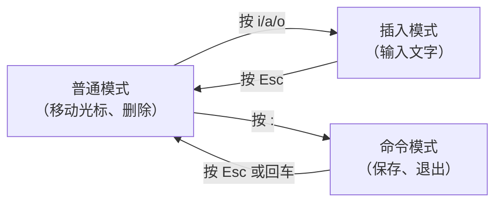

# 03 - 文件内容查看与编辑

## cat - 查看文件全部内容

```bash
cat file.txt                    # 显示文件内容
cat -n file.txt                 # 显示行号
cat file1.txt file2.txt         # 拼接显示多个文件
cat file1.txt file2.txt > all.txt  # 合并多个文件
```

!!! warning "文件太大怎么办？"
    `cat` 会一次性输出所有内容。文件太大时屏幕会刷屏，建议用 `less` 代替。

---

## less / more - 分页查看

```bash
less bigfile.log               # 分页查看（推荐用 less）
more bigfile.log               # 较老的分页工具
```

**less 常用操作：**

| 按键 | 作用 |
|------|------|
| `空格` / `f` | 下一页 |
| `b` | 上一页 |
| `↑` / `↓` | 上/下一行 |
| `g` | 跳到文件开头 |
| `G` | 跳到文件末尾 |
| `/关键词` | 向下搜索 |
| `?关键词` | 向上搜索 |
| `n` | 下一个匹配项 |
| `N` | 上一个匹配项 |
| `q` | 退出 |

```bash
# 实际场景：查看内核日志
less /var/log/syslog
# 输入 /error 搜索错误信息
```

---

## head / tail - 查看开头 / 结尾

```bash
# head - 查看文件开头
head file.txt                   # 默认显示前 10 行
head -n 20 file.txt             # 显示前 20 行
head -c 100 file.txt            # 显示前 100 个字节

# tail - 查看文件结尾
tail file.txt                   # 默认显示后 10 行
tail -n 20 file.txt             # 显示后 20 行

# ⭐ tail -f：实时跟踪文件变化（调试神器）
tail -f /var/log/syslog         # 实时查看系统日志
tail -f /var/log/kern.log       # 实时查看内核日志（驱动调试必用）
# 按 Ctrl+C 停止跟踪
```

!!! tip "嵌入式调试必会"
    `tail -f` + `dmesg` 是调试内核驱动的标配：
    ```bash
    # 终端1：实时查看内核消息
    tail -f /var/log/kern.log
    
    # 终端2：加载你的驱动
    sudo insmod mydriver.ko
    # 此时终端1会实时显示驱动的 printk 输出
    ```

---

## grep - 文本搜索

`grep` 是 Linux 中最常用的搜索工具，**必须熟练掌握**。

```bash
# 基本用法
grep "error" logfile.txt         # 在文件中搜索包含 error 的行
grep "main" *.c                  # 在所有 .c 文件中搜索 main

# 常用选项
grep -i "error" log.txt          # 忽略大小写
grep -n "error" log.txt          # 显示匹配的行号
grep -r "TODO" .                 # 递归搜索当前目录及子目录
grep -c "error" log.txt          # 只显示匹配的行数
grep -v "debug" log.txt          # 反向匹配（排除包含 debug 的行）
grep -l "main" *.c               # 只显示包含匹配的文件名
grep -w "int" main.c             # 全词匹配（不会匹配 printf 中的 int）
grep -A 3 "error" log.txt        # 显示匹配行及后面 3 行
grep -B 2 "error" log.txt        # 显示匹配行及前面 2 行
grep -C 2 "error" log.txt        # 显示匹配行及前后各 2 行
```

### 正则表达式

```bash
grep "^#include" main.c          # 以 #include 开头的行
grep "};$" main.c                # 以 }; 结尾的行
grep "err[0-9]" log.txt          # err 后跟数字
grep -E "error|warning" log.txt  # 匹配 error 或 warning
```

### 嵌入式常用搜索

```bash
# 在内核源码中查找函数定义
grep -rn "gpio_request" /usr/src/linux/drivers/

# 查看设备树中的节点
grep -r "compatible" /boot/dtbs/

# 在 dmesg 中筛选特定驱动信息
dmesg | grep "mydriver"
dmesg | grep -i "usb"
```

---

## wc - 统计行数 / 字数

```bash
wc file.txt           # 行数 单词数 字节数
wc -l file.txt        # 只显示行数
wc -w file.txt        # 只显示单词数
wc -c file.txt        # 只显示字节数

# 实用场景
find . -name "*.c" | wc -l       # 统计有多少个 .c 文件
cat main.c | wc -l               # 看代码有多少行
```

---

## sort - 排序

```bash
sort file.txt                    # 按字母排序
sort -n file.txt                 # 按数字排序
sort -r file.txt                 # 逆序排序
sort -u file.txt                 # 排序并去重
sort -t: -k3 -n /etc/passwd     # 按第3列（UID）数字排序
```

---

## diff - 比较文件差异

```bash
diff file1.c file2.c             # 比较两个文件
diff -u file1.c file2.c          # 统一格式输出（更易读）
diff -r dir1/ dir2/              # 比较两个目录
```

---

## nano - 最简单的文本编辑器

如果你是新手，先用 `nano`，足够日常编辑使用。

```bash
nano file.txt                    # 打开/创建文件
```

**nano 常用操作（底部有提示，^ 表示 Ctrl）：**

| 快捷键 | 作用 |
|--------|------|
| `Ctrl + O` | 保存文件 |
| `Ctrl + X` | 退出 |
| `Ctrl + K` | 剪切一行 |
| `Ctrl + U` | 粘贴 |
| `Ctrl + W` | 搜索 |
| `Ctrl + G` | 帮助 |

---

## vi/vim - 专业文本编辑器

`vi` 是 Linux 自带的编辑器，所有 Linux 系统都有。虽然学习曲线陡峭，但嵌入式开发中**必须会用**（因为很多嵌入式系统只有 vi）。

### vi 的三种模式



### 最小使用流程

```bash
# 1. 打开文件
vi file.txt

# 2. 按 i 进入插入模式（左下角显示 -- INSERT --）
#    现在可以正常打字了

# 3. 编辑完成后按 Esc 回到普通模式

# 4. 输入 :wq 回车（保存并退出）
#    或 :q!（不保存退出）
```

### 常用操作速查

| 模式 | 按键 | 作用 |
|------|------|------|
| 普通 | `i` | 在光标前插入 |
| 普通 | `a` | 在光标后插入 |
| 普通 | `o` | 在下方新建一行并插入 |
| 普通 | `dd` | 删除一行 |
| 普通 | `yy` | 复制一行 |
| 普通 | `p` | 粘贴 |
| 普通 | `u` | 撤销 |
| 普通 | `/keyword` | 搜索 |
| 普通 | `gg` | 跳到文件开头 |
| 普通 | `G` | 跳到文件末尾 |
| 命令 | `:w` | 保存 |
| 命令 | `:q` | 退出 |
| 命令 | `:wq` | 保存并退出 |
| 命令 | `:q!` | 强制退出（不保存）|
| 命令 | `:set number` | 显示行号 |

!!! tip "不会用 vi 怎么退出？"
    如果你不小心进了 vi 不知道怎么退出：按 `Esc`，然后输入 `:q!` 回车。

---

## dmesg - 查看内核消息

这是嵌入式开发的**核心调试工具**。

```bash
dmesg                            # 显示所有内核消息
dmesg | tail -20                 # 显示最后 20 条
dmesg | grep "error"             # 搜索错误信息
dmesg -w                         # 实时显示新内核消息（类似 tail -f）
dmesg -c                         # 显示并清空缓冲区（需要 sudo）
dmesg -T                         # 显示人类可读的时间戳
```

---

## 练习

!!! question "动手试试"
    1. 用 `cat -n /etc/passwd` 查看系统用户文件（带行号）
    2. 用 `less /etc/services` 浏览系统服务文件，用 `/http` 搜索 http
    3. 用 `grep -rn "root" /etc/passwd` 找到 root 用户信息
    4. 用 `nano` 创建一个 `hello.c` 文件，写入 Hello World 程序
    5. 用 `wc -l hello.c` 看看写了几行
    6. 用 `dmesg | tail -10` 查看最近的内核消息
