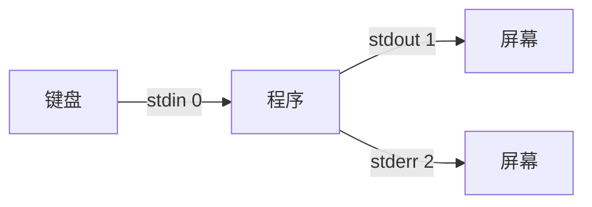

# 09 - I/O 重定向与管道

## 三个标准流

每个 Linux 程序启动时都有三个"数据通道"：

| 流 | 编号 | 默认方向 | 用途 |
|----|------|---------|------|
| stdin（标准输入） | 0 | 键盘 | 程序读取数据 |
| stdout（标准输出） | 1 | 屏幕 | 程序正常输出 |
| stderr（标准错误） | 2 | 屏幕 | 程序错误输出 |



---

## 输出重定向

```bash
# > 覆盖写入文件（文件已存在会清空）
echo "hello" > output.txt
ls -la > filelist.txt

# >> 追加写入文件（不清空原内容）
echo "world" >> output.txt
date >> log.txt

# 只重定向错误输出
gcc main.c 2> errors.txt

# 标准输出和错误输出分开
gcc main.c > output.txt 2> errors.txt

# 标准输出和错误输出都写入同一文件
gcc main.c > all.txt 2>&1
# 或者（更简洁的写法）
gcc main.c &> all.txt

# 丢弃输出（/dev/null 是黑洞）
command > /dev/null 2>&1          # 丢弃所有输出
find / -name "*.c" 2>/dev/null   # 只丢弃错误信息
```

!!! tip "/dev/null 黑洞"
    `/dev/null` 是一个特殊设备，写入的数据会被直接丢弃。常用来：
    - 隐藏不需要的输出
    - 隐藏权限不足的错误信息

---

## 输入重定向

```bash
# < 从文件读取输入
wc -l < file.txt                 # 统计文件行数

# << 多行输入（Here Document）
cat << EOF > config.txt
server=192.168.1.1
port=8080
timeout=30
EOF
# 这会创建 config.txt 并写入这三行
```

### 嵌入式实用场景

```bash
# 生成设备树覆盖文件
cat << 'EOF' > my-overlay.dts
/dts-v1/;
/plugin/;

/ {
    compatible = "brcm,bcm2835";
    fragment@0 {
        target-path = "/";
        __overlay__ {
            my_device {
                compatible = "mycompany,mydevice";
                status = "okay";
            };
        };
    };
};
EOF
```

---

## 管道 |

管道是 Linux 最强大的特性之一——**把一个命令的输出，直接作为另一个命令的输入**。

```bash
# 基本用法
ls -la | less                    # 文件列表太长，分页查看
ps aux | grep nginx              # 在进程列表中搜索 nginx
cat log.txt | grep "error"       # 在日志中搜索错误

# 多级管道
cat access.log | grep "404" | wc -l
# 含义：读取日志 → 筛选 404 行 → 统计行数

# 更多实用组合
history | grep ssh               # 搜索用过的 ssh 命令
dmesg | grep -i usb              # 搜索 USB 相关内核消息
ls -lS | head -10                # 显示最大的 10 个文件
du -sh * | sort -rh | head -5    # 当前目录最大的 5 个项
```

---

## tee - 同时输出到屏幕和文件

`tee` 就像一个 T 型管道接头，把数据分流到两个方向。

```bash
# 既显示在屏幕上，又保存到文件
ls -la | tee filelist.txt

# 追加模式
echo "new line" | tee -a log.txt

# 实用场景：编译时同时看输出和保存日志
make 2>&1 | tee build.log
```

---

## xargs - 将输入转换为命令参数

`xargs` 把管道传来的数据，变成后面命令的参数。

```bash
# 删除所有 .o 文件
find . -name "*.o" | xargs rm

# 在所有 .c 文件中搜索 main 函数
find . -name "*.c" | xargs grep "main"

# 处理文件名含空格的情况
find . -name "*.c" -print0 | xargs -0 grep "main"

# 限制每次传入的参数数量
echo "1 2 3 4 5" | xargs -n 2 echo
# 输出：
# 1 2
# 3 4
# 5
```

---

## 实战组合

### 日志分析

```bash
# 统计错误出现次数
grep -c "ERROR" app.log

# 找出出错最多的文件
grep "ERROR" app.log | awk '{print $3}' | sort | uniq -c | sort -rn | head -10

# 实时监控并过滤
tail -f /var/log/syslog | grep --line-buffered "mydriver"
```

### 嵌入式开发

```bash
# 编译并过滤警告
make 2>&1 | grep -E "warning|error"

# 查找哪些源文件包含某个头文件
grep -rl "#include \"myheader.h\"" src/ | sort

# 批量替换文件中的字符串
find . -name "*.c" | xargs sed -i 's/old_func/new_func/g'

# 统计项目代码行数
find . -name "*.c" -o -name "*.h" | xargs wc -l | tail -1
```

---

## 练习

!!! question "动手试试"
    1. 用 `echo "hello world" > test.txt` 创建文件
    2. 用 `echo "second line" >> test.txt` 追加内容
    3. 用 `cat test.txt | wc -l` 统计行数
    4. 用 `ls -la | tee filelist.txt` 同时查看和保存
    5. 用 `find / -name "*.conf" 2>/dev/null | head -10` 找配置文件（隐藏错误）
    6. 用 `history | grep cd | wc -l` 统计你用了多少次 cd
