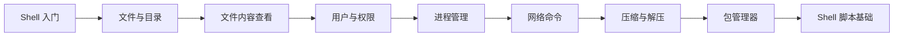

# Linux 基础命令

!!! info "适合人群"
    零基础入门，从来没用过 Linux 命令行的同学。学完本章后，你可以独立在 Linux 终端中完成日常操作。

## 学习路径

## 课程列表

| 编号 | 课程 | 你将学会 | 难度 |
|------|------|---------|------|
| 01 | [Shell 是什么](01-shell-intro/README.md) | 终端、Shell、命令提示符、Tab 补全 | ⭐ |
| 02 | [文件与目录操作](02-file-directory/README.md) | ls、cd、mkdir、rm、cp、mv、find | ⭐ |
| 03 | [文件内容查看与编辑](03-file-content/README.md) | cat、less、head、tail、grep、vi/nano | ⭐⭐ |
| 04 | [用户与权限管理](04-user-permission/README.md) | chmod、chown、sudo、用户管理 | ⭐⭐ |
| 05 | [进程管理](05-process/README.md) | ps、top、kill、systemctl、后台任务 | ⭐⭐ |
| 06 | [网络命令](06-network/README.md) | ping、ifconfig/ip、ssh、scp、curl | ⭐⭐ |
| 07 | [压缩与解压](07-archive/README.md) | tar、gzip、zip、解压各种格式 | ⭐ |
| 08 | [软件包管理](08-package/README.md) | apt、yum/dnf、dpkg、rpm | ⭐⭐ |
| 09 | [I/O 重定向与管道](09-redirect-pipe/README.md) | >、>>、<、\|、tee、xargs | ⭐⭐⭐ |
| 10 | [Shell 脚本入门](10-shell-script/README.md) | 变量、条件、循环、函数、实战脚本 | ⭐⭐⭐ |

## 速查表

??? tip "最常用的 20 个命令（点击展开）"

    | 命令 | 作用 | 示例 |
    |------|------|------|
    | `ls` | 列出目录内容 | `ls -la` |
    | `cd` | 切换目录 | `cd /home` |
    | `pwd` | 显示当前目录 | `pwd` |
    | `mkdir` | 创建目录 | `mkdir -p a/b/c` |
    | `rm` | 删除文件/目录 | `rm -rf dir/` |
    | `cp` | 复制 | `cp -r src/ dst/` |
    | `mv` | 移动/重命名 | `mv old.txt new.txt` |
    | `cat` | 查看文件内容 | `cat file.txt` |
    | `grep` | 搜索文本 | `grep "error" log.txt` |
    | `find` | 查找文件 | `find / -name "*.c"` |
    | `chmod` | 修改权限 | `chmod 755 script.sh` |
    | `chown` | 修改所有者 | `chown user:group file` |
    | `ps` | 查看进程 | `ps aux` |
    | `kill` | 终止进程 | `kill -9 PID` |
    | `tar` | 打包/解压 | `tar -xzf file.tar.gz` |
    | `ssh` | 远程登录 | `ssh user@host` |
    | `scp` | 远程复制 | `scp file user@host:/path` |
    | `sudo` | 以管理员执行 | `sudo apt update` |
    | `apt/yum` | 安装软件 | `sudo apt install vim` |
    | `man` | 查看手册 | `man ls` |
