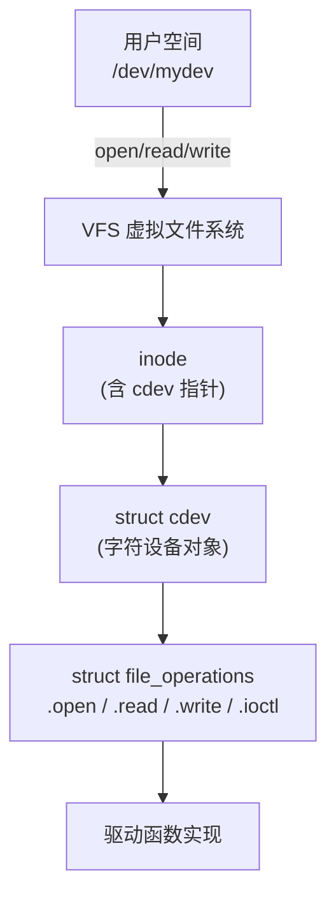

# 01 - 字符设备驱动

## 原理概述

字符设备是 Linux 中最基本的设备类型，以**字节流**方式访问（区别于块设备）。

### 核心数据结构关系



### 关键步骤

1. **申请设备号**：`alloc_chrdev_region()` 或 `register_chrdev_region()`
2. **初始化 cdev**：`cdev_init()` 绑定 `file_operations`
3. **注册 cdev**：`cdev_add()` 将设备挂入内核
4. **创建设备节点**：`class_create()` + `device_create()` 自动生成 `/dev/xxx`
5. **卸载时反向操作**：`device_destroy()` → `class_destroy()` → `cdev_del()` → `unregister_chrdev_region()`

---

## 硬件说明

本课程为纯软件演示，无需特定硬件，直接在 **虚拟设备** 上操作。

可在开发板或 PC 的 Linux 系统上运行。

!!! note "推荐环境"
    - QEMU 虚拟机（任意 ARM/x86 Linux）
    - Raspberry Pi
    - 任意运行 Linux 的 SBC

---

## 驱动代码

### 文件结构

```
01-char-device/
├── README.md           # 本文档
└── code/
    ├── Makefile
    ├── char_driver.c   # 驱动主体
    └── test_app.c      # 用户空间测试程序
```

### char_driver.c

```c
#include <linux/init.h>
#include <linux/module.h>
#include <linux/cdev.h>
#include <linux/fs.h>
#include <linux/device.h>
#include <linux/uaccess.h>
#include <linux/slab.h>

#define DEVICE_NAME     "mychardev"
#define CLASS_NAME      "myclass"
#define BUF_SIZE        1024

/* 设备私有数据 */
struct mydev_data {
    struct cdev     cdev;
    char            buf[BUF_SIZE];
    size_t          buf_len;
};

static dev_t            dev_num;        /* 设备号 */
static struct class    *dev_class;
static struct device   *dev_device;
static struct mydev_data *mydev;

/* ============ file_operations 实现 ============ */

static int mydev_open(struct inode *inode, struct file *filp)
{
    /* 通过 cdev 获取设备私有数据，存入 filp->private_data */
    struct mydev_data *data = container_of(inode->i_cdev,
                                           struct mydev_data, cdev);
    filp->private_data = data;
    pr_info("%s: device opened\n", DEVICE_NAME);
    return 0;
}

static int mydev_release(struct inode *inode, struct file *filp)
{
    pr_info("%s: device closed\n", DEVICE_NAME);
    return 0;
}

static ssize_t mydev_read(struct file *filp, char __user *buf,
                           size_t count, loff_t *ppos)
{
    struct mydev_data *data = filp->private_data;
    size_t to_copy;

    if (*ppos >= data->buf_len)
        return 0;   /* EOF */

    to_copy = min(count, data->buf_len - (size_t)*ppos);

    if (copy_to_user(buf, data->buf + *ppos, to_copy))
        return -EFAULT;

    *ppos += to_copy;
    return to_copy;
}

static ssize_t mydev_write(struct file *filp, const char __user *buf,
                            size_t count, loff_t *ppos)
{
    struct mydev_data *data = filp->private_data;
    size_t to_copy = min(count, (size_t)BUF_SIZE - 1);

    if (copy_from_user(data->buf, buf, to_copy))
        return -EFAULT;

    data->buf[to_copy] = '\0';
    data->buf_len = to_copy;
    *ppos = to_copy;

    pr_info("%s: received %zu bytes: %s\n", DEVICE_NAME, to_copy, data->buf);
    return to_copy;
}

static const struct file_operations mydev_fops = {
    .owner   = THIS_MODULE,
    .open    = mydev_open,
    .release = mydev_release,
    .read    = mydev_read,
    .write   = mydev_write,
};

/* ============ 模块初始化 / 退出 ============ */

static int __init mydev_init(void)
{
    int ret;

    /* 1. 动态申请设备号 */
    ret = alloc_chrdev_region(&dev_num, 0, 1, DEVICE_NAME);
    if (ret < 0) {
        pr_err("Failed to alloc chrdev region: %d\n", ret);
        return ret;
    }
    pr_info("Major: %d, Minor: %d\n", MAJOR(dev_num), MINOR(dev_num));

    /* 2. 分配设备私有数据 */
    mydev = kzalloc(sizeof(*mydev), GFP_KERNEL);
    if (!mydev) {
        ret = -ENOMEM;
        goto err_unreg;
    }

    /* 3. 初始化并注册 cdev */
    cdev_init(&mydev->cdev, &mydev_fops);
    mydev->cdev.owner = THIS_MODULE;
    ret = cdev_add(&mydev->cdev, dev_num, 1);
    if (ret < 0) {
        pr_err("Failed to add cdev: %d\n", ret);
        goto err_free;
    }

    /* 4. 创建设备类和节点（自动生成 /dev/mychardev）*/
    dev_class = class_create(THIS_MODULE, CLASS_NAME);
    if (IS_ERR(dev_class)) {
        ret = PTR_ERR(dev_class);
        goto err_cdev;
    }

    dev_device = device_create(dev_class, NULL, dev_num, NULL, DEVICE_NAME);
    if (IS_ERR(dev_device)) {
        ret = PTR_ERR(dev_device);
        goto err_class;
    }

    pr_info("%s: driver loaded, /dev/%s created\n", DEVICE_NAME, DEVICE_NAME);
    return 0;

err_class:
    class_destroy(dev_class);
err_cdev:
    cdev_del(&mydev->cdev);
err_free:
    kfree(mydev);
err_unreg:
    unregister_chrdev_region(dev_num, 1);
    return ret;
}

static void __exit mydev_exit(void)
{
    device_destroy(dev_class, dev_num);
    class_destroy(dev_class);
    cdev_del(&mydev->cdev);
    kfree(mydev);
    unregister_chrdev_region(dev_num, 1);
    pr_info("%s: driver unloaded\n", DEVICE_NAME);
}

module_init(mydev_init);
module_exit(mydev_exit);

MODULE_LICENSE("GPL");
MODULE_AUTHOR("Your Name");
MODULE_DESCRIPTION("Basic char device driver example");
```

### test_app.c

```c
#include <stdio.h>
#include <stdlib.h>
#include <fcntl.h>
#include <unistd.h>
#include <string.h>

#define DEVICE "/dev/mychardev"

int main(void)
{
    int fd;
    char write_buf[] = "Hello from userspace!";
    char read_buf[64] = {0};
    ssize_t n;

    fd = open(DEVICE, O_RDWR);
    if (fd < 0) {
        perror("open");
        return EXIT_FAILURE;
    }

    /* 写入数据 */
    n = write(fd, write_buf, strlen(write_buf));
    printf("Written %zd bytes: %s\n", n, write_buf);

    /* 重置文件偏移再读取 */
    lseek(fd, 0, SEEK_SET);
    n = read(fd, read_buf, sizeof(read_buf) - 1);
    printf("Read %zd bytes: %s\n", n, read_buf);

    close(fd);
    return EXIT_SUCCESS;
}
```

### Makefile

```makefile
obj-m += char_driver.o

KDIR ?= /lib/modules/$(shell uname -r)/build

all:
	$(MAKE) -C $(KDIR) M=$(PWD) modules
	$(CC) -o test_app test_app.c

clean:
	$(MAKE) -C $(KDIR) M=$(PWD) clean
	rm -f test_app
```

---

## 测试步骤

```bash
# 编译
make

# 加载驱动
sudo insmod char_driver.ko

# 查看设备节点
ls -l /dev/mychardev

# 查看内核日志
dmesg | tail -5

# 运行测试程序
sudo ./test_app

# 卸载驱动
sudo rmmod char_driver
```

---

## 常见问题

!!! warning "权限问题"
    如果 `./test_app` 提示 `Permission denied`，需要 `sudo` 或修改 udev 规则：
    ```bash
    echo 'KERNEL=="mychardev", MODE="0666"' | sudo tee /etc/udev/rules.d/99-mychardev.rules
    sudo udevadm trigger
    ```

!!! tip "调试技巧"
    使用 `pr_info()` / `dev_info()` 输出日志，通过 `dmesg -w` 实时查看。
