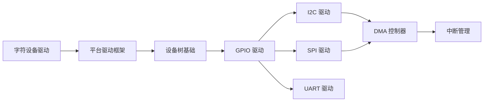

# Linux 驱动开发

## 学习路径

## 课程列表

| 编号 | 课程 | 关键知识点 | 难度 |
|------|------|----------|------|
| 01 | [字符设备驱动](01-char-device/README.md) | `file_operations`、`cdev`、设备号 | ⭐⭐ |
| 02 | [平台驱动框架](02-platform-driver/README.md) | `platform_driver`、`probe/remove` | ⭐⭐⭐ |
| 03 | [设备树基础](03-device-tree/README.md) | DTS 语法、`of_*` API | ⭐⭐⭐ |
| 04 | [GPIO 驱动](04-gpio-driver/README.md) | `gpio_chip`、`gpiod_*` API | ⭐⭐⭐ |
| 05 | [I2C 驱动](05-i2c-driver/README.md) | `i2c_driver`、`i2c_transfer` | ⭐⭐⭐ |
| 06 | [SPI 驱动](06-spi-driver/README.md) | `spi_driver`、DMA 传输 | ⭐⭐⭐⭐ |
| 07 | [UART 驱动](07-uart-driver/README.md) | `uart_driver`、`tty` 框架 | ⭐⭐⭐⭐ |
| 08 | [DMA 控制器](08-dma/README.md) | `dma_async_tx_descriptor`、链式 DMA | ⭐⭐⭐⭐⭐ |
| 09 | [中断管理](09-interrupt/README.md) | IRQ 申请、中断下半部、tasklet/workqueue | ⭐⭐⭐⭐ |

## 开发环境

- 内核版本：Linux 5.x / 6.x
- 工具链：`arm-linux-gnueabihf-gcc`
- 调试工具：`gdb`、`kprobes`、`ftrace`
