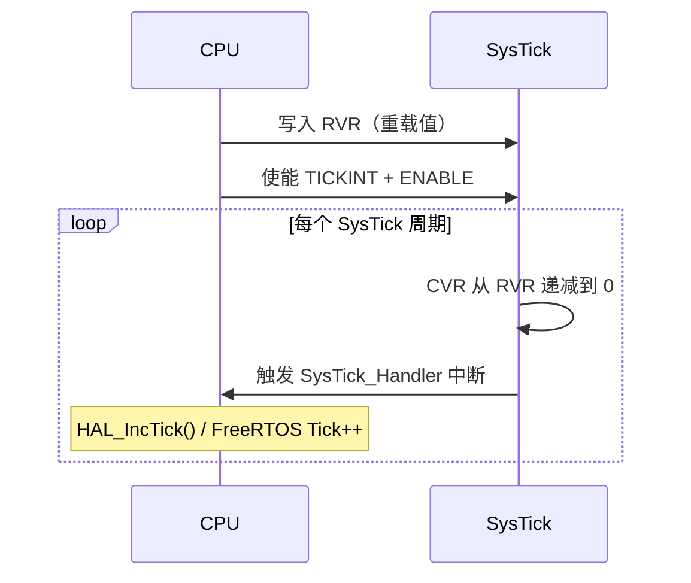

# 03 - SysTick 定时器

## 原理概述

SysTick 是 Cortex-M 内核内置的 **24位递减计数器**，独立于厂商外设，所有 Cortex-M MCU 均支持。

### 寄存器结构

| 寄存器 | 地址 | 说明 |
|--------|------|------|
| `SYST_CSR` | 0xE000E010 | 控制和状态 |
| `SYST_RVR` | 0xE000E014 | 重载值（定义周期）|
| `SYST_CVR` | 0xE000E018 | 当前值 |

### 工作原理



**1ms 定时配置：**

$$\text{RVR} = \frac{f_{sys}}{1000} - 1$$

例如 168MHz 系统时钟：RVR = 168000 - 1 = 167999

---

## 硬件说明

SysTick 为内核内置，无需外部硬件连接。

!!! info "时钟源"
    - **内部时钟（推荐）**：`SYST_CSR.CLKSOURCE = 1`，使用处理器时钟
    - **外部时钟**：`SYST_CSR.CLKSOURCE = 0`，使用参考时钟（通常为处理器时钟 ÷ 8）

---

## 驱动代码

### systick.h

```c
#ifndef SYSTICK_H
#define SYSTICK_H

#include <stdint.h>

/**
 * @brief 初始化 SysTick，产生 1ms 中断
 * @param sysclk_hz 系统时钟频率（Hz）
 * @return 0 成功，-1 失败（重载值超出 24bit 范围）
 */
int systick_init(uint32_t sysclk_hz);

/**
 * @brief 获取当前 tick 计数（毫秒）
 */
uint32_t systick_get_ms(void);

/**
 * @brief 毫秒阻塞延时
 */
void delay_ms(uint32_t ms);

/**
 * @brief 微秒忙等待延时（基于 DWT 计数器，需提前使能）
 */
void delay_us(uint32_t us);

#endif /* SYSTICK_H */
```

### systick.c

```c
#include "systick.h"
#include "stm32f4xx.h"   /* 替换为你的 MCU 头文件 */

static volatile uint32_t s_tick_ms = 0;

int systick_init(uint32_t sysclk_hz)
{
    uint32_t reload = sysclk_hz / 1000U - 1U;

    /* 24bit 计数器最大值为 0xFFFFFF */
    if (reload > SysTick_LOAD_RELOAD_Msk)
        return -1;

    SysTick->LOAD = reload;
    SysTick->VAL  = 0;                            /* 清零当前值 */
    SysTick->CTRL = SysTick_CTRL_CLKSOURCE_Msk   /* 使用处理器时钟 */
                  | SysTick_CTRL_TICKINT_Msk      /* 使能中断 */
                  | SysTick_CTRL_ENABLE_Msk;      /* 启动计数 */

    /* 使能 DWT 计数器（用于微秒延时）*/
    CoreDebug->DEMCR |= CoreDebug_DEMCR_TRCENA_Msk;
    DWT->CYCCNT = 0;
    DWT->CTRL  |= DWT_CTRL_CYCCNTENA_Msk;

    return 0;
}

/* SysTick 中断服务程序 */
void SysTick_Handler(void)
{
    s_tick_ms++;
    /* 如果使用 FreeRTOS，在此调用 xPortSysTickHandler() */
}

uint32_t systick_get_ms(void)
{
    return s_tick_ms;
}

void delay_ms(uint32_t ms)
{
    uint32_t start = s_tick_ms;
    while ((s_tick_ms - start) < ms)
        __NOP();
}

void delay_us(uint32_t us)
{
    uint32_t start = DWT->CYCCNT;
    uint32_t cycles = us * (SystemCoreClock / 1000000U);
    while ((DWT->CYCCNT - start) < cycles)
        __NOP();
}
```

---

## 测试例程

```c
#include "systick.h"
#include "gpio.h"   /* 你的 GPIO 驱动 */

int main(void)
{
    /* 初始化系统时钟（假设 168MHz）*/
    SystemInit();
    systick_init(168000000U);

    /* LED GPIO 初始化 */
    led_init();

    while (1) {
        led_toggle();
        delay_ms(500);   /* 500ms 闪烁 */
    }
}
```

---

## 常见问题

!!! warning "FreeRTOS 冲突"
    当使用 FreeRTOS 时，SysTick 由 RTOS 接管，不要重复初始化。
    在 `FreeRTOSConfig.h` 中配置 `configSYSTICK_CLOCK_HZ`。

!!! tip "更高精度延时"
    `delay_us()` 基于 DWT 硬件计数器，比软件循环更准确，但需要确保 DWT 已使能（部分 MCU 需要解锁调试访问权限）。
