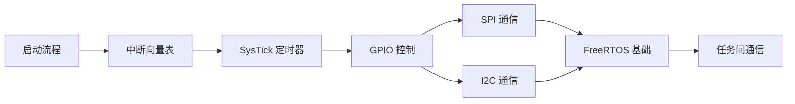

# MCU 裸机开发

## 学习路径

## 课程列表

| 编号 | 课程 | 关键知识点 | 难度 |
|------|------|----------|------|
| 01 | [启动流程](01-startup/README.md) | Reset_Handler、堆栈初始化、SystemInit | ⭐⭐ |
| 02 | [中断向量表](02-nvic/README.md) | NVIC、优先级分组、中断嵌套 | ⭐⭐⭐ |
| 03 | [SysTick 定时器](03-systick/README.md) | SysTick 配置、毫秒延时实现 | ⭐⭐ |
| 04 | [GPIO 控制](04-gpio/README.md) | GPIO 模式、外部中断 EXTI | ⭐⭐ |
| 05 | [SPI 通信](05-spi/README.md) | SPI 时序、DMA 传输、CS 管理 | ⭐⭐⭐ |
| 06 | [I2C 通信](06-i2c/README.md) | I2C 协议、软件/硬件 I2C | ⭐⭐⭐ |
| 07 | [FreeRTOS 基础](07-freertos/README.md) | 任务创建、调度器、内存管理 | ⭐⭐⭐ |
| 08 | [任务间通信](08-rtos-comm/README.md) | 队列、信号量、互斥锁、事件组 | ⭐⭐⭐⭐ |

## 目标平台

- **STM32F4xx / STM32H7xx**（Cortex-M4/M7）
- **STM32G0xx**（Cortex-M0+）
- 代码基于 **HAL 库** + 裸机寄存器对比讲解
